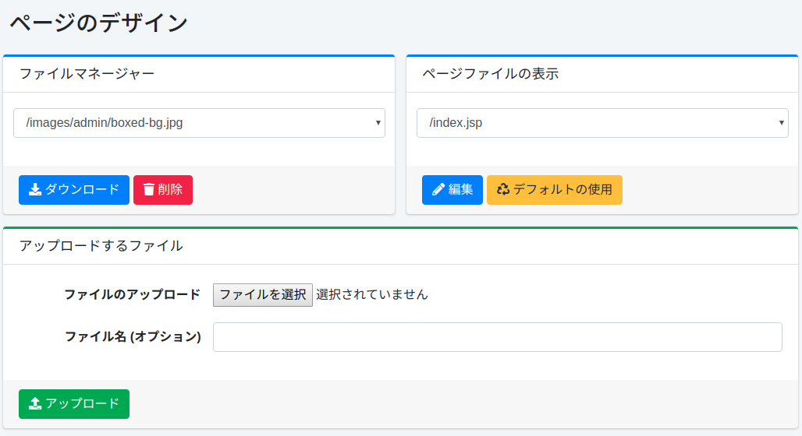
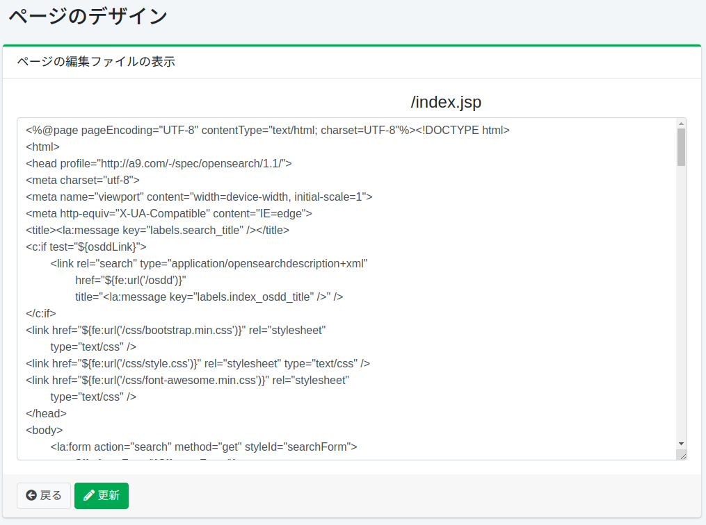

================
ページのデザイン
================

概要
====

ここでは、検索画面のデザインに関する設定について説明します。

設定方法
========

表示方法
--------

下図のページのデザインの設定を行うための一覧ページを開くには、左メニューの [システム > ページのデザイン] をクリックします。

|image0|

ファイルマネージャー
--------------------

検索画面で利用可能なファイルをダウンロードや削除することができます。

ページファイルの表示
--------------------

検索画面の JSP ファイルを編集することができます。
対象の JSP ファイルの編集ボタンを押下することで、その JSP ファイルを編集することができます。
また、デフォルトを使用ボタンを押下すると、インストール時の JSP ファイルとして編集することができます。
編集画面で更新ボタンで保存することで、変更が反映されます。

以下に編集可能なページの説明をまとめます。

.. tabularcolumns:: |p{4cm}|p{8cm}|
.. list-table::

   * - /index.jsp
     - 検索トップページの JSP ファイルです。この JSP ファイルが各部分の JSP ファイルを include しています。
   * - /header.jsp
     - ヘッダーの JSP ファイルです。
   * - /footer.jsp
     - フッターの JSP ファイルです。
   * - /search.jsp
     - 検索結果一覧ページの JSP ファイルです。この JSP ファイルが各部分の JSP ファイルを include しています。
   * - /searchResults.jsp
     - 検索結果一覧ページの検索結果部分を表現する JSP ファイルです。検索結果があるときに利用される JSP ファイルです。検索結果の表現をカスタマイズしたい場合に変更します。
   * - /searchNoResult.jsp
     - 検索結果一覧ページの検索結果部分を表現する JSP ファイルです。検索結果がないときに利用される JSP ファイルです。
   * - /searchOptions.jsp
     - 検索オプション画面の JSP ファイルです。
   * - /advance.jsp
     - 詳細検索画面の JSP ファイルです。
   * - /help.jsp
     - ヘルプページの JSP ファイルです。
   * - /error/error.jsp
     - 検索エラーページの JSP ファイルです。検索エラーの表現をカスタマイズしたい場合に変更します。
   * - /error/notFound.jsp
     - ページが見つからない場合に表示されるエラーページの JSP ファイルです。
   * - /error/system.jsp
     - システムエラーの場合に表示されるエラーページの JSP ファイルです。
   * - /error/redirect.jsp
     - HTTPリダイレクト発生時に表示されるエラーページの JSP ファイルです。
   * - /error/badRequest.jsp
     - 不正なリクエストが発生時に表示されるエラーページの JSP ファイルです。
   * - /cache.hbs
     - 検索結果のキャッシュを表示するファイルです。
   * - /login/index.jsp
     - ログイン画面の JSP ファイルです。
   * - /profile/index.jsp
     - ユーザー用パスワード変更画面の JSP です。

表: 編集可能な JSP ファイル

|image1|

アップロードするファイル
------------------------

検索画面で使用するファイルをアップロードすることができます。
サポートしている画像ファイル名は jpg、gif、png、css、js です。

ファイルのアップロード
::::::::::::::::::::::

アップロードするファイルを指定します。

フィイル名(オプション)
::::::::::::::::::::::

アップロードするファイルにファイル名を指定したい場合に利用します。
省略した場合はアップロードしたファイル名が利用されます。
たとえば、logo.png を指定すると、検索トップページの画像が変更されます。

