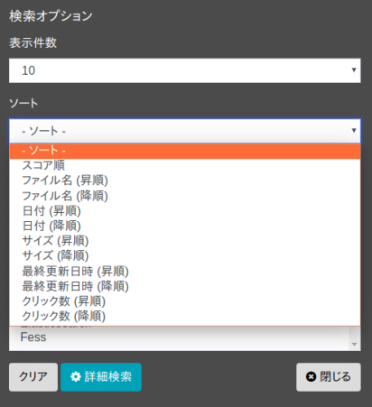

==========
ソート検索
==========

ソート検索
==========

検索日時などのフィールドを指定して検索結果をソートすることができます。

ソート対象フィールド
--------------------

デフォルトでは以下のフィールドを指定してソートすることができます。

.. list-table::
   :header-rows: 1

   * - フィールド名
     - 説明
   * - created
     - クロールした日時
   * - content_length
     - クロールしたドキュメントサイズ
   * - last_modified
     - クロールしたドキュメントの最終更新日時
   * - filename
     - ファイル名
   * - score
     - スコア値
   * - timestamp
     - ドキュメントをインデックスした日時
   * - click_count
     - ドキュメントをクリックした回数 
   * - favorite_count
     - ドキュメントをお気に入りした回数

表: ソート対象フィールド一覧

カスタマイズすることで独自のフィールドをソート対象として追加することもできます。

利用方法
--------

検索時にソート条件を選択することができます。ソート条件はオプションボタンを押下することで表示される検索オプションダイアログで選択することができます。

|image0|

また、検索フィールドでソートをする場合は、「sort:フィールド名」のようにsortとフィールド名をコロン(:)で区切って検索フォームに入力して検索します。

以下は fess を検索語として、ドキュメントサイズを昇順にソートします。

::

fess sort:content_length

降順にソートする場合は以下のようにします。

::

fess sort:content_length.desc

複数のフィールドでソートする場合は以下のように , 区切りで指定します。

::

fess sort:content_length.desc,last_modified

.. pdf            :width: 300 px
