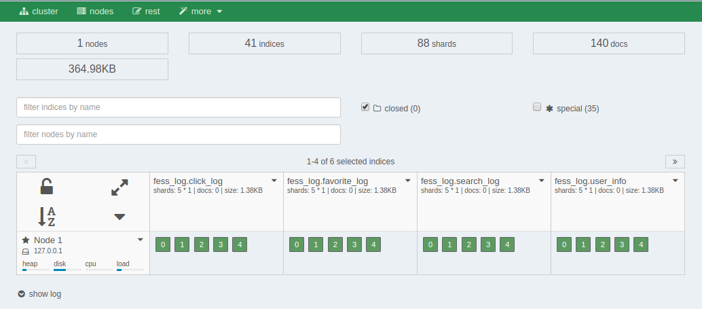
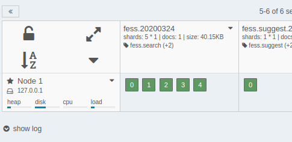

==============
ダッシュボード
==============

概要
====

ダッシュボードでは、 |Fess| がアクセスしている OpenSearch のクラスタとインデックスを管理するウェブ管理ツールを提供します。

|image0|

.. tabularcolumns:: |p{4cm}|p{8cm}|
.. list-table:: |Fess| が管理するインデックス
   :header-rows: 1

   * - インデックス名
     - 説明
   * - fess.YYYYMMDD
     - インデックスされたドキュメント
   * - fess_log
     - アクセスログ
   * - fess.suggest.YYYYMMDD
     - サジェストワード
   * - fess_config
     - |Fess| の設定
   * - fess_user
     - ユーザー/ロール/グループのデータ
   * - configsync
     - 辞書の設定
   * - fess_suggest
     - サジェストのメタデータ
   * - fess_suggest_array
     - サジェストのメタデータ
   * - fess_suggest_badword
     - サジェストのNGワードリスト
   * - fess_suggest_analyzer
     - サジェストのメタデータ
   * - fess_crawler
     - クロール情報

ドット(.)で始まるインデックス名はシステム用のインデックスであるため、表示されていません。
システム用のインデックスも表示するためには、specialのチェックボックスを有効にしてください。

インデックスされているドキュメント数の確認
==========================================

インデックスされているドキュメントの数は、下図のように fessインデックス に表示されています。

|image1|

各インデックスの右上のアイコンをクリックすると、インデックスに対する操作メニューが表示されます。
インデックスされたドキュメントを削除する場合は管理用の検索画面で削除します。「delete index」で削除しないように注意してください。

.. pdf            :width: 400 px
