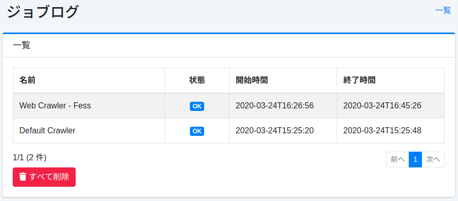
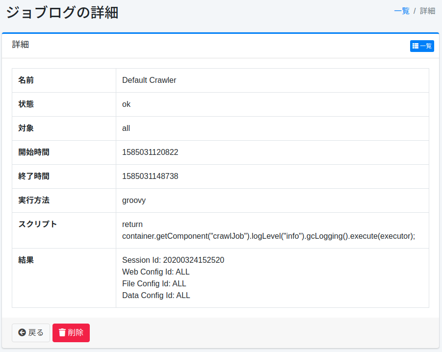

========
ジョブログ
========

概要
====

実行したジョブの結果を一覧として表示します。

管理方法
======

表示方法
------

下図のジョブログ確認ページを開くには、左メニューの [システム情報 > ジョブログ] をクリックします。

|image0|

ジョブログ詳細
-----------

ジョブのログ内容を確認できます。ジョブ名、ステータス、開始・完了時刻、結果などを表示します。

|image1|

名前
::::

実行されたジョブ名。

状態
::::

ジョブの実行結果。

対象
::::

ジョブの実行される対象。

開始時間
::::::

ジョブが開始したUNIX時間。

終了時間
::::::

ジョブが終了したUNIX時間。

実行方法
::::::

ジョブが実行された実行環境。

スクリプト
::::::::

ジョブの実行内容。

結果
::::

ジョブの実行結果。

