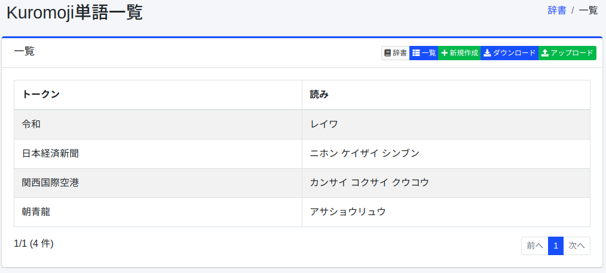
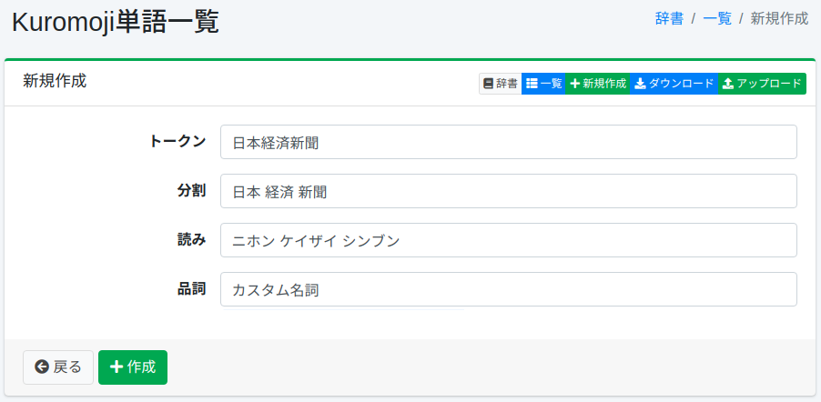

===========
Kuromoji辞書
===========

概要
====

人名、固有名詞、専門用語などを形態素解析用に登録することができます。

管理方法
======

表示方法
------

下図のKuromojiの設定一覧ページを開くには、左メニューの [システム > 辞書] を選択した後、kuromojiをクリックします。

|image0|

編集するには設定名をクリックします。

設定方法
------

Kuromojiの設定ページを開くには新規作成ボタンをクリックします。

|image1|

設定項目
------

トークン
::::::

形態素解析で処理する単語を入力します。

分割
::::

単語が複合語から構成される場合、分割した単語で検索されてもヒットするようにできます。
たとえば、「全文検索エンジン」を「全文 検索 エンジン」と入力することで、分割した単語でも検索できるようにします。

読み
::::

トークンとして入力した単語の読みをカタカナで入力します。
分割を行った場合は分割して入力します。
たとえば、「ゼンブン ケンサク エンジン」と入力します。

品詞
::::

入力した単語の品詞を入力します。

ダウンロード
=========

Kuromojiの辞書形式でダウンロードすることができます。

アップロード
=========

Kuromojiの辞書形式でアップロードすることができます。
Kuromojiの辞書形式はカンマ(,)区切りで、「トークン,分割トークン,分割トークンの読み,品詞」になります。
分割トークンはスペース区切りで分割します。
分割する必要がない場合はトークンと分割トークンは等しくなります。
たとえば、以下のようになります。

::

    朝青龍,朝青龍,アサショウリュウ,カスタム名詞
    関西国際空港,関西 国際 空港,カンサイ コクサイ クウコウ,カスタム名詞

