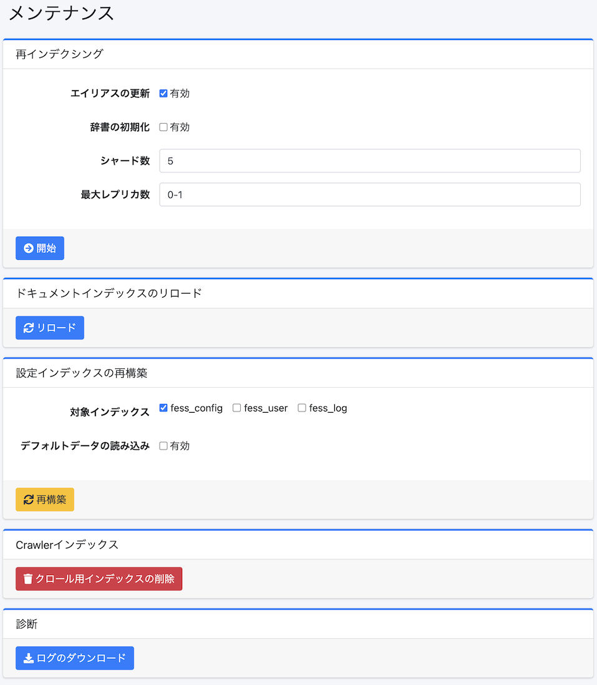

=========
メンテナンス
=========

概要
====

メンテナンスページはシステムのデータ操作を実行するときに利用します。

|image0|

操作方法
======

再インデクシング
------------

既存のfessインデックスから新しいインデックスを再作成することができます。
インデックスのマッピングを変更したい場合などで実行します。

設定項目
------

エイリアスの更新
::::::::::::

有効にすることで、再インデクシングが完了した後に既存のインデックスに割り当ててあるfess.searchとfess.updateのエイリアスを新しいインデックスに張り替えることができます。

辞書の初期化
:::::::::

有効にすることで、辞書の設定を初期化することができます。

シャード数
::::::::

OpenSearchのシャード数(index.number_of_shards)を指定することができます。

最大レプリカ数
:::::::::::

OpenSearchの最大レプリカ数(index.auto_expand_replicas)を指定することができます。

設定インデックスの再構築
--------------------------

設定インデックス（fess_config、fess_user、fess_log）を最新のマッピングで再構築することができます。
この操作はバックグラウンドで実行されます。実行する前には設定のバックアップ等を取得しておいてください。

対象インデックス
::::::::::::

再構築するインデックスを選択します。fess_config、fess_user、fess_logから選択できます。

デフォルトデータの読み込み
::::::::::::::::

有効にすることで、再構築時にデフォルトデータを読み込むことができます。既存のドキュメントは上書きされません。

ドキュメントインデックスのリロード
--------------------------

インデックスの設定を反映させるために、ドキュメントインデックスをリロードすることができます。

Crawlerインデックス
----------------

fess_crawlerインデックス(クロール情報)を削除することができます。
クローラーの実行中には実行しないください。

診断
----

ログファイルをzip形式でダウンロードすることができます。

