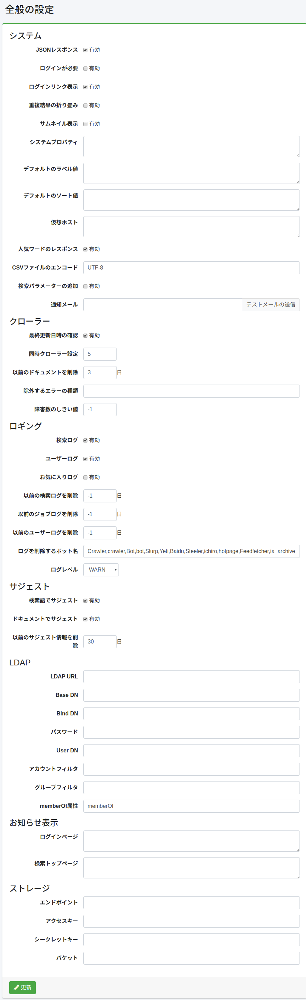

====
全般
====

概要
====

この管理ページでは、 |Fess| の設定を管理することができます。
|Fess| を再起動せずに |Fess| の様々な設定を変更できます。

|image0|

設定内容
======

システム
------

JSONレスポンス
::::::::::::

JSON APIを有効にするかを指定します。

ログインが必要
:::::::::::

検索機能をログインを必須にするかを指定します。

ログインリンク表示
::::::::::::::

検索画面でログインページヘのリンクを表示するかどうかを設定します。

重複結果の折り畳み
::::::::::::::

重複結果を折り畳みを有効にするかを設定します。

サムネイル表示
:::::::::::

サムネイル表示を有効にするかを設定します。

デフォルトのラベル値
:::::::::::::::

デフォルトで検索条件に追加するラベル値を記述します。
ロールやグループ単位で指定する場合は、「role:admin=label1」のように role: または group: を付加して指定します。

デフォルトのソート値
:::::::::::::::

デフォルトで検索条件に追加するソート値を記述します。
ロールやグループ単位で指定する場合は、「role:admin=content_length.desc」のように role: または group: を付加して指定します。

仮想ホスト
::::::::

仮想ホストを設定します。
詳しくは :doc:`設定ガイドの仮想ホスト <../config/security-virtual-host>` を参照してください。

人気ワードのレスポンス
:::::::::::::::::

人気ワード APIを有効にするかを指定します。

CSVファイルのエンコード
::::::::::::::::::

ダウンロードするCSVファイルのエンコーディングを指定します。

検索パラメーターの追加
:::::::::::::::::

検索結果表示にパラメーターを渡す場合に有効にします。

検索ファイルプロキシ
:::::::::::::::

検索結果のファイルプロキシを有効にするかを指定します。

ブラウザロケールを使用
:::::::::::::::::

検索時にブラウザのロケールを使用するかを指定します。

SSOタイプ
::::::::

シングルサインオンのタイプを指定します。

- **None**: SSOを使用しない
- **OpenID Connect**: OpenID Connectを使用
- **SAML**: SAMLを使用
- **SPNEGO**: SPNEGOを使用
- **Entra ID**: Microsoft Entra IDを使用

クローラー
--------

最終更新日時の確認
::::::::::::::

差分クロールを行う場合に有効にします。

同時クローラー設定
::::::::::::::

同時に実行するクロール設定数を指定します。

ユーザーエージェント
:::::::::::::::

クローラーが使用するユーザーエージェント名を指定します。

以前のドキュメントを削除
::::::::::::::::::

インデックス後の有効期間の日数を指定します。

除外するエラーの種別
:::::::::::::::

しきい値を超える障害URLはクロール対象から除外されますが、ここで指定された例外名などはしきい値を超える障害URLでもクロール対象になります。

障害数のしきい値
::::::::::::

クロール対象のドキュメントがここで指定された回数以上に障害URLに記録された場合は次回のクロールで対象外になります。

ロギング
------

検索ログ
::::::

検索ログの記録を有効にするかを指定します。

ユーザログ
::::::::

ユーザーログの記録を有効にするかを指定します。

お気に入りログ
:::::::::::

お気に入りログの記録を有効にするかを指定します。

以前の検索ログを削除
:::::::::::::::

指定された日数以前の検索ログを削除します。

以前のジョブログを削除
:::::::::::::::::

指定された日数以前のジョブログを削除します。

以前のユーザーログを削除
::::::::::::::::::

指定された日数以前のユーザーログを削除します。

ログを削除するボット名
:::::::::::::::::

検索ログから除外するボット名を指定します。

ログレベル
::::::::

fess.logのログレベルを指定します。

ログ通知
::::::

ERROR や WARN レベルのログイベントを自動的に捕捉して通知する機能を有効にするかを指定します。
詳しくは :doc:`設定ガイドのログ通知 <../config/admin-log-notification>` を参照してください。

ログ通知レベル
:::::::::::

ログ通知の対象とするログレベルを指定します。
選択したレベル以上のログイベントが通知されます。

- **ERROR**: エラーのみ通知（デフォルト）
- **WARN**: 警告以上を通知
- **INFO**: 情報以上を通知
- **DEBUG**: デバッグ以上を通知
- **TRACE**: すべてのログを通知

サジェスト
--------

検索語でサジェスト
::::::::::::::

検索ログからサジェスト候補を生成するかを指定します。

ドキュメントでサジェスト
::::::::::::::::::

インデックスしたドキュメントからサジェスト候補を生成するかを指定します。

以前のサジェスト情報を削除
::::::::::::::::::::

指定された日数以前のサジェストデータを削除します。

LDAP
----

LDAP URL
::::::::

LDAPサーバのURLを指定します。

Base DN
:::::::

検索画面にログインするベースの識別名を指定します。

Bind DN
:::::::

管理者のBind DNを指定します。

パスワード
::::::::

Bind DNのパスワードを指定します。

User DN
:::::::

ユーザーの識別名を指定します。

アカウントフィルター
:::::::::::::::

ユーザーのCommon Nameやuidなど指定します。

グループフィルター
::::::::::::::

取得したいグループのフィルター条件を指定します。

memberOf属性
:::::::::::

LDAPサーバで利用できるmemberOf属性名を指定します。
Active Directoryの場合、memberOfです。
その他のLDAPサーバではisMemberOfの場合もあります。

セキュリティ認証
::::::::::::

LDAPのセキュリティ認証方式を指定します（例: simple）。

初期コンテキストファクトリ
::::::::::::::::::::::

LDAPの初期コンテキストファクトリクラスを指定します（例: com.sun.jndi.ldap.LdapCtxFactory）。

OpenID Connect
--------------

クライアントID
:::::::::::

OpenID ConnectプロバイダーのクライアントIDを指定します。

クライアントシークレット
::::::::::::::::::

OpenID Connectプロバイダーのクライアントシークレットを指定します。

認証サーバーURL
::::::::::::

OpenID Connectの認証サーバーURLを指定します。

トークンサーバーURL
::::::::::::::

OpenID ConnectのトークンサーバーURLを指定します。

リダイレクトURL
::::::::::::

OpenID ConnectのリダイレクトURLを指定します。

スコープ
::::::

OpenID Connectのスコープを指定します。

ベースURL
::::::::

OpenID ConnectのベースURLを指定します。

デフォルトグループ
::::::::::::::

OpenID Connect認証時にユーザーに割り当てるデフォルトグループを指定します。

デフォルトロール
::::::::::::

OpenID Connect認証時にユーザーに割り当てるデフォルトロールを指定します。

SAML
----

SPベースURL
::::::::::

SAML Service ProviderのベースURLを指定します。

グループ属性名
:::::::::::

SAMLレスポンスからグループを取得するための属性名を指定します。

ロール属性名
:::::::::

SAMLレスポンスからロールを取得するための属性名を指定します。

デフォルトグループ
::::::::::::::

SAML認証時にユーザーに割り当てるデフォルトグループを指定します。

デフォルトロール
::::::::::::

SAML認証時にユーザーに割り当てるデフォルトロールを指定します。

SPNEGO
------

Krb5設定
:::::::

Kerberos 5設定ファイルのパスを指定します。

ログイン設定
:::::::::

JAAS（Java Authentication and Authorization Service）ログイン設定ファイルのパスを指定します。

ログインクライアントモジュール
::::::::::::::::::::::::

JAASのクライアントログインモジュール名を指定します。

ログインサーバーモジュール
::::::::::::::::::::::

JAASのサーバーログインモジュール名を指定します。

事前認証ユーザー名
::::::::::::::

SPNEGO事前認証に使用するユーザー名を指定します。

事前認証パスワード
::::::::::::::

SPNEGO事前認証に使用するパスワードを指定します。

Basic認証許可
::::::::::

Basic認証によるフォールバックを許可するかを指定します。

非セキュアBasic認証許可
:::::::::::::::::

非セキュア（HTTP）接続でのBasic認証を許可するかを指定します。

NTLMプロンプト
:::::::::::

NTLMプロンプトを有効にするかを指定します。

ローカルホスト許可
::::::::::::::

ローカルホストからのアクセスを許可するかを指定します。

委任許可
::::::

Kerberos委任を許可するかを指定します。

除外ディレクトリ
::::::::::::

SPNEGO認証から除外するディレクトリを指定します。

Entra ID
--------

クライアントID
:::::::::::

Microsoft Entra IDのアプリケーション（クライアント）IDを指定します。

クライアントシークレット
::::::::::::::::::

Microsoft Entra IDのクライアントシークレットを指定します。

テナント
::::::

Microsoft Entra IDのテナントIDを指定します。

認証局
:::::

Microsoft Entra IDの認証局URLを指定します。

応答URL
::::::

Microsoft Entra IDの応答（リダイレクト）URLを指定します。

ステートTTL
:::::::::

認証ステートの有効期間（TTL）を指定します。

デフォルトグループ
::::::::::::::

Entra ID認証時にユーザーに割り当てるデフォルトグループを指定します。

デフォルトロール
::::::::::::

Entra ID認証時にユーザーに割り当てるデフォルトロールを指定します。

パーミッションフィールド
::::::::::::::::::

Entra IDからパーミッション情報を取得するフィールドを指定します。

ドメインサービス使用
:::::::::::::::

Entra IDドメインサービスを使用するかを指定します。

お知らせ表示
---------

ログインページ
:::::::::::

ログイン画面に表示するメッセージを記述します。

検索トップページ
::::::::::::

検索トップ画面に表示するメッセージを記述します。

詳細検索ページ
:::::::::::

詳細検索画面に表示するメッセージを記述します。

通知
----

通知メール
::::::::

クロール完了時に通知するメールアドレスを指定します。
カンマ区切りで複数指定が可能です。使用するためにはメールサーバが必要です。

Slack Webhook URL
:::::::::::::::::

Slackへの通知に使用するWebhook URLを指定します。

Google Chat Webhook URL
:::::::::::::::::::::::

Google Chatへの通知に使用するWebhook URLを指定します。

ストレージ
--------

各項目を設定後、左メニューに [システム > ストレージ] というメニューが表示されるようになります。
ファイル管理については :doc:`ストレージ <../admin/storage-guide>` を参照してください。

タイプ
::::

ストレージのタイプを指定します。
「自動」を選択すると、エンドポイントから自動的にストレージタイプを判定します。

- **自動**: エンドポイントから自動判定
- **S3**: Amazon S3
- **GCS**: Google Cloud Storage

バケット
::::::

管理するバケット名を指定します。

エンドポイント
:::::::::::

ストレージサーバのエンドポイントURLを指定します。

- S3: 空欄の場合はAWSデフォルトエンドポイントを使用
- GCS: 空欄の場合はGoogle Cloudデフォルトエンドポイントを使用
- MinIO等: MinIOサーバのエンドポイントURL

アクセスキー
::::::::::

S3またはS3互換ストレージのアクセスキーを指定します。

シークレットキー
:::::::::::::

S3またはS3互換ストレージのシークレットキーを指定します。

リージョン
::::::::

S3のリージョンを指定します（例: ap-northeast-1）。

プロジェクトID
:::::::::::

GCSのGoogle CloudプロジェクトIDを指定します。

認証情報パス
::::::::::

GCS用のサービスアカウント認証情報JSONファイルのパスを指定します。

例
==

LDAPの設定例
----------

.. tabularcolumns:: |p{4cm}|p{4cm}|p{4cm}|
.. list-table:: LDAP/Active Directory の設定
   :header-rows: 1

   * - 名前
     - 値 (LDAP)
     - 値 (Active Directory)
   * - LDAP URL
     - ldap://SERVERNAME:389
     - ldap://SERVERNAME:389
   * - Base DN
     - cn=Directory Manager
     - dc=fess,dc=codelibs,dc=org
   * - Bind DN
     - uid=%s,ou=People,dc=fess,dc=codelibs,dc=org
     - manager@fess.codelibs.org
   * - User DN
     - uid=%s,ou=People,dc=fess,dc=codelibs,dc=org
     - %s@fess.codelibs.org
   * - アカウントフィルター
     - cn=%s または uid=%s
     - (&(objectClass=user)(sAMAccountName=%s))
   * - グループフィルター
     -
     - (member:1.2.840.113556.1.4.1941:=%s)
   * - memberOf
     - isMemberOf
     - memberOf

.. pdf            :height: 940 px
