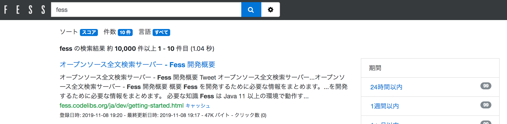

========
検索機能
========

概要
====

|Fess| は強力な全文検索機能を提供します。
本セクションでは、検索機能の詳細設定と利用方法について説明します。

検索結果件数の表示
==================

デフォルトの動作
----------------

``query.track.total.hits`` のデフォルト値は ``10000`` です。
このため、検索結果が 10,000 件を超える場合、検索結果画面での件数表示は「約 10,000 件以上」と表示されます。
これは、OpenSearch が正確な総ヒット件数を数える上限を ``query.track.total.hits`` の値に制限することで、大規模な検索でのパフォーマンスへの影響を抑えるためのデフォルト設定です。

検索例

|image0|

正確なヒット件数の表示
----------------------

より大きな件数まで正確なヒット件数を表示する場合は、``fess_config.properties`` で ``query.track.total.hits`` の値を変更します。

::

    query.track.total.hits=100000

上記の例では、最大 100,000 件までの正確なヒット件数を取得できます。
件数表示が「約 N 件以上」となるしきい値も、この設定値に連動して変化します。
ただし、大きな値を設定するとパフォーマンスに影響する可能性があります。

.. warning::
   値を大きくしすぎると検索パフォーマンスが低下する可能性があります。
   実際の利用状況に応じて適切な値を設定してください。

検索オプション
==============

基本的な検索
------------

|Fess| では、検索ボックスにキーワードを入力するだけで全文検索が実行されます。
複数のキーワードを入力すると、AND検索が実行されます。

::

    検索 エンジン

上記の例では、「検索」と「エンジン」の両方を含むドキュメントが検索されます。

OR検索
------

OR検索を実行する場合は、キーワード間に ``OR`` を挿入します。

::

    検索 OR エンジン

NOT検索
-------

特定のキーワードを除外する場合は、キーワードの前に ``-`` (マイナス記号)を付けます。

::

    検索 -エンジン

フレーズ検索
------------

完全一致のフレーズを検索する場合は、ダブルクォーテーションで囲みます。

::

    "検索エンジン"

フィールド指定検索
------------------

特定のフィールドを指定して検索することができます。

::

    title:検索エンジン
    url:https://fess.codelibs.org/

主なフィールド:

- ``title``: ドキュメントのタイトル
- ``content``: ドキュメントの本文
- ``url``: ドキュメントのURL
- ``filetype``: ファイルタイプ(例: pdf, html, doc)
- ``label``: ラベル(分類)
- ``mimetype``: MIMEタイプ(例: text/html, application/pdf)
- ``filename``: ファイル名
- ``host``: ホスト名
- ``site``: サイト(ホスト名とパスの組み合わせ)
- ``lang``: 言語

検索対象とするフィールドは、``fess_config.properties`` の ``query.additional.search.fields`` で追加できます。

ワイルドカード検索
------------------

ワイルドカードを使用した検索が可能です。

- ``*``: 0文字以上の任意の文字列
- ``?``: 任意の1文字

::

    検索*
    検索?ジン

ファジー検索
------------

スペルミスや表記揺れに対応したファジー検索が利用できます。
デフォルトでは、4文字以上のキーワードに対して、通常の検索に加えてファジー検索が追加で実行されます。

::

    検索エンジン~

``~`` の後に数値を指定することで、編集距離を指定できます。

検索結果のソート
================

検索結果は、デフォルトでは関連度順にソートされます。
管理画面の設定やAPIパラメータで、以下のようなソート順を指定できます。

- 関連度順(``score``、デフォルト)
- 更新日時順(``last_modified``)
- 作成日時順(``created``)
- ファイルサイズ順(``content_length``)
- ファイル名順(``filename``)
- クリック数順(``click_count``)
- お気に入り数順(``favorite_count``)

ソート対象とするフィールドは、``fess_config.properties`` の ``query.additional.sort.fields`` で追加できます。

ファセット検索
==============

ファセット検索を使用すると、検索結果をカテゴリ別に絞り込むことができます。
デフォルトでは、ラベル(label)フィールドがファセットとして設定されています。

検索画面の左側に表示されるファセットをクリックすることで、検索結果を絞り込むことができます。

検索結果のハイライト
====================

検索キーワードは、検索結果のタイトルと要約部分でハイライト表示されます。
ハイライトの設定は ``fess_config.properties`` でカスタマイズできます。

::

    query.highlight.tag.pre=<strong>
    query.highlight.tag.post=</strong>
    query.highlight.fragment.size=60
    query.highlight.number.of.fragments=2

- ``query.highlight.tag.pre`` / ``query.highlight.tag.post``: ハイライト箇所を囲むタグ(デフォルト: ``<strong>`` / ``</strong>``)
- ``query.highlight.fragment.size``: ハイライトする断片(フラグメント)の文字数(デフォルト: ``60``)
- ``query.highlight.number.of.fragments``: 表示するフラグメントの最大数(デフォルト: ``2``)

要約(スニペット)としてハイライトの対象となるフィールドは、``query.highlight.content.description.fields``\ (デフォルト: ``hl_content,digest``)で指定します。

サジェスト機能
==============

検索ボックスに文字を入力すると、サジェスト(入力補完)が表示されます。
サジェストは、過去の検索キーワードや人気のある検索キーワードに基づいて生成されます。

サジェスト機能は、管理画面の「全般」設定で有効/無効を切り替えることができます。

検索ログ
========

|Fess| は、すべての検索クエリとクリックログを記録します。
これらのログは、以下の目的で使用できます。

- 検索品質の分析と改善
- ユーザー行動の分析
- 人気の検索キーワードの把握
- 検索結果が0件のキーワードの特定

検索ログとクリックログは、OpenSearch の ``fess_log`` プレフィックスを持つインデックスに保存されます
(検索クエリは ``fess_log.search_log``、クリックログは ``fess_log.click_log`` インデックス)。
これらのログは OpenSearch Dashboards を用いて可視化・分析できます。
|Fess| には可視化用のダッシュボード定義ファイルが同梱されています。詳細は :doc:`admin-opensearch-dashboards` を参照してください。

パフォーマンスチューニング
==========================

検索タイムアウトの設定
----------------------

検索のタイムアウト時間を設定できます。デフォルトは10秒です。

::

    query.timeout=10000

検索クエリの最大文字数
----------------------

セキュリティとパフォーマンスのため、検索クエリの最大文字数を制限できます。

::

    query.max.length=1000

キャッシュの利用
----------------

|Fess| 自体には、検索結果(検索レスポンス)をキャッシュする機能はありません。
ただし、バックエンドの OpenSearch がシャードリクエストキャッシュやクエリキャッシュをエンジンレベルで提供しており、同一条件の検索に対するレスポンス時間の短縮に寄与します。
これらは OpenSearch 側の機能であるため、必要に応じて OpenSearch の設定で調整してください。

トラブルシューティング
======================

検索結果が表示されない
----------------------

1. インデックスが正しく作成されているか確認してください。
2. クロールが正常に完了しているか確認してください。
3. ロール／権限ベースの検索フィルタリングにより、現在のユーザー(ゲストを含む)に対して対象ドキュメントが除外されていないか確認してください。
4. OpenSearch が正常に動作しているか確認してください。

検索速度が遅い
--------------

1. OpenSearch のヒープメモリサイズを確認してください。
2. インデックスのシャード数とレプリカ数を最適化してください。
3. 検索クエリの複雑さを確認してください。
4. ハードウェアリソース(CPU、メモリ、ディスクI/O)を確認してください。

関連性の低い結果が表示される
----------------------------

1. ブースト設定を調整してください(``query.boost.title``, ``query.boost.content``\ など)。
2. ファジー検索の設定を見直してください。
3. Analyzer の設定を確認してください。
4. 必要に応じて、商用サポートにご相談ください。
5. Rank Fusionを活用して検索精度を向上させることもできます。詳細は :doc:`rank-fusion` を参照してください。
