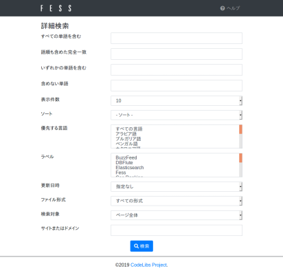

======
詳細検索
======

詳細検索画面では、複数の条件を組み合わせたより高度な検索ができます。

利用方法
------

詳細検索画面は、検索画面の検索オプション内にある「詳細検索」のリンクからアクセスできます。検索結果画面から開いた場合は、入力済みの検索キーワードが「すべての単語を含む」欄に引き継がれます。

|image0|

各項目に条件を入力し、ページ下部の「検索」ボタンを押すことで検索できます。入力した複数の項目は組み合わされて1つの検索条件になります。

項目一覧
------

すべての単語を含む
::::::::::::::

入力した単語をすべて含むドキュメントを検索します（AND検索）。単語はスペースで区切って複数指定できます。

語順も含めた完全一致
:::::::::::::::

入力した文字列を語順も含めて完全に含む（フレーズ検索）ドキュメントを検索します。スペースを含む文字列全体が1つのフレーズとして扱われるため、単語ごとに区切って検索することはできません。

いずれかの単語を含む
:::::::::::::::

入力した単語のいずれかを含むドキュメントを検索します（OR検索）。単語はスペースで区切って複数指定できます。

含めない単語
:::::::::

入力した単語を含まないドキュメントを検索します。単語はスペースで区切って複数指定でき、指定したすべての単語が検索結果から除外されます。

表示件数
::::::

1ページに表示する検索結果の件数を指定できます。10、20、30、40、50、100件から選択できます。指定しない場合は、既定の表示件数（初期値は10件）が使用されます。

ソート
:::::

検索結果を並び替える基準を指定できます。スコア順、ファイル名、日付、サイズ、最終更新日時から選択でき、それぞれ昇順・降順を指定できます。クリック数やお気に入り数による並び替えは、対応する機能が有効な場合に選択できます。

優先する言語
:::::::::

検索結果で優先する言語を指定できます。複数の言語を選択することもできます。「すべての言語」を選択した場合は、特定の言語を優先しません。

ラベル
:::::

ラベルで絞り込み検索ができます。複数のラベルを選択することもできます。ラベルが登録されていない場合や、現在のユーザーが参照できるラベルがない場合は表示されません。

更新日時
::::::

ドキュメントの更新日時で絞り込み検索ができます。「指定なし」「24時間以内」「1週間以内」「1ヶ月以内」「1年以内」から選択できます。

ファイル形式
:::::::::

ドキュメントのファイル形式で絞り込み検索ができます。「すべての形式」「HTML」「PDF」「MS Word」「MS Excel」「MS PowerPoint」から選択できます。

検索対象
::::::

検索する対象を指定できます。「ページ全体」「ページ内のタイトル」「ページ内のURL」から選択できます。「ページ内のタイトル」または「ページ内のURL」を指定すると、入力した単語をタイトルまたはURLのみから検索します。

サイトまたはドメイン
:::::::::::::::

入力したサイトまたはドメインで絞り込み検索ができます。特定のサイトやドメインに含まれるドキュメントのみを検索したい場合に指定します。

