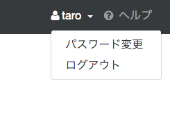
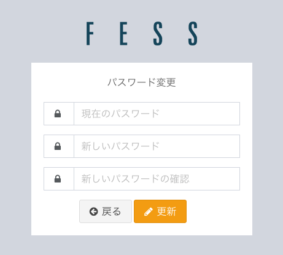

========
ロール検索
========

|Fess| はユーザー管理機能を提供しており、ログインしたユーザーは自分が所属するロールに基づいて検索できます。|Fess| で管理しているユーザーは、ログイン後にロール検索を利用したり、自分のパスワードを変更したりできます。

ロール検索では、コンテンツに設定されたパーミッション（ロール・グループ・ユーザー）と、検索するユーザーが持つパーミッションを照合し、アクセスが許可されたコンテンツだけを検索結果に表示します。ロールやユーザーの作成方法、およびコンテンツへのパーミッションの割り当て方法など、ロールベース検索の設定については :doc:`../config/security-role` を参照してください。

検索方法
------

ロールを設定して、クロールおよびインデックスしてある状態であれば、検索結果はそのロールを保持したユーザーだけに表示することができます。
ユーザーがログインしている場合は、そのユーザーが所属するロールやグループに基づいて検索が行われます。
ログインしていない場合は guest ユーザーとして検索され、guest 向けに公開されたコンテンツのみが表示されます。

ログイン
------

検索画面の上部に表示されるログインリンクをクリックすると、ログイン画面が表示されます。ユーザー名とパスワードを入力してログインすると検索画面に戻り、以降の検索はそのユーザーが所属するロールに基づいて行われます。

.. note::
    シングルサインオンや LDAP と連携している場合は、それぞれの認証方式でログインします。また、ログインリンクの表示有無は設定により変更できます。

パスワードの変更
------------

ログイン後、検索画面の上部に表示されるユーザー名をクリックすると、メニューが表示されます。

|image0|

メニューの中から「パスワード変更」をクリックすると、パスワードの変更画面が表示されます。

|image1|

現在のパスワード、新しいパスワード、および確認用の新しいパスワード（再入力）を入力して、更新ボタンをクリックすることでパスワードが更新されます。
パスワードの変更後、戻るボタンをクリックすることで検索画面に戻ることができます。

.. note::
    「パスワード変更」メニューは、|Fess| で管理しているユーザー（および編集が許可された LDAP ユーザー）にのみ表示されます。シングルサインオンで認証したユーザーには表示されません。
    新しいパスワードには、長さや使用できる文字種などのパスワードポリシーが適用される場合があります。

ログアウト
--------

ログインしている状態で検索画面の上部に表示されるユーザー名をクリックし、メニューの中から「ログアウト」を選択することでログアウトできます。
管理者権限を持つユーザーの場合は、同じメニューから「管理」を選択して管理画面に移動することもできます。

.. pdf   :width: 200 px

.. pdf   :width: 300 px
