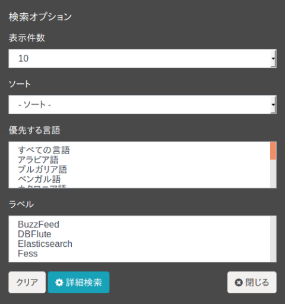

===========
ラベル指定検索
===========

ラベル指定検索 (カテゴリ検索)
=======================

検索対象のドキュメントにカテゴリ分けするためのラベル情報を付加することで、検索時にラベルを指定した絞り込み検索が可能です。ラベルを利用すると、たとえば部署やサイト、ドキュメントの種類ごとに検索範囲を限定できます。

ラベルは管理画面であらかじめ登録しておくことで、検索画面でラベルによる絞り込みが利用できるようになります。利用可能なラベルは検索時にプルダウンで複数選択でき、複数のラベルを選択した場合は、いずれかのラベルが付与されたドキュメントが検索対象になります。ラベルを登録していない場合は、ラベルのプルダウンボックスは表示されません。

.. note::
    ラベルにはパーミッションを設定できるため、検索するユーザーがアクセスを許可されたラベルだけがプルダウンに表示されます。また、仮想ホストやロケール（言語）によって表示されるラベルが切り替わる場合もあります。そのため、ラベルを登録していても、ユーザーによってはプルダウンに表示されないことがあります。

ラベルは、ラベルを付加する対象を URL のパスの正規表現で指定して定義します。ラベルの登録方法や設定項目については、:doc:`ラベルの管理ガイド <../admin/labeltype-guide>` を参照してください。

利用方法
------

検索時にラベル情報を選択することができます。ラベル情報は「オプション」ボタンを押下することで表示される検索オプション内で選択することができます。

|image0|

ラベルを設定してインデックスを作成することで、ラベルが設定されたドキュメントごとに検索をすることができます。ラベルを指定しない検索は通常と同様の全件検索になります。

ドキュメントへのラベルの付与は、クロールしてインデックスを作成するときに、ドキュメントの URL とラベルに設定されたパスを照合して行われます。そのため、ラベルの定義（対象とするパスや除外するパス）を追加・変更した場合、その内容はすでにインデックスされているドキュメントには自動では反映されません。変更を反映するには、対象のドキュメントを再度クロールするか、スケジューラに登録されている「Label Updater」ジョブを実行してインデックスを更新してください。

.. pdf   :width: 300 px
