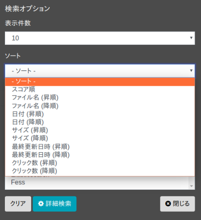

========
ソート検索
========

検索日時などのフィールドを指定して検索結果をソートすることができます。

ソート対象フィールド
---------------

デフォルトでは以下のフィールドを指定してソートすることができます。

.. list-table::
   :header-rows: 1

   * - フィールド名
     - 説明
   * - created
     - クロールした日時
   * - content_length
     - クロールしたドキュメントサイズ
   * - last_modified
     - クロールしたドキュメントの最終更新日時
   * - filename
     - ファイル名
   * - score
     - スコア値
   * - timestamp
     - ドキュメントをインデックスした日時
   * - click_count
     - ドキュメントをクリックした回数 
   * - favorite_count
     - ドキュメントをお気に入りした回数

表: ソート対象フィールド一覧

独自のフィールドをソート対象として追加することもできます。追加するには ``fess_config.properties`` の ``query.additional.sort.fields`` に、ソート対象としたいフィールド名をカンマ区切りで指定します（初期値は空です）。ここで指定したフィールドは上記の標準フィールドに追加され、ソートに利用できるようになります。なお、ソート対象とするフィールドは、あらかじめインデックスに登録されている必要があります。

利用方法
------

検索時にソート条件を選択することができます。ソート条件はオプションボタンを押下することで表示される検索オプションダイアログで選択することができます。

|image0|

また、検索フィールドでソートをする場合は、「sort:フィールド名」のようにsortとフィールド名をコロン(:)で区切って検索フォームに入力して検索します。

以下は fess を検索語として、ドキュメントサイズを昇順にソートします。

::

    fess sort:content_length

降順にソートする場合は、フィールド名の後ろに ``.desc`` を付けます。

::

    fess sort:content_length.desc

フィールド名の後ろに指定できるのは ``.asc`` （昇順）または ``.desc`` （降順）で、省略した場合は昇順になります。

複数のフィールドでソートする場合は、以下のように , 区切りで指定します。先に指定したフィールドが優先され、その値が同じドキュメント同士が次のフィールドで並び替えられます。

::

    fess sort:content_length.desc,last_modified

.. note::
   ソート対象フィールド一覧にないフィールド名や、 ``asc`` ・ ``desc`` 以外のソート順を指定した場合は、検索がエラーになります。

.. pdf            :width: 300 px
