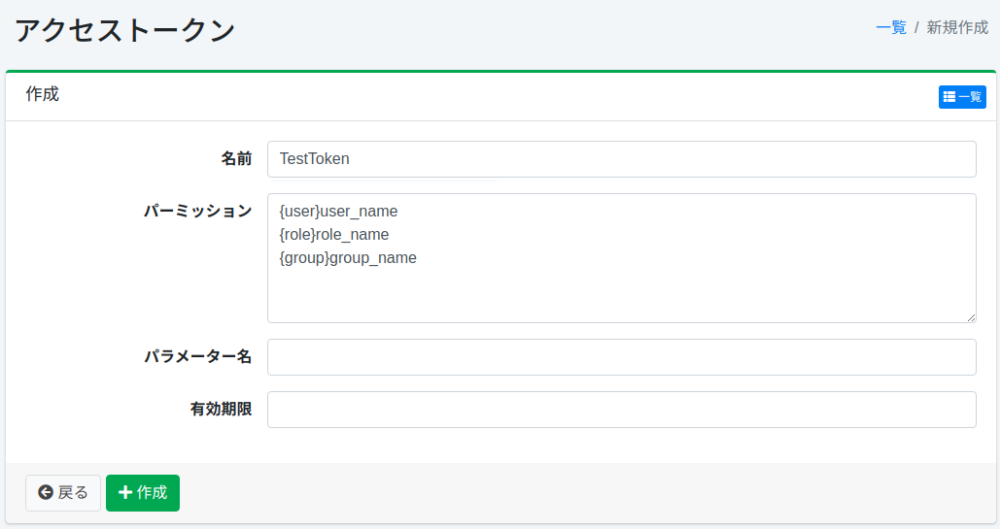
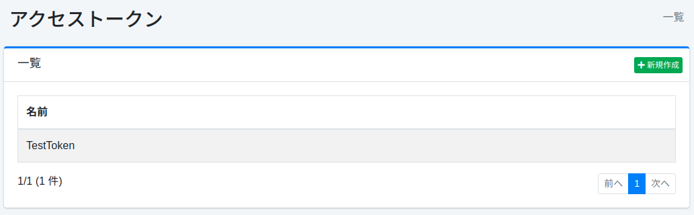

============
アクセストークン
============

概要
====

アクセストークン設定ページではアクセストークンを管理します。

管理方法
======

表示方法
------

下図のアクセストークンの設定一覧ページを開くには、左メニューの[システム>アクセストークン] をクリックします。

|image0|

編集するには設定名をクリックします。

設定の作成
--------

アクセストークンの設定ページを開くには新規作成ボタンをクリックします。

|image1|

設定項目
------

名前
::::

このアクセストークンを説明するための名前を指定します。

パーミッション
:::::::::::

アクセストークンのパーミッションを設定します。
「{user\ |group|\ role}name」形式で記述します。
たとえば、developerグループに属するユーザーが検索結果を表示するためには、パーミッションは「{group}developer」を設定します。

.. warning::

   パーミッションに ``{role}admin-api`` を指定したアクセストークン（内部的には ``Radmin-api`` として保存されます）は、Admin API のすべてのエンドポイントを利用できます。詳しくは :doc:`../api/admin/api-admin-overview` を参照してください。``admin-accesstoken`` ロールを持つユーザーはこのトークンを発行でき、``admin-accesstoken-view`` ロールを持つユーザーはトークンの値を表示できるため、この 2 つのロールは管理者ロールと同等として扱い、信頼できる運用担当者にのみ付与してください。

パラメーター名
:::::::::::

検索クエリーとしてパーミッションを指定する場合のリクエストパラメーター名を指定します。

.. warning::

   パラメーター名機能は、信頼された内部環境でのみ使用することを想定した機能です。
   この機能を有効にすると、URLパラメーターを通じて追加のパーミッションを指定できるようになりますが、
   外部からアクセス可能な環境やパブリックAPIとして公開されている環境では、
   悪意のあるユーザーによってURLパラメーターが操作され、本来持たない権限に昇格される可能性があります。

   以下の点に注意してください:

   * この機能は、Fessが他のアプリケーションやサービスに組み込まれ、そのアプリケーションがリクエストを完全に制御する場合にのみ使用してください。
   * Fessが信頼できないネットワークに公開されている場合は、パラメーター名を設定しないでください。
   * アクセストークンを使用する際は、外部ユーザーによってURLパラメーターが操作できないことを確認してください。

有効期限
::::::

アクセストークンの有効期限を指定します。

設定の削除
--------

一覧ページの設定名をクリックし、削除ボタンをクリックすると確認画面が表示されます。
削除ボタンを押すと設定が削除されます。

