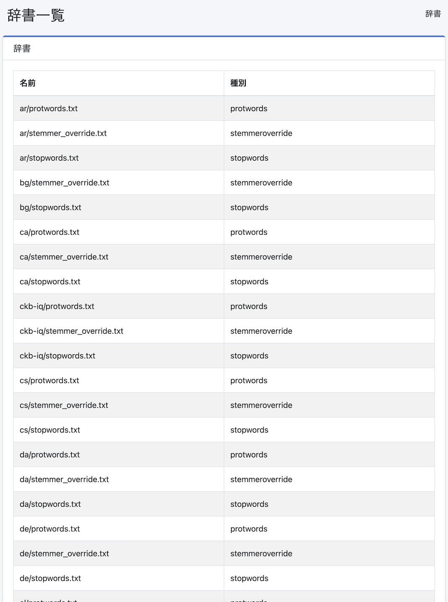

====
辞書
====

概要
====

ここでは、辞書に関する設定について説明します。

辞書の変更は各辞書に関する仕様を理解した上で実施してください。
辞書の変更に失敗するとインデックスにアクセスできなくなる場合があります。

一覧
====

下図の管理可能な辞書一覧ページを開くには、左メニューの [システム > 辞書] をクリックします。

|image0|

辞書が効く範囲と反映のタイミング
================================

辞書ごとに、効くフィールドと反映されるタイミングが異なります。
辞書を編集したのに検索結果が変わらない場合は、まずこの表を確認してください。

.. list-table::
   :header-rows: 1
   :widths: 22 26 28 24

   * - 辞書
     - ファイル
     - 効くフィールド
     - 反映のタイミング
   * - Kuromoji
     - ``ja/kuromoji.txt``
     - ``content_ja`` などの ``_ja`` フィールドのみ
     - インデックス時（再クロールが必要）
   * - 同義語
     - ``synonym.txt``
     - ``content`` ・ ``title``
     - 検索時（再クロール不要）
   * - マッピング（言語共通）
     - ``mapping.txt``
     - ``content`` ・ ``title``
     - インデックス時（再クロールが必要）
   * - マッピング（言語別）
     - ``ja/mapping.txt``
     - ``content_ja`` などの ``_ja`` フィールドのみ
     - インデックス時（再クロールが必要）
   * - Protwords
     - ``en/protwords.txt``
     - ``content`` ・ ``title``
     - インデックス時と検索時
   * - ストップワード
     - ``en/stopwords.txt``
     - ``content`` ・ ``title``
     - インデックス時と検索時
   * - Stemmer上書き
     - ``en/stemmer_override.txt``
     - ``content`` ・ ``title``
     - インデックス時と検索時

.. note::

   アナライザーはインデックスを開くときに構築されるため、辞書ファイルを更新しても
   **インデックスを close / open するまで反映されません**\ 。
   さらに「インデックス時」に効く辞書は、すでにインデックス済みの文書には遡及しないので、
   対象を再クロールする必要があります。

.. warning::

   全文検索の中心となる ``content`` フィールドに効く文字置換辞書は\ **ルートの**
   ``mapping.txt`` であり、 ``ja/mapping.txt`` ではありません。
   同じ「マッピング」という名前ですが、別のファイルです。

Kuromoji ユーザー辞書と検索結果
-------------------------------

``content`` フィールドは standard トークナイザーと ``cjk_bigram`` で解析されるため、
Kuromoji の形態素解析の分割結果には影響されません。日本語の複合語を Kuromoji ユーザー辞書に
登録して再クロールしても、 ``content`` に対する検索の結果は変わりません。
登録の効果が現れるのは ``content_ja`` で、このフィールドはリクエストの言語に応じて
検索条件に加わります。

Kuromoji
========

日本語形態素解析用の辞書を管理します。
ja/kuromoji.txt は日本語の形態素解析用辞書になります。

同義語
=====

同義語辞書の管理をします。
synonym.txtは言語共通で利用される同義語辞書ファイルになります。

マッピング
========

文字置換辞書の管理をします。
mapping.txtは言語共通または各言語用の単語置換辞書ファイルになります。

Protwords
=========

保護単語辞書の管理をします。
protwords.txtは各言語用に配置して、ステミングの対象外などにするための単語一覧ファイルになります。

ストップワード
===========

ストップワード辞書の管理をします。
stopwords.txtは各言語用に配置して、インデックス作成時に除外するための単語一覧ファイルになります。

Stemmer上書き
============

Stemmer上書き辞書の管理をします。
stemmer_override.txtは各言語用に配置して、ステミング処理を上書きするための単語置換辞書ファイルになります。

