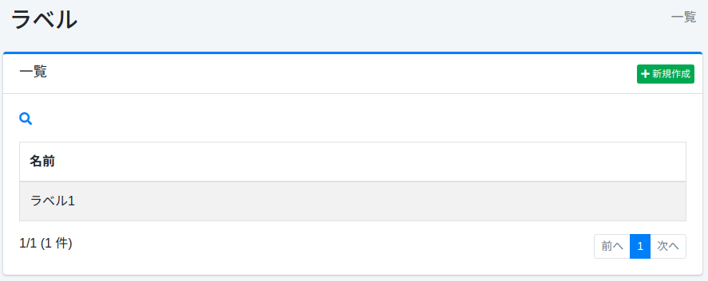
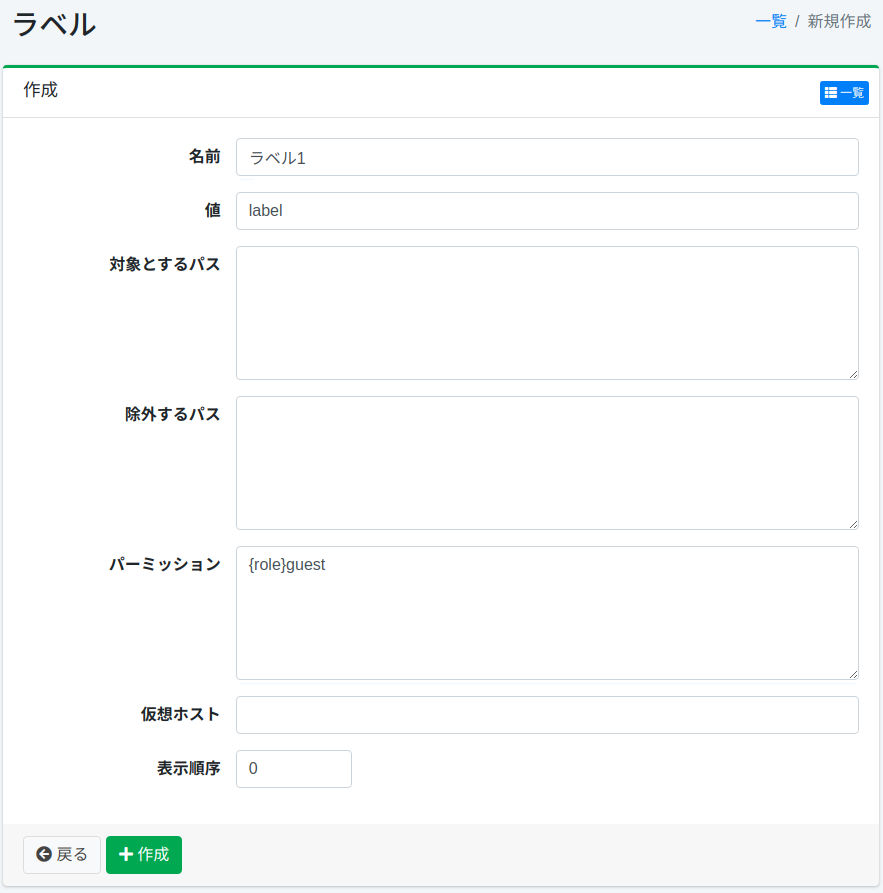

=====
ラベル
=====

概要
====

ここでは、ラベルに関する設定について説明します。
ラベルは検索結果に表示されるドキュメントを分類することができます。
ラベルの設定はラベルを付加するパスを正規表現で指定します。
ラベルを登録している場合には、検索オプション内にラベルのプルダウンボックスが表示されます。

ここでのラベル設定は、ウェブまたはファイルシステムのクロール設定に対して適用されます。

管理方法
======

表示方法
------

下図のラベルの設定一覧ページを開くには、左メニューの [クローラー > ラベル] をクリックします。

|image0|

編集するには設定名をクリックします。

設定の作成
--------

ラベルの設定ページを開くには新規作成ボタンをクリックします。

|image1|

設定項目
------

名前
::::

検索時のラベル選択プルダウンボックスに表示される名前を指定します。

値
::

ドキュメントを分類するときの識別子を指定します。
英数字で指定してください。

対象とするパス
:::::::::::

ラベルを付加するパスを正規表現で設定します。
複数行記述することで複数指定することができます。
ここで指定したパスにマッチするドキュメントにラベルが設定されます。

除外するパス
:::::::::

クロール対象とするパスで対象から除外したいものを正規表現で設定します。
複数行記述することで複数指定することができます。

パーミッション
:::::::::::

この設定のパーミッションを指定します。
パーミッションの指定方法は、たとえば、developerグループに属するユーザーに検索結果を表示させるためには{group}developerと指定します。
ユーザー単位の指定は{user}ユーザー名、ロール単位の指定は{role}ロール名、グループ単位の指定は{group}グループ名で指定します。

仮想ホスト
::::::::

仮想ホストのホスト名を指定します。
詳しくは :doc:`設定ガイドの仮想ホスト <../config/security-virtual-host>` を参照してください。

仮想ホストでアクセスされた検索画面には、この欄にその仮想ホスト名を指定したラベルだけが表示されます。
この欄が空のラベルは、仮想ホストでアクセスされたときには表示されません。
どの仮想ホストにも一致しないアクセスでは、この欄に関係なくすべてのラベルが表示されます。

1つのラベルに指定できる仮想ホストは1つです。
複数の仮想ホストで同じラベルを表示するには、名前と値が同じラベルを仮想ホストごとに作成し、それぞれの仮想ホスト欄にその仮想ホスト名を指定します。
値が同じであれば、どのラベルを選択しても同じドキュメントに絞り込まれます。

表示順序
::::::

ラベルの表示順を指定します。

設定の削除
--------

一覧ページの設定名をクリックし、削除ボタンをクリックすると確認画面が表示されます。
削除ボタンを押すと設定が削除されます。

