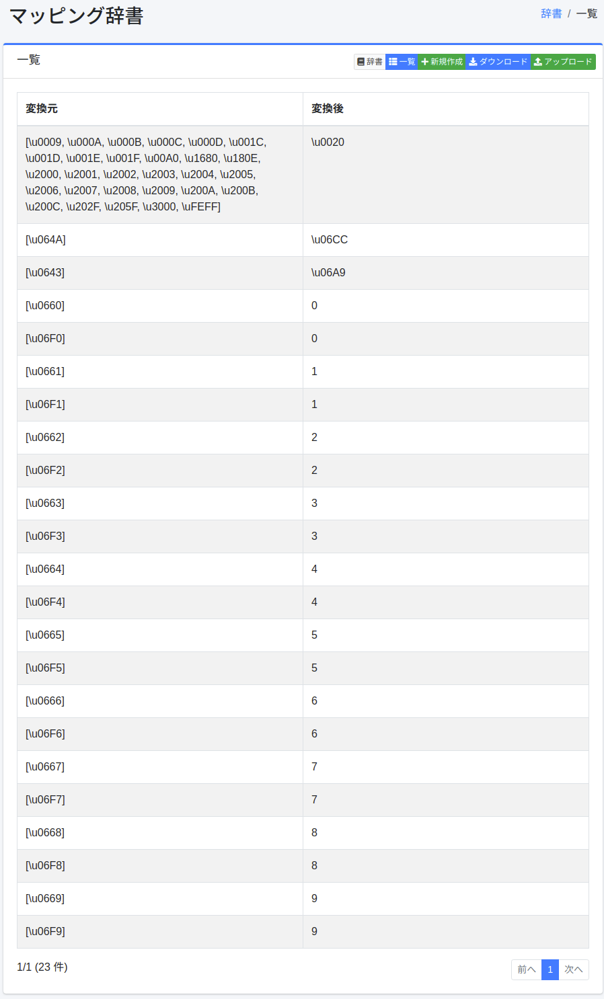
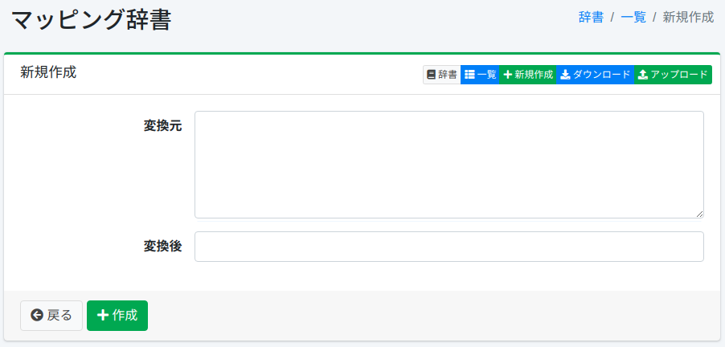

===========
マッピング辞書
===========

概要
====

特定の文字(記号・文字コード・全角半角)を別の文字にマッピングさせることができます。

管理方法
======

表示方法
------

下図のマッピングの設定一覧ページを開くには、左メニューの [システム > 辞書] を選択した後、mappingをクリックします。

|image0|

編集するには設定名をクリックします。

設定方法
------

マッピングの設定ページを開くには新規作成ボタンをクリックします。

|image1|

設定項目
------

変換元
:::::

マッピングの対象とする文字(記号・文字コード・全角半角)を入力します。

変換後
:::::

変換元で入力した文字を変換後の文字で展開します。

ダウンロード
=========

マッピングの辞書形式でダウンロードすることができます。

アップロード
=========

マッピングの辞書形式でアップロードすることができます。

同梱のマッピング辞書
====================

既定の ``mapping.txt`` は、 ``title`` や ``content`` などの検索用フィールドの解析で使われ、ひらがな、小書きのかな、半角カナを全角のカタカナにそろえます。そのため「りんご」「リンゴ」「ﾘﾝｺﾞ」は互いに一致します。 |Fess| 15.9 では、次の表記もそろえるようになりました。

- ゐ・ゑ（イ・エ）、ゎ・ゕ・ゖ・ヮ・ヵ・ヶ・ㇰ〜ㇿ などの小書きのかな、ゝ・ゞ（ヽ・ヾ）
- ヴ、ヴャ・ヴュ・ヴョ、ひらがなの ゔ、半角の ｳﾞ、ウ・う と結合用濁点（U+3099）の組み合わせ（例: ラヴ → ラブ、レヴュー → レビユー）

また、かなの直後に書かれた ‐ ‑ ‒ – — ― ⁻ ₋ − － は、長音記号「ー」として扱われます（ ``prolonged_sound_mark_filter`` ）。このため「サ―バ－」や「サ−バ‐」は「サーバー」と一致します。半角のハイフン（ ``-`` ）や、漢字・英数字の後のダッシュ（東京－大阪、2026−10−02）は変換されません。

日本語用の ``ja/mapping.txt`` （ ``*_ja`` フィールド）は、形態素解析のためにひらがなと小書きのかなをそのまま残し、ヴ などの表記だけをそろえます。

.. note::

   これらの設定は、新しく作成された文書インデックスに適用されます。既存のインデックスは、再インデクシングするまで以前の解析設定と辞書を使います。既存のインデックスに適用するには、 :doc:`maintenance-guide` で「辞書の初期化」を有効にして再インデクシングしてください。辞書の初期化は、管理画面で編集した ``mapping.txt`` / ``ja/mapping.txt`` の内容を上書きします。

