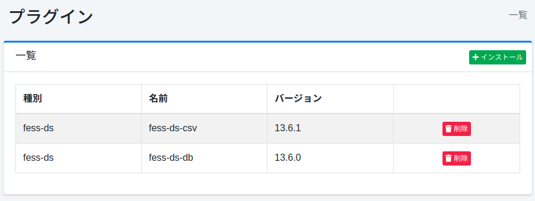
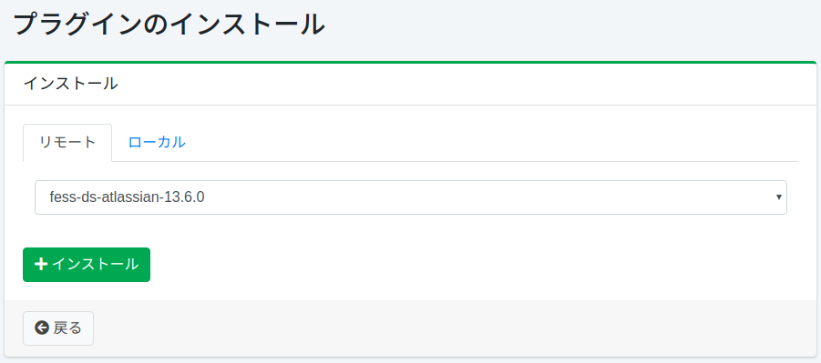

========
プラグイン
========

概要
====

プラグイン設定ページではプラグインを管理します。

管理方法
======

表示方法
------

下図のページのインストール済みプラグインの一覧ページを開くには、左メニューの [システム > プラグイン] をクリックします。

|image0|

アンインストールする場合は削除ボタンをクリックします。

インストール
---------

新規にプラグインをインストールするにはインストールボタンをクリックします。

|image1|

プルダウンメニューでインストールしたいプラグインを選択してインストールボタンをクリックすると、インストールが開始されます。

コマンドラインからのインストール
================================

``bin/fess-setup`` を使うと、コマンドラインからプラグインをインストールできます。

::

    $ bin/fess-setup install plugin fess-script-groovy

バージョンを指定しない場合は、この |Fess| に対応する最新のバージョンがリポジトリから選択されるため、実行するたびに異なるバージョンが入る可能性があります。バージョンを固定するには、プラグイン名の後ろにコロンで区切って指定します。

::

    $ bin/fess-setup install plugin fess-script-groovy:15.9.0 fess-ds-git:15.9.0

プラグインはそれぞれ個別にリリースされるため、同時にインストールするプラグインのバージョンが一致するとは限りません。プラグインごとに指定してください。バージョンを指定しなかったプラグインには ``--version`` の値が使用されます。

::

    $ bin/fess-setup install plugin fess-script-groovy fess-ds-git:15.9.1 --version 15.9.0

新しいバージョンのインストールが完了した後に、同じプラグインの以前のバージョンが削除されます。存在しないバージョンを指定した場合は終了コード 1 で終了するため、Dockerfile などのビルド手順に組み込んでも、プラグインが欠けたまま処理が進むことはありません。

