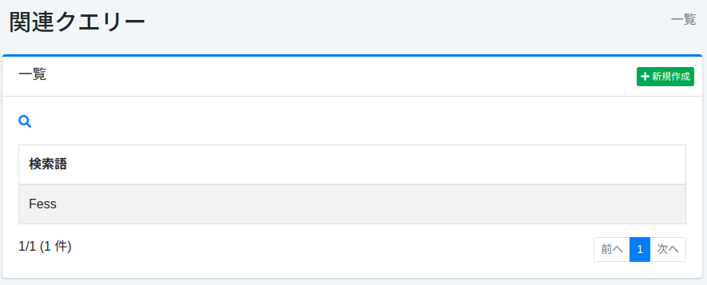
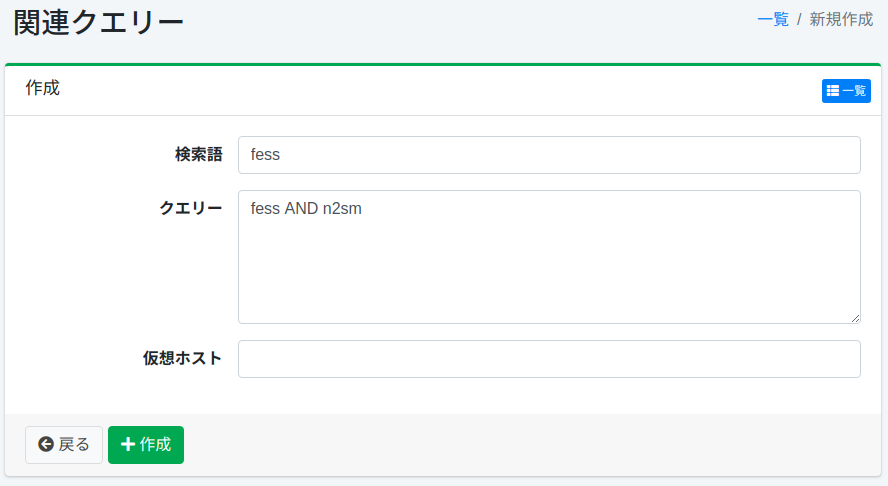

=========
関連クエリー
=========

概要
====

ここでは、関連クエリーの設定について説明します。
登録した関連クエリ―で検索結果を改善することができます。
関連クエリーは検索語の代替語として利用できます。

管理方法
======

表示方法
------

下図の関連クエリ―の設定を行うための一覧ページを開くには、左メニューの [クローラー > 関連クエリー] をクリックします。

|image0|

編集するには設定名をクリックします。

設定の作成
--------

関連クエリーの設定ページを開くには新規作成ボタンをクリックします。

|image1|

設定項目
------

検索語
:::::

検索クエリ―と一致させたい検索語を指定します。

クエリー
::::::

クエリーを指定します。

仮想ホスト
:::::::

仮想ホストのホスト名を指定します。
詳しくは :doc:`設定ガイドの仮想ホスト <../config/security-virtual-host>` を参照してください。

設定の削除
----------

一覧ページの設定名をクリックし、削除ボタンをクリックすると確認画面が表示されます。
削除ボタンを押すと設定が削除されます。

検索ログから生成
----------------

一覧ページの [検索ログから生成] ボタンをクリックすると、最近の検索ログから関連クエリーを作成します。同じ利用者のセッションで、ある検索の後に短い間隔で続けて行われた検索（誤字の後の正しい語や、広い語の後のより具体的な語など）を言い換えとみなし、よく検索される語について、最も多い言い換えをその語の関連クエリーにします。

関連クエリーは誰にでも適用され、その語の検索をすべて広げるため、生成は控えめに行われます。

- ゲストに見える検索だけを使います。検索ログのロールがすべて ``suggest.search.log.permissions`` （サジェストと同じ設定）を満たす場合だけ読み込みます。
- ``label:"x"`` などのフィールド指定、演算子、ワイルドカード、 ``sort:`` 、先頭の ``+`` / ``-`` を含む検索語は使いません。
- [サジェスト > 除外ワード] に登録した語は、語にも関連クエリーにも使いません。
- 語とその関連クエリーは、それぞれ ``related_query.generate.min.sessions`` 以上のセッションから得られたものに限ります。言い換え後の検索はヒットがあるものに限ります。
- 仮想ホストごとに作成します。仮想ホストのない検索ログは既定のホストとして扱います。
- 既に関連クエリーがある語は変更しません（スキップした件数が結果に表示されます）。また、関連クエリーのキャッシュに読み込める件数（ ``page.relatedquery.max.fetch.size`` ）を超えて作成しません。

作成された関連クエリーは、手で登録したものと同じように編集、削除できます。[システム > 全般] の「検索ログ」または「ユーザーログ」が無効な場合は生成できません。生成の実行中に、もう一度実行することはできません。

生成の動作は ``fess_config.properties`` の次の設定で調整できます。

.. list-table::
   :header-rows: 1
   :widths: 45 40 15

   * - プロパティ
     - 説明
     - デフォルト
   * - ``related_query.generate.days``
     - 読み込む検索ログの日数
     - ``30``
   * - ``related_query.generate.term.size``
     - 仮想ホストごとの語の最大数
     - ``100``
   * - ``related_query.generate.query.size``
     - 1 つの語に作る関連クエリーの最大数
     - ``5``
   * - ``related_query.generate.min.sessions``
     - 語と関連クエリーが現れる必要のある最小のセッション数
     - ``3``
   * - ``related_query.generate.session.interval``
     - 言い換えとみなす間隔（分）
     - ``10``
   * - ``related_query.generate.seed.log.size``
     - 1 つの語について読み込む検索ログの最大数
     - ``1000``
   * - ``related_query.generate.seed.session.size``
     - 1 つの語について読み込むセッションの最大数
     - ``200``
   * - ``related_query.generate.log.fetch.size``
     - 1 つの語について読み込む後続の検索ログの最大数
     - ``2000``
   * - ``related_query.generate.query.min.length``
     - 語と関連クエリーの最小の長さ（文字数）
     - ``2``
   * - ``related_query.generate.query.max.length``
     - 語と関連クエリーの最大の長さ（文字数）
     - ``50``

