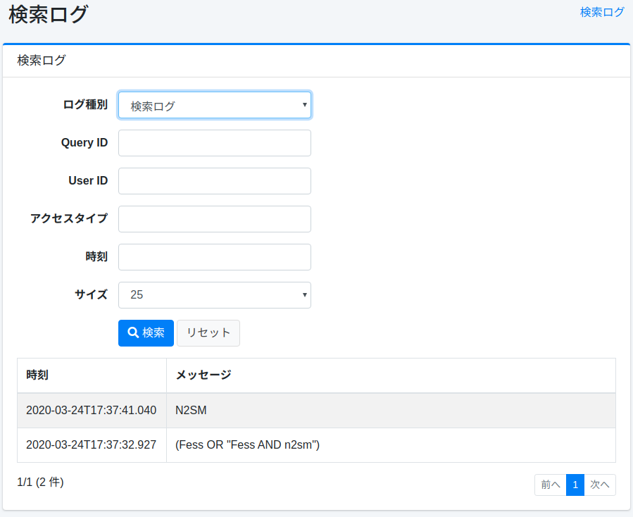
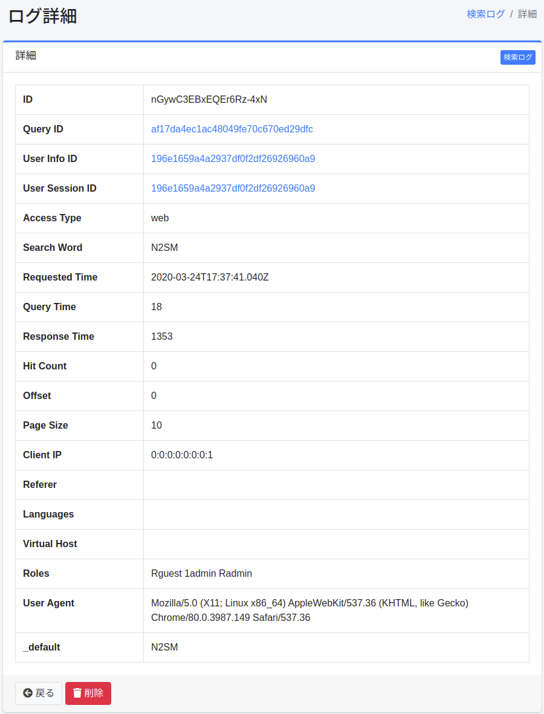

========
検索ログ
========

概要
====

検索、クリック、お気に入りの実行結果は記録されます。検索ログの画面では、それらを集計した分析レポートと、個々のログの一覧を確認できます。

画面を開くには、左メニューの [システム情報 > 検索ログ] をクリックします。最初に「概要」タブが表示されます。閲覧には ``admin-searchlog`` または ``admin-searchlog-view`` のロールが必要です。 ``admin-searchlog-view`` ではログを削除できません。

分析レポート
============

期間と絞り込み
--------------

各タブの上部で、集計する期間を「今日」「昨日」「過去7日間」「過去28日間」「過去90日間」から選ぶか、「カスタム」で開始日と終了日（最大 366 日）を指定します。「前の期間と比較」を有効にすると、同じ日数だけ前の期間の値と比較します。アクセス種別と、表の行数も指定できます。期間とグラフの区切りは、サーバーのタイムゾーンの日付に従います。

タブ
----

- **概要**: 検索数、利用者数、ゼロヒット率、クリック率、平均応答時間の指標を、推移の小さなグラフと前の期間からの変化とともに表示します。指標を切り替えられる推移のグラフ（比較時は前の期間を破線で表示）と、人気の検索語、ゼロヒット語も表示します。
- **検索語**: 検索語ごとの検索数、利用者数、平均ヒット数、クリック数、クリック率、平均クリック順位を表示します。ゼロヒット語（最終検索日時付き）と、ヒットしたのに結果が一度もクリックされなかったゼロクリック語も表示します。
- **クリック**: クリック数の多い URL、お気に入り数の多い URL、クリック順位の分布、2 ページ目以降の閲覧率を表示します。
- **パフォーマンス**: 応答時間の平均と中央値 (p50)・p95・p99、応答時間の分布、応答の遅い検索語、クエリ時間を表示します。
- **利用者・環境**: 新規利用者と既存利用者、アクセス種別、曜日・時間帯別の検索数、上位の User-Agent、リファラ、言語、仮想ホストを表示します。「ロール・グループ別の検索数」は、ロールやグループごとの検索数、利用者数、ゼロヒット率を表示します。検索は実行した利用者のすべてのロールとグループに計上されるため、合計が全体の検索数より多くなることがあります。利用者個人は表示されません。
- **AIチャット**: AI 検索モード（RAG チャット）のリクエスト数、利用者数、合計トークン数、平均応答時間、エラー率と、上位ユーザー、意図別・モデル別のリクエストを表示します。チャットの利用ログは ``rag.chat.log.enabled`` （デフォルト: ``true`` ）が有効な場合に記録されます。質問と回答の内容は記録されません。トークン数は LLM プラグインが報告した場合にのみ記録されます。
- **ログ**: 個々のログの一覧です。下の「ログの一覧」を参照してください。

.. note::

   検索語ごとのクリックの指標とゼロクリック語は、検索語が記録されるようになった後（ |Fess| 15.9 以降）のクリックだけを集計します。全体のクリック数とクリック率には、それ以前のクリックも含まれます。利用者数などの一部の値は概算です。

ゼロヒット語の確認
------------------

「概要」と「検索語」のタブで、ゼロヒット語をクリックすると、「ログ」タブにヒット件数「0件のみ」で絞り込んだその語の検索ログが表示されます。どのような検索で結果が見つからなかったかを確認し、文書や同義語、関連クエリーの追加に役立てられます。

CSV のダウンロード
------------------

分析レポートの各表とグラフには CSV へのリンクがあり、表示中の期間、比較、アクセス種別、行数の条件で集計した内容をダウンロードできます。絞り込みの欄には、指標をまとめた CSV へのリンクもあります。数値は加工せずに出力されます（比率は 0〜1、時間はミリ秒）。比較時のグラフには ``<系列>_previous`` の列が加わります。

ログの一覧
==========

「ログ」タブでは、検索ログ、クリックログ、お気に入りログ、ユーザーログを確認できます。ログの種別、クエリーID、ユーザーID、時刻の範囲、アクセスタイプ、検索語で絞り込めます。検索ログでは、ヒット件数（「すべて」「0件のみ」「1件以上」）でも絞り込めます。ログの詳細を確認したい場合は、対象のログをクリックします。

|image0|

[CSVをダウンロード] ボタンをクリックすると、現在の条件に一致するログを、件数の上限なしに新しい順で CSV としてダウンロードできます。見出し行はフィールド名で、画面の言語によって変わりません。

CSV ファイルは、分析レポートのものも含めて ``csv.file.encoding`` の文字コードで出力され、UTF-8 の場合は BOM が付きます。 ``=`` 、 ``+`` 、 ``-`` 、 ``@`` 、タブ、復帰文字（CR）で始まる値には、表計算ソフトで数式として扱われないように先頭に ``'`` が付きます。

詳細
----

一覧からログをクリックすると、対象のログの詳細が表示されます。

|image1|

