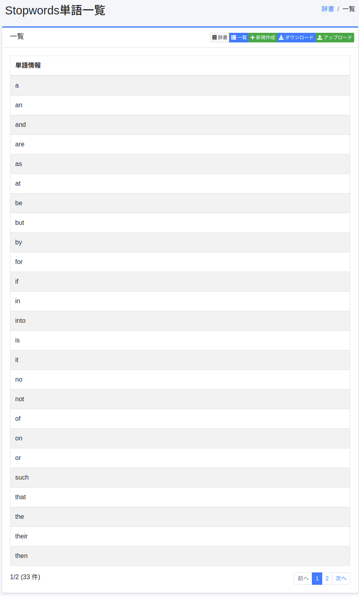
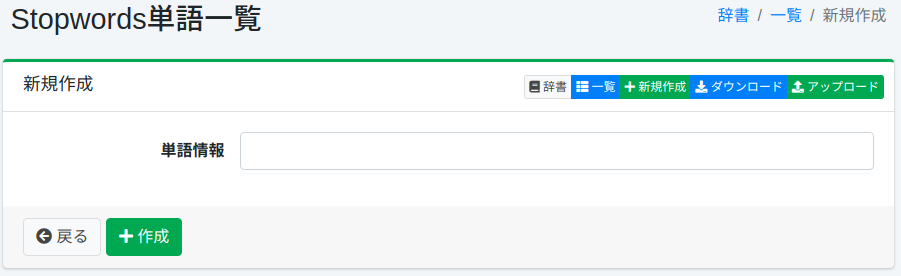

==============
ストップワード辞書
==============

概要
====

ストップワードは、インデックス作成時と検索時に、アナライザーが取り除く単語です。
ストップワード辞書では、取り除く単語を管理することができます。

.. note::

   ストップワード辞書は言語ごとのファイル（ ``en/stopwords.txt`` 、 ``ja/stopwords.txt`` など）で、
   それぞれ対応する言語のアナライザーでだけ使われます。
   ``en/stopwords.txt`` は ``content`` ・ ``title`` フィールドと ``content_en`` などの ``_en`` フィールドの解析に使われ、
   日本語と判定された文書の ``content_ja`` ・ ``title_ja`` の解析には ``ja/stopwords.txt`` が使われます。
   ``content_ja`` などの言語別フィールドはリクエストの言語に応じて検索条件に加わるため、
   ``en/stopwords.txt`` にだけ追加した単語は、言語別フィールドを通じて検索にヒットし続けることがあります。
   検索にヒットさせたくない単語は、対象の文書の言語のストップワード辞書にも追加してください。

   ストップワードはアナライザーが分割した後の単語（トークン）ごとに照合されます。
   英字と数字が混ざった語など、アナライザーが複数のトークンに分割する語は、その語のまま追加しても取り除かれません。
   分割のされ方は OpenSearch の ``_analyze`` API で確認できます。

管理方法
======

表示方法
------

下図のストップワードの設定一覧ページを開くには、左メニューの [システム > 辞書] を選択した後、stopwordsをクリックします。

|image0|

編集するには設定名をクリックします。

設定方法
------

ストップワードの設定ページを開くには新規作成ボタンをクリックします。

|image1|

設定項目
------

単語情報
::::::::

ストップワードとして取り除く単語を入力します。

ダウンロード
=========

ストップワード辞書を、1行に1語を記述したテキスト形式でダウンロードすることができます。

アップロード
=========

1行に1語を記述したテキスト形式のファイルをアップロードすることができます。 ``#`` で始まる行はコメントとして扱われます。

