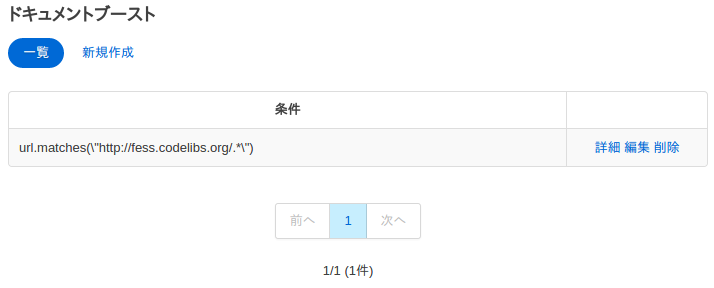
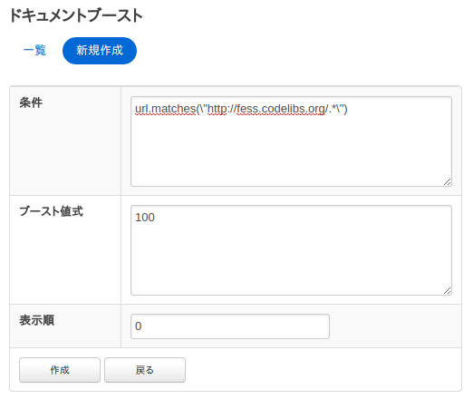

===============================================
ドキュメントブーストの設定
===============================================

概要
===============================================

ここでは、ドキュメントブーストに関する設定について説明します。
ドキュメントブーストの設定を行うことで、検索語に関わらず検索結果の上位にドキュメントを位置づけることができます。

設定方法
===============================================

表示方法
-----------------------------------------------

管理者アカウントでログイン後、メニューのドキュメントブーストをクリックします。

|image0|

|image1|

設定項目
===============================================

条件
-----------------------------------------------

上位に位置づけたいドキュメントのURLパターンを指定します。

ブースト値式
-----------------------------------------------

ドキュメントの重み付けの値を指定します。

表示順
-----------------------------------------------

ドキュメントブーストの表示順を設定します。

