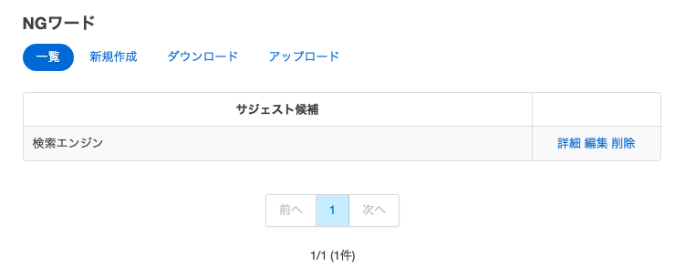
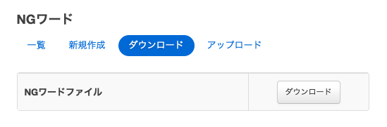

==============================
サジェストのワード設定
==============================

概要
===========

ここでは、サジェストのワード関する設定について説明します。
サジェストは検索語に応じて表示されますが、そのワードを追加したり、サジェストに表示させなくすることができます。
サジェスト表示については \ `クロール全般の設定 <../config/crawl-guide.html>`__\ を参照してください。

|image1|

追加候補の設定
=======================================

設定方法
-------------------------------

表示方法
###############################

管理者アカウントでログイン後、メニューの [サジェスト » 追加候補] をクリックします。

|image2|

|image3|

設定項目
-----------------

サジェスト候補
#########################################

サジェストに表示するワード

読み
#########################################

ワードのよみがな

ロール名
#########################################

ワードにロール情報を設定します。
設定したロールを持っているユーザーしかサジェストに表示されません。

ラベル
#########################################

ワードにラベルを設定します。
設定したラベル以外を選択している場合はサジェストに表示されません。

ダウンロード
-----------------------------------------

登録したワードをCSV形式でダウンロードします。

|image4|

CSVの内容
########################################

1行目はヘッダです。

::

"SuggestWord","Reading","Role","Label","Boost"
"fess","ふぇす","role1","label1","100"

アップロード
-----------------------------------------

CSV形式でワードを登録します。

|image5|

CSVの内容
########################################

1行目はヘッダです。

::

"SuggestWord","Reading","Role","Label","Boost"
"fess","ふぇす","role1","label1","100"

NGワードの設定
=======================================

設定方法
-------------------------------

表示方法
###############################

管理者アカウントでログイン後、メニューの [サジェスト » NGワード] をクリックします。

|image6|

|image7|

設定項目
-----------------

サジェスト候補
#########################################

NGワードを登録します。
ここで登録したワードはサジェストに表示されなくなります。

ダウンロード
-----------------------------------------

登録したワードをCSV形式でダウンロードします。

|image8|

CSVの内容
########################################

1行目はヘッダです。

::

"BadWord"
"検索エンジン"

アップロード
-----------------------------------------

CSV形式でワードを登録します。

|image9|

CSVの内容
########################################

1行目はヘッダです。

::

"BadWord"
"検索エンジン"

.. |image1| image:: ../../../resources/images/ja/9.3/admin/suggestWord-1.png
.. |image2| image:: ../../../resources/images/ja/9.3/admin/suggestWord-2.png
.. |image3| image:: ../../../resources/images/ja/9.3/admin/suggestWord-3.png
.. |image4| image:: ../../../resources/images/ja/9.3/admin/suggestWord-4.png
.. |image5| image:: ../../../resources/images/ja/9.3/admin/suggestWord-5.png

.. |image7| image:: ../../../resources/images/ja/9.3/admin/suggestWord-7.png

.. |image9| image:: ../../../resources/images/ja/9.3/admin/suggestWord-9.png

