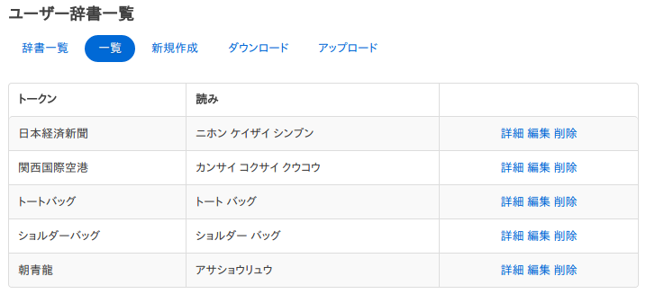
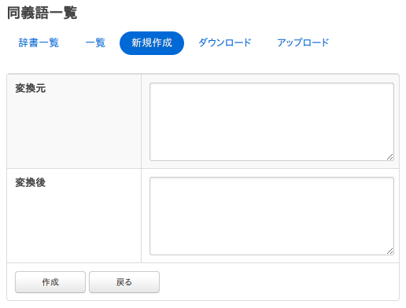

==========
辞書の設定
==========

概要
====

ここでは、辞書に関する設定について説明します。

設定方法
========

表示方法
--------

管理者アカウントでログイン後、メニューの辞書をクリックします。編集可能な各種辞書が一覧されます。

|image0|

ユーザー辞書
============

人名、固有名詞、専門用語などの登録することができます。
ユーザー辞書のパスをクリックすると辞書に登録された単語一覧が表示されます。

|image1|

編集したい単語をクリックすると編集画面が表示されます。

|image2|

設定項目
--------

トークン
::::::::

検索対象とする単語を入力します。

分割
::::

単語が複合語の場合、分割した単語で検索されてもヒットするようにできます。
たとえば、「全文検索エンジン」を「全文 検索 エンジン」と入力することで、分割した単語でも検索できるようにします。

読み
::::

単語の読みをカタカナで入力します。分割を行った場合は分割して入力します。
たとえば、「ゼンブン ケンサク エンジン」と入力します。

品詞
::::

入力した単語の品詞を入力します。

ダウンロード
-----------

Kuromojiの辞書形式でダウンロードすることができます。

アップロード
-----------

Kuromojiの辞書形式でアップロードすることができます。
Kuromojiの辞書形式はカンマ(,)区切りで、「トークン,分割トークン,分割トークンの読み,品詞」になります。
分割トークンはスペース区切りで分割します。
分割する必要がない場合はトークンと分割トークンは等しくなります。
たとえば、以下のようになります。

::

    朝青龍,朝青龍,アサショウリュウ,カスタム名詞
    関西国際空港,関西 国際 空港,カンサイ コクサイ クウコウ,カスタム名詞

同義語辞書
==========

意味が同じ単語(GB、gigabyteなど)を登録することができます。
同義語辞書のパスをクリックすると辞書に登録された単語一覧が表示されます。

|image3|

編集したい単語をクリックすると編集画面が表示されます。

|image4|

設定項目
--------

変換元
::::::

同義語として扱う対象となる単語を入力します。

変換後
::::::

変換元で入力した単語を変換後の単語で展開します。
たとえば、「TV」を「TV」と「テレビ」として扱いたい場合は、変換元に「TV」を入力して、変換後に「TV」と「テレビ」を入力します。

ダウンロード
------------

Apache Luceneが提供する同義語の辞書形式でダウンロードすることができます。

アップロード
------------

Apache Luceneが提供する同義語の辞書形式でアップロードすることができます。
同義語はある単語群を別の単語群への置換になるため、辞書の記述ではカンマ(,)と変換(=>)を利用します。
たとえば、「らーめん」を「ラーメン」に置き換える場合は=>を利用して、以下のように記述します。

::

    らーめん=>ラーメン

「fess」と「フェス」を同様のものとして扱う場合は以下のように記述します。

::

    fess,フェス=>fess,フェス

上記のような場合は、=>を省略して以下のようにも記述することができます。

::

    fess,フェス

.. |image0| image:: ../../../resources/images/ja/9.4/admin/dict-1.png

.. |image2| image:: ../../../resources/images/ja/9.4/admin/dict-5.png
.. |image3| image:: ../../../resources/images/ja/9.4/admin/dict-2.png

