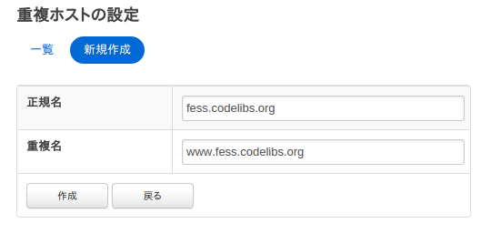

================
重複ホストの設定
================

概要
====

ここでは、重複ホストに関する設定について説明します。重複ホストはクロール時に異なるホスト名を同一のものとして扱いたいときに利用します。たとえば、www.example.com
と example.com を同じサイトとして扱いたい場合などで利用できます。

設定方法
========

表示方法
--------

管理者アカウントでログイン後、メニューの重複ホストをクリックします。

|image0|

|image1|

設定項目
========

正規名
------

正規ホスト名を指定します。重複ホスト名は正規ホスト名に置き換えます。

重複名
------

重複しているホスト名を指定します。置き換えたいホスト名を指定します。

.. |image0| image:: ../../../resources/images/ja/9.4/admin/overlappingHost-1.png

