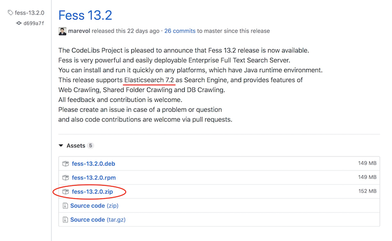
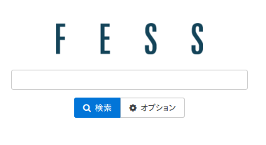
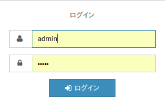
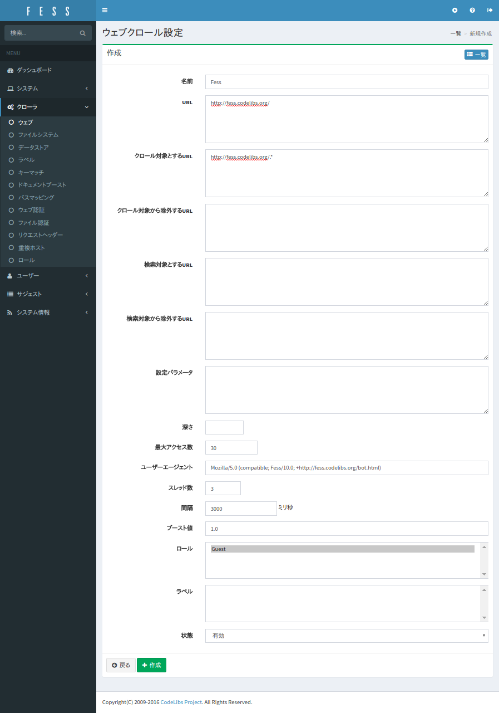
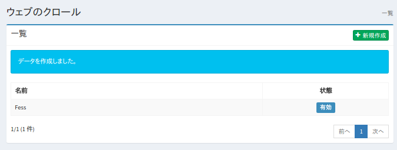
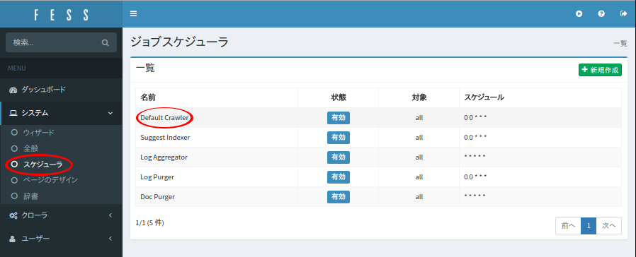
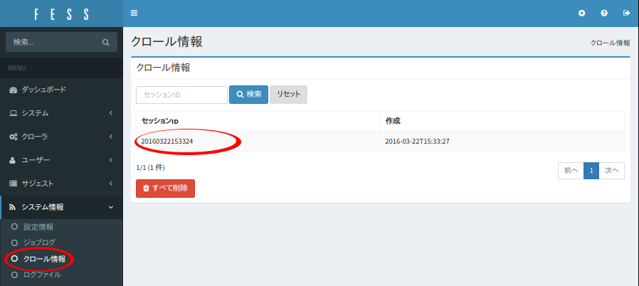
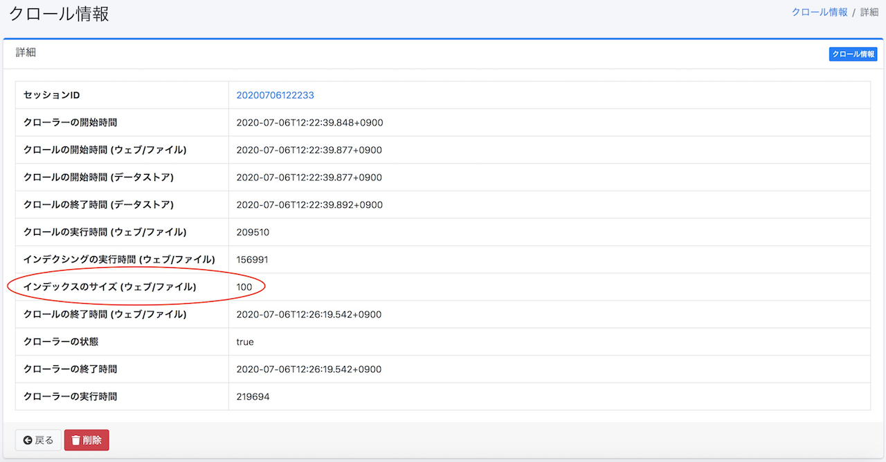
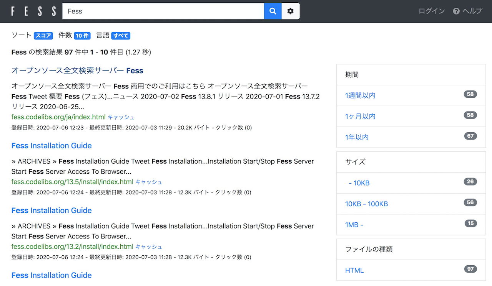

===============================================
Fess で作るエンタープライズサーチ環境 〜 導入編
===============================================

はじめに
========

管理するドキュメントは日々増えていき、それらのドキュメントを効率よく管理して、ナレッジ活用されることが求められています。
管理対象ドキュメントが多くなればなるほど、その中から特定の情報をもつものを見つけにくくなっていきます。
その解決策として、膨大な情報から検索することができる全文検索サーバーを導入することなどがあげられます。

Fess は簡単に導入できる、Java ベースのオープンソース全文検索サーバーです。
Fess の検索エンジン部分には Elasticsearch を利用しています。
Elasticsearch は、Lucene ベースのスケーラブルで柔軟な設計の高機能な検索エンジンです。
一方で、 Elasticsearch で全文検索システムを構築しようとする場合、クローラ部分などの様々な機能を自分で実装する必要性があります。
Fess ではクローラ部分に Fess Crawler を利用して、ウェブやファイルシステム上の様々な種類のドキュメントを収集して検索対象とすることができます。

そこで、本記事では Fess による検索サーバーの構築について紹介します。

対象読者
========

-  エンタープライズサーチ/検索システムを構築してみたい方

-  既存のシステムに検索機能を追加してみたい方

- 社内検索を実現して、ナレッジを活用できる環境を作りたい方

-  Lucene や Elasticsearch などの検索ソフトウェアに興味がある方

必要な環境
==========

この記事の内容に関しては次の環境で、動作確認を行っています。

-  Ubuntu 22.04

-  OpenJDK 21

Fess とは
=========

Fess はウェブやファイルシステムを対象とした、オープンソースの全文検索システムです。
GitHub の CodeLibs プロジェクトで `Fess サイト <https://fess.codelibs.org/ja/>`__\ から Apache ライセンスで提供されています。

Fess の特徴
-----------

Java ベースの検索システム
~~~~~~~~~~~~~~~~~~~~~~~~~

Fess は様々なオープンソースプロダクトを利用して構築されています。

配布物は実行可能なアプリケーションとして提供されます。
Fess では検索画面や管理画面を提供しています。
Fess はウェブフレームワークとして LastaFlute を採用しています。
ですので、画面などのカスタマイズが必要な場合は JSP を修正することで簡単にカスタマイズが可能です。
また、設定データやクロールデータは OpenSearch に保存されており、それらのデータへのアクセスは、O/R マッパーの DBFlute を利用してアクセスしています。

Fess は Java ベースのシステムとして構築されているので、Java が動作可能なすべてのプラットフォームでも実行可能です。
各種設定もウェブブラウザーから簡単に設定する UI を備えています。

OpenSearch を検索エンジンとして利用
~~~~~~~~~~~~~~~~~~~~~~~~~~~~~~~~~~~~

OpenSearch は AWS から提供される、Lucene をベースとしたオープンソースの検索・分析エンジンです。
特徴としては、リアルタイム検索、検索結果の強調表示や集計機能などをサポートしていることが上げられます。
また、検索対象とすることができるドキュメント数は、OpenSearch サーバーの構成次第で、数億ドキュメントにもなり、大規模サイトへもスケールアウトできる検索サーバーです。
利用実績も日本でも数多くあり、注目されている検索エンジンの一つであると言えます。

Fess では、検索エンジン部分に OpenSearch を採用しています。
Fess の Docker 版では OpenSearch を組み込んだ形で配布していますが、 Fess サーバーとは別なサーバーへ切り出して利用することも可能です。
また、 Fess と OpenSearch でそれぞれで冗長構成を組むことができ、高い拡張性を活かすことができる設計になっています。

Fess Crawler をクロールエンジンとして利用
~~~~~~~~~~~~~~~~~~~~~~~~~~~~~~~~~~~~~~~~~

Fess Crawler は CodeLibs プロジェクトから提供される、クローラフレームワークです。
Fess Crawler はウェブ上にあるドキュメントやファイルシステム上にドキュメントを巡回して収集することができます。
ドキュメント収集もマルチスレッドで同時に複数のドキュメントを効率良く処理することが可能です。
また、扱えるドキュメントは HTML はもちろんのこと、Word や Excel などの MS Office 系ファイル、zip などのアーカイブファイル、画像や音声ファイルなど、数多くのフォーマットに対応しています(画像や音声ファイルの場合はメタ情報を取得します)。

Fess では Fess Crawler を利用して、ウェブ上およびファイルシステム上のドキュメントを巡回して、テキスト情報を収集します。
対応するファイルフォーマットも Fess Crawler が扱うことができるものを検索対象とすることができます。
Fess Crawler でクロール実行するためのパラメーター等は Fess の管理 UIから設定することが可能です。

インストールと起動
==================

ここでは、 Fess を起動させ、検索を行うまでの手順を説明します。
Ubuntu 22.04 で実行することを想定して説明を行いますが、macOS や Windows でもほぼ同様の手順でインストールと起動を行うことができます。

ダウンロードとインストール
--------------------------

Fess のダウンロード
^^^^^^^^^^^^^^^^^^^

https://github.com/codelibs/fess/releases から最新のパッケージをダウンロードします。
この記事執筆の時点（2025/11）での最新バージョンは、 15.3.0 です。
ダウンロード完了後、任意のディレクトリに解凍してください。

Fess のダウンロード
|image1|

OpenSearch のダウンロード
^^^^^^^^^^^^^^^^^^^^^^^^^

OpenSearch の `ダウンロードページ <https://opensearch.org/downloads.html>`__\ からダウンロードします。
Fess のダウンロードページでは、各バージョンに対応する OpenSearch のバージョンを記載していますので、バージョンを確認してダウンロードしてください。
Fess 15.3.0 に対応するバージョンは 3.3.0 ですので、このバージョンをダウンロードします。
ダウンロード完了後、任意のディレクトリに解凍してください。

設定
----

起動する前に、Fess で OpenSearch クラスタへ接続するための設定をします。
ZIP/TAR.GZ パッケージの設定方法については、インストールページの `インストール方法 <https://fess.codelibs.org/ja/15.3/install/install.html>`__\ を参照してください。
利用するパッケージが RPM/DEB パッケージの場合も、同様のインストールページを参照してください。

起動
----

起動は簡単です。展開したディレクトリ opensearch-<version> 、 fess-<version> の中で以下のコマンドを実行します。
OpenSearch → Fess の順に起動します。

OpenSearch の起動
::

    $ ./bin/opensearch

Fess の起動
::

    $ ./bin/fess

ブラウザーで http://localhost:8080/ にアクセスし、以下のような画面が表示されれば、 起動できています。

検索トップ画面
|image2|

停止
----

Fess サーバーを停止させるには Fess のプロセスを停止(kill)します。
停止する際は Fess → OpenSearch の順に停止します。

ディレクトリ構成
----------------

ディレクトリ構成は以下のようになります。

Fess のディレクトリ構成
::

    fess-15.3.0
    ├── LICENSE
    ├── README.md
    ├── app
    │   ├── META-INF
    │   ├── WEB-INF
    │   │   ├── cachedirs
    │   │   ├── classes
    │   │   ├── conf
    │   │   ├── env
    │   │   ├── fe.tld
    │   │   ├── lib
    │   │   ├── logs
    │   │   ├── orig
    │   │   ├── plugin
    │   │   ├── project.properties
    │   │   ├── site
    │   │   ├── thumbnails
    │   │   ├── view
    │   ├── css
    │   │   ├── admin
    │   │   ├── fonts
    │   │   └── style.css
    │   ├── favicon.ico
    │   ├── images
    │   └── js
    ├── bin
    ├── extension
    ├── lib
    ├── logs
    └── temp

Fess は LastaFlute が提供する TomcatBoot を元に構成されています。
Fess のアプリケーション群のファイルはappディレクトリ以下に配置されます。
管理画面からも編集は可能ですが、検索画面のJSPはapp/WEB-INF/view以下に保存されます。
また、appディレクトリ直下のjs、css、imagesが検索画面で利用されるファイルになります。

OpenSearch のディレクトリ構成
::

    opensearch-3.3.0
    ├── LICENSE.txt
    ├── NOTICE.txt
    ├── README.md
    ├── bin
    ├── config
    │   ├── opensearch.yml
    │   ├── jvm.options
    │   ├── jvm.options.d
    │   ├── log4j2.properties
    │   └── ...
    ├── data
    ├── lib
    ├── logs
    ├── modules
    └── plugins

インデックスのデータはdataディレクトリに保存されます。

インデックスの作成から検索まで
==============================

起動直後の状態では、検索するためのインデックスが作成されていないため、検索しても何も結果が返ってきません。
ですので、まずインデックスを作成する必要があります。 ここでは、 https://fess.codelibs.org/ja/ 以下を対象にインデックスを作成し、検索を行うまでを例として説明します。

管理ページへのログイン
----------------------

まず、管理ページである http://localhost:8080/admin にアクセスし、ログインしてください。
デフォルトではユーザー名、パスワードともに admin です。

管理ページへのログイン
|image3|

クロール対象の登録
------------------

次に、クロールの対象を登録します。 今回は、 Web ページを対象とするので、管理ページの左側から［ウェブ］を選択してください。
初期状態では何も登録されていないため、［新規作成］を選択します。

［新規作成］を選択
|image4|

ウェブクロールの設定として、今回は、 https://fess.codelibs.org/ja/ 以下のページ群を10秒間隔の2スレッドでクロールして(10秒に2ページ程度をクロール)、100ページ程度を検索対象にします。
設定項目は URL : \https://fess.codelibs.org/ja/ 、クロール対象とするURL : \https://fess.codelibs.org/ja/.*、最大アクセス数 : 100 、スレッド数 : 2 、間隔 : 10000 ミリ秒 とし、他はデフォルトにします。

ウェブクロールの設定
|image5|

［作成］をクリックすることで、クロールの対象を登録することができます。
登録内容は、各設定を押下して変更することが可能です。

ウェブクロールの設定の登録完了
|image6|

クロールを開始する
------------------

次に、システム > スケジューラ > Default Crawler を選択し、[今すぐ開始]を押下します。

スケジューラの選択
|image7|

クロールが開始され、インデックスが作成されているかどうかは、システム情報 > クロール情報 から確認することができます。
クロールが完了している場合、[クロール情報] のインデックスサイズ(ウェブ/ファイル)に検索対象としたドキュメント数が表示されます。

クロール状況の確認
|image8|

クロールが完了している場合の例
|image9|

検索実行例
----------

クロール完了後、検索をすると下の画像のような結果が返されます。

検索例
|image10|

検索画面のカスタマイズ
======================

ここでは、利用者が最も閲覧する、検索トップ画面と検索結果一覧画面をカスタマイズする方法を紹介します。

今回は、ロゴファイル名を変える方法を示します。
デザイン自体を変えたい場合については、シンプルな JSP ファイルで記述されているので HTML の知識があれば変更することができます。

まず、検索トップ画面は「app/WEB-INF/view/index.jsp」ファイルになります。

検索トップ画面のJSPファイルの一部
::

    <la:form action="/search" method="get" styleId="searchForm">
      ${fe:facetForm()}${fe:geoForm()}
      ・
      ・
      ・
      <main class="container">
        

          

            <h1 class="mainLogo">
              " />
            </h1>
            
${notification}

            

              <la:info id="msg" message="true">
                
${msg}

              </la:info>
              <la:errors header="errors.front_header"
                footer="errors.front_footer" prefix="errors.front_prefix"
                suffix="errors.front_suffix" />
            

検索トップ画面に表示される画像を変更する場合は、上記の「logo.png」の箇所を置き換えたいファイル名に変更します。
ファイルは「app/images」に配置します。

<la:form> や <la:message>などは JSP タグになります。
たとえば、<s:form> は実際の HTML 表示時に form タグに変換されます。
詳しい説明は LastaFlute のサイトや JSP に関するサイトをご覧ください。

次に、検索結果一覧画面のヘッダー部分は「app/WEB-INF/view/header.jsp」ファイルになります。

ヘッダーJSPファイルの一部
::

				<la:link styleClass="navbar-brand d-inline-flex" href="/">
					"
						class="align-items-center" />
				</la:link>

検索結果一覧画面の上部に表示される画像を変更する場合は、上記の「logo-head.png」の箇所のファイル名を変更します。
「logo.png」の場合と同様に「app/images」に配置します。

また、これらの設定は システム > ページのデザイン からも設定することが可能です。

JSP ファイルで利用している CSS ファイルを変更したい場合は「app/css」に配置されている「style.css」を編集してください。

まとめ
======

全文検索システムである Fess について、インストールから検索までと簡単なカスタマイズ方法について説明をしました。
特別な環境構築も必要なく、Java の実行環境があれば検索システムを簡単に構築できることをご紹介できたと思います。
既存のシステムにサイト検索機能を追加したいような場合にも導入できるので、ぜひお試しください。

参考資料
========

-  `Fess <https://fess.codelibs.org/ja/>`__

-  `OpenSearch <https://opensearch.org/>`__

-  `LastaFlute <https://lastaflute.dbflute.org/>`__

.. |image4| image:: ../../resources/images/ja/article/1/web-crawl-conf-1.png

