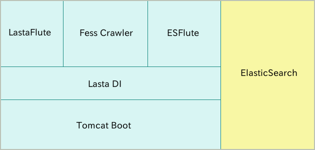

===================================================
|Fess| で作るApache Solrベースの検索サーバー 〜 導入編
===================================================

はじめに
========

管理するドキュメントは日々増えていき、それらのドキュメントを効率よく管理することを求められています。
管理対象ドキュメントが多くなればなるほど、その中から特定の情報をもつものを見つけにくくなっていきます。
その解決策として、膨大な情報から検索することができる全文検索サーバーを導入することなどがあげられます。

|Fess| は簡単に導入できる、Java
ベースのオープンソース全文検索サーバーです。 |Fess| の検索エンジン部分には
Elasticsearch を利用しています。 Elasticsearch は、スケーラブルで柔軟な設計の高機能な検索エンジンです。
一方で、 Elasticsearch
で検索システムを構築しようとする場合、クローラ部分などを自分で実装する必要性があります。
|Fess| ではクローラ部分に CodeLibs の Fess Crawler
を利用して、ウェブやファイルシステム上の様々な種類のドキュメントを収集して検索対象とすることができます。

そこで、本記事では |Fess| による検索サーバーの構築について紹介します。

対象読者
========

-  検索システムを構築してみたい方

-  既存のシステムに検索機能を追加してみたい方

-  Elasticsearch に興味がある方

必要な環境
==========

この記事の内容に関しては次の環境で、動作確認を行っています。

-  Ubuntu 14.04

-  Java 1.8.0\_74

|Fess| とは
=========

|Fess| 
はウェブやファイルシステムを対象とした、オープンソースの全文検索システムです。
GitHub の `Fess サイト <http://fess.codelibs.org/ja/>`__\ から
Apache ライセンスで提供されています。

|Fess| の特徴
-----------

Java ベースの検索システム(TODO)
~~~~~~~~~~~~~~~~~~~~~~~~~

|Fess| 
は以下の図にあるとおり、様々なオープンソースプロダクトを利用して構築されています。

|Fess| の構造
|image0|

配布物は Tomcat に |Fess| と Solr の war
ファイルが配備された形になります。 |Fess| の war
ファイルは検索画面や管理画面を提供しています。 |Fess| 
は開発フレームワークとして Seasar2 を利用し、プレゼンテーション層には
SAStruts を採用しています。
ですので、画面などのカスタマイズが必要な場合は JSP
を修正することで簡単にカスタマイズが可能です。

また、設定データやクロールデータを保存するために組み込みデータベースの
H2Database を利用し、O/R マッパーの DBFlute
を利用してアクセスしています。 S2Chronos は Seasar
プロジェクトで提供されるスケジューリングフレームワークで、 |Fess| 
では指定された時間でのクロールを実行するために利用しています。 Solr と
S2Robot については後述します。

|Fess| は Java
ベースのシステムとして構築されているので、どのプラットフォームでも実行可能です。
各種設定もウェブブラウザから簡単に設定する UI を備えています。

Apache Solr を検索エンジンとして利用(TODO)
~~~~~~~~~~~~~~~~~~~~~~~~~~~~~~~~~~~~

Apache Solr は Apache Software Foundation から提供される、Lucene
をベースとしたエンタープライズ向け検索サーバーです。
特徴としては、ファセット検索、検索結果の強調表示、複数の出力形式などをサポートしていることが上げられます。
また、検索対象とすることができるドキュメント数は、Solr
サーバーの構成次第で、数億ドキュメントにもなり、大規模サイトへもスケールアウトできる検索サーバーです。
利用実績も日本でも数多くあり、注目されている検索エンジンの一つであると言えます。

|Fess| では、検索エンジン部分に Apache Solr を採用しています。 |Fess| 
の配布物には Solr を同梱した形で配布していますが、 |Fess| の Solr
サーバーを別なサーバーへ切り出して利用することも可能です。 また、 |Fess| 
は複数の Solr
サーバーをグループとして管理して、冗長構成を組むことが可能です。
このように |Fess| では Solr
のもつ高い拡張性を活かすことができる設計になっています。

S2Robot をクロールエンジンとして利用(TODO)
~~~~~~~~~~~~~~~~~~~~~~~~~~~~~~~~~~~~

S2Robot は Seasar
プロジェクトから提供される、クローラフレームワークです。 S2Robot
はウェブ上にあるドキュメントやファイルシステム上にドキュメントを巡回して収集することができます。
ドキュメント収集もマルチスレッドで同時に複数のドキュメントを効率良く処理することが可能です。
また、扱えるドキュメントは HTML はもちろんのこと、Word や Excel などの
MS Office 系ファイル、zip
などのアーカイブファイル、画像や音声ファイルなど、数多くのフォーマットに対応しています(画像や音声ファイルの場合はメタ情報を取得します)。

|Fess| では S2Robot
を利用して、ウェブ上およびファイルシステム上のドキュメントを巡回して、テキスト情報を収集します。
対応するファイルフォーマットも S2Robot
が扱うことができるものを検索対象とすることができます。 S2Robot
でクロール実行するためのパラメータ等は |Fess| の管理 UI
から設定することが可能です。

インストールと起動
==================

ここでは、 |Fess| を起動させ、検索を行うまでの手順を説明します。 Ubuntu14.04 で実行することを想定して説明を行いますが、Mac OS X や Windows
でもほぼ同様の手順でインストールと起動を行うことができます。

ダウンロードとインストール
--------------------------

https://github.com/codelibs/fess/releases
から最新のパッケージをダウンロードします。
この記事執筆の時点（2016/03）での最新バージョンは、 10.0.2 です。
ダウンロード完了後、任意のディレクトリに解凍してください。

|Fess| のダウンロード
|image1|

起動
----

起動は簡単です。展開したディレクトリfess-<version>の中で以下のコマンドを実行します。

|Fess| の起動
::

    $ ./bin/fess

ブラウザで http://localhost:8080/
にアクセスし、以下のような画面が表示されれば、 |Fess| は起動しています。

検索トップ画面
|image2|

停止
----

Fess サーバーを停止させるには Fess のプロセスを kill します。

ディレクトリ構成
----------------

ディレクトリ構成は以下のようになります。

ディレクトリ構成
::

    fess-10.0.2
    |-- LICENSE
    |-- README.md
    |-- app/
    |   |-- META-INF/
    |   |-- WEB-INF/
    |   |   |-- cachedirs/
    |   |   |-- classes/
    |   |   |-- conf/
    |   |   |-- crawler/
    |   |   |-- lib/
    |   |   |-- logs/
    |   |   |-- orig/
    |   |   |-- screenshots/
    |   |   |-- suggest/
    |   |   |-- view/
    |   |   |-- fe.tld
    |   |   `-- web.xml
    |   |-- css/
    |   |-- images/
    |   |-- js/
    |   `--favicon.ico
    |-- bin/
    |-- es/
    |   |-- config/
    |   |-- data/
    |   |-- logs/
    |   |-- plugins/
    |   `-- work/
    |-- extension/
    |-- lib/
    |-- logs/
    `-- temp/

(TODO)「fess-server-8.1.0」直下のディレクトリ構成は Tomcat 7
とほぼ同様で、Solr
のデータディレクトリ「solr」、「fess.war」と「solr.war」が配備された形になります。
配備された「fess.war」は「webapps/fess/WEB-INF/view」に検索画面や管理画面の
JSP ファイルが配置されています。 また、利用している CSS
ファイルは「webapps/fess/css」に配置しているので、画面のカスタマイズが必要な場合はそれらのファイルを編集します。

インデックスの作成から検索まで
==============================

起動直後の状態では、検索するためのインデックスが作成されていないため、検索しても何も結果が返ってきません。
ですので、まずインデックスを作成する必要があります。 ここでは、
http://fess.codelibs.org/
以下を対象にインデックスを作成し、検索を行うまでを例として説明します。

管理ページへのログイン
----------------------

まず、管理ページである http://localhost:8080/admin
にアクセスし、ログインしてください。
デフォルトではユーザー名、パスワードともに admin です。

管理ページへのログイン
|image3|

クロール対象の登録
------------------

次に、クロールの対象を登録します。 今回は、 Web
ページを対象とするので、管理ページの左側から［ウェブ］を選択してください。
初期状態では何も登録されていないため、［新規作成］を選択します。

［新規作成］を選択
|image4|

ウェブクロールの設定として、今回は、\ http://fess.codelibs.org/
以下のすべてのページをクロール対象とすることにします。
設定項目は URL : http://fess.codelibs.org/ 、クロール対象とするURL : http://fess.codelibs.org/.*
、最大アクセス数 : 30 、間隔 : 3000 ミリ秒 とし、他はデフォルトにします。

ウェブクロールの設定
|image5|

［作成］をクリックすることで、クロールの対象を登録することができます。
登録内容は、各設定を押下して変更することが可能です。

ウェブクロールの設定の登録完了
|image6|

クロールを開始する
------------------

次に、システム > スケジューラ > Default Crawler を選択し、[今すぐ開始]を押下します。

スケジューラの選択
|image7|

クロールが開始され、インデックスが作成されているかどうかは、システム情報 > クロール情報 から確認することができます。
クロールが完了している場合、[クロール情報] の
インデックスサイズ(ウェブ/ファイル)
に検索対象としたドキュメント数が表示されます。

クロール状況の確認
|image8|

クロールが完了している場合の例
|image9|

検索実行例
----------

クロール完了後、検索をすると下の画像のような結果が返されます。

検索例
|image10|

検索画面のカスタマイズ
======================

ここでは、利用者が最も閲覧する、検索トップ画面と検索結果一覧画面をカスタマイズする方法を紹介します。

今回は、ロゴファイル名を変える方法を示します。
デザイン自体を変えたい場合については、シンプルな JSP
ファイルで記述されているので HTML の知識があれば変更することができます。

まず、検索トップ画面は「app/WEB-INF/view/index.jsp」ファイルになります。

検索トップ画面のJSPファイルの一部
::

	

		

			

				<h1 class="mainLogo">
					" />
				</h1>
				
${notification}

				

					<la:info id="msg" message="true">
						
${msg}

					</la:info>
					<la:errors header="errors.front_header"
						footer="errors.front_footer" prefix="errors.front_prefix"
						suffix="errors.front_suffix" />
				

				<la:form styleClass="form-stacked" action="search" method="get"
					styleId="searchForm">
					${fe:facetForm()}${fe:geoForm()}

検索トップ画面に表示される画像を変更する場合は、上記の「logo.png」の箇所を置き換えたいファイル名に変更します。
ファイルは「app/images」に配置します。

<la:form> や <la:message>などは JSP タグになります。
たとえば、<s:form> は実際の HTML 表示時に form タグに変換されます。
詳しい説明は LastaFlute のサイトや JSP に関するサイトをご覧ください。

次に、検索結果一覧画面のヘッダー部分は「app/WEB-INF/view/header.jsp」ファイルになります。

ヘッダーJSPファイルの一部
::

    <la:link styleClass="navbar-brand" href="/">
		" />
	</la:link>

検索結果一覧画面の上部に表示される画像を変更する場合は、上記の「logo-head.png」の箇所のファイル名を変更します。
「logo.png」の場合と同様に「app/images」に配置します。

また、これらの設定は システム > ページのデザイン からも設定することが可能です。

JSP ファイルで利用している CSS
ファイルを変更したい場合は「app/css」に配置されている「style.css」を編集してください。

まとめ
======

全文検索システムである |Fess| 
について、インストールから検索までと簡単なカスタマイズ方法について説明をしました。
特別な環境構築も必要なく、Java
の実行環境があれば検索システムを簡単に構築できることをご紹介できたと思います。
既存のシステムにサイト検索機能を追加したいような場合にも導入できるので、ぜひお試しください。

参考資料
========

-  `Fess <http://fess.codelibs.org/ja/>`__

-  `Elasticsearch <https://www.elastic.co/products/elasticsearch>`__

-  `LastaFlute <http://dbflute.seasar.org/ja/lastaflute/>`__

.. |image1| image:: ../../resources/images/ja/article/1/fess-download.png
.. |image2| image:: ../../resources/images/ja/article/1/top.png
.. |image3| image:: ../../resources/images/ja/article/1/login.png
.. |image4| image:: ../../resources/images/ja/article/1/web-crawl-conf-1.png
.. |image5| image:: ../../resources/images/ja/article/1/web-crawl-conf-2.png
.. |image6| image:: ../../resources/images/ja/article/1/web-crawl-conf-3.png
.. |image7| image:: ../../resources/images/ja/article/1/scheduler.png
.. |image8| image:: ../../resources/images/ja/article/1/session-info-1.png
.. |image9| image:: ../../resources/images/ja/article/1/session-info-2.png
.. |image10| image:: ../../resources/images/ja/article/1/search-result.png
