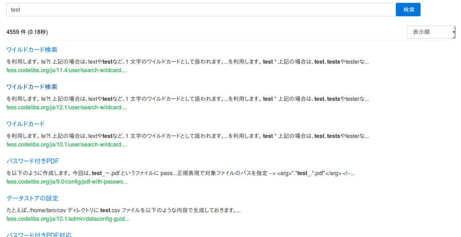

========================================================
Fess で作る Elasticsearch ベースの検索サーバー 〜 FSS 編
========================================================

はじめに
========

本記事では Fess Site Search(FSS) を利用してwebサイトに検索サービスを組み込む方法をご紹介します。
FSS　を利用すれば、既存のwebサイトに javascriptを配置するだけで簡単にFessサーバーの検索機能を利用できます。

本記事では Fess 12.1を利用して説明します。
Fess の構築方法については\ `導入編 <https://fess.codelibs.org/ja/articles/article-1.html>`__\ を参照してください。

対象読者
========

- 既存のウェブシステムに検索機能を加えたい方

- Google Site Search や Googleカスタム検索などから移行したい方。

必要な環境
==========

この記事の内容に関しては次の環境で、動作確認を行っています。

-  Google Chrome 66

-  Firefox 59

FSS とは
========

FSSはwebサイトに検索サービスを組み込む方法です。
CodeLibsプロジェクトで `FSS サイト <https://fss-generator.codelibs.org/ja/>`__ から提供されています。
webサイトに検索サービスを組み込む方法はいろいろありますが、 FSS では既存のサイトにJavaScriptを配置するだけで、Fessの検索ページを組み込むことができます。ですので、同様にJavascriptを配置するGoogle Site Search(GSS)やGoogle Custom Searchからの移行もFSSを利用すれば簡単にできます。

FSSによる検索サイトの構築
=========================

今回は FSS を利用したサイトを構築する方法を説明します。
今回利用する Fess サーバーは Fess プロジェクトでデモ用として公開している Fess サーバーを利用しています。
もし、独自の Fess サーバーを利用したい場合は Fess 11.3以上のバージョンをインストールしてください。

FSS JSの作成
--------------

FSS JS とは検索フォームと検索結果を表示するJavaScriptファイルです。
FSS JS は `FSS JS Generator <https://fss-generator.codelibs.org/generator>`__ で生成して入手できます。

|image0|

FSS JS Generatorでは検索フォームの配色や文字のフォントを指定できます。

「Generate」ボタンを押下することで、指定された設定のJavaScriptファイルを生成できます。

|image1|

プレビューが表示されますので、問題がなければ「Download JS」ボタンを押下してJavaScriptファイルをダウンロードしてください。
ダウンロードしたJavaScriptファイルの名前を「Fess-ss.min.js」に変更し、webサイト上に配置してください。

HTMLの作成
------------

次にFSS JSを配置するHTMLファイルを作成します。
今回は例として「index.html」を作成します。
作成したHTMLのbody以下の検索フォームを組み込みたい位置に以下のコードを追加します。

::

    
    <fess:search></fess:search>

srcには「fess-sss.min.js」のURLを指定します。fess-urlには利用するfessサーバーを指定します。
今回はfessの公開デモサーバーを利用しています。

実行
----

「index.html」にアクセスすると検索フォームが表示されます。
検索語を入力すると次のように検索結果を表示できます。

|image2|

まとめ
======

今回は JavaScript のタグを配置するだけで、 Fess の検索結果をサイトに埋め込む方法を紹介しました。
FSS によって、 GSS からの移行も既存の JavaScript のタグを置き換えるだけで実現できます。
FSS JS には他の表示方法や検索ログを Google Analytics と連携する方法などもあります。 その他の設定方法については、 `FSSの[マニュアル] <https://fss-generator.codelibs.org/ja/docs/manual>`__ を参照してください。

参考資料
========
- `Fess Site Search <https://fss-generator.codelibs.org/>`__

.. |image0| image:: ../../resources/images/ja/article/5/FSS-JS-Generator1.png
.. |image1| image:: ../../resources/images/ja/article/5/FSS-JS-Generator2.png

