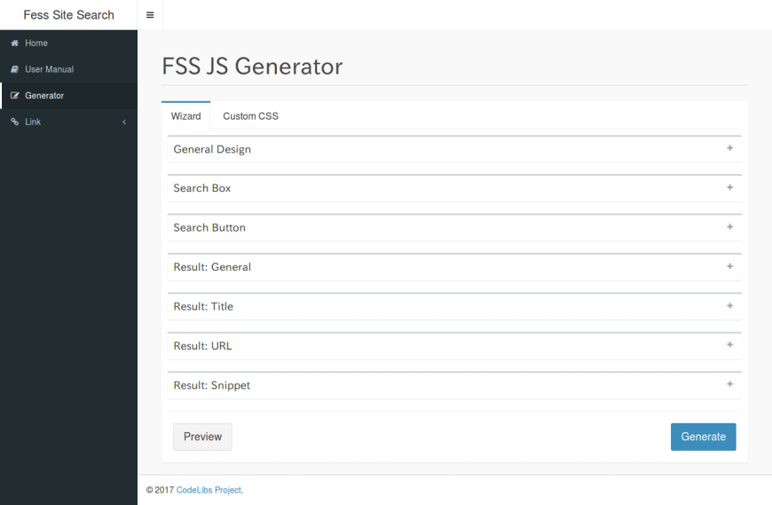
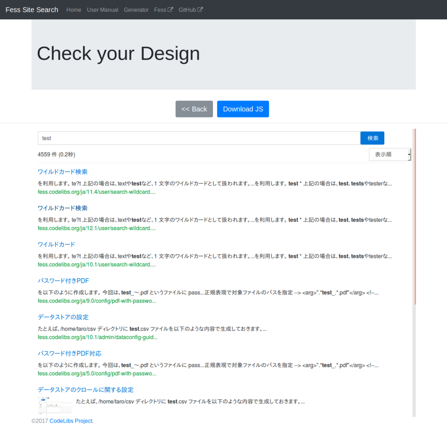
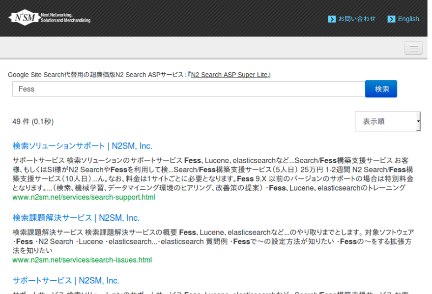

========================================================
Fess で作る Elasticsearch ベースの検索サーバー 〜 FSS 編
========================================================

はじめに
========

構築したFessサーバを利用して、Webサイトに検索サービスを組み込む方法を紹介します。
Fess Site Search(FSS) が提供するタグとJavaScriptファイルを利用することで、既存のwebサイトに検索ボックスや検索結果を表示することができます。

対象読者
========

- 既存のwebサイトに検索機能を加えたい方

- Google Site Search や Googleカスタム検索などから移行したい方。

Fess Site Search(FSS)とは
===========================

FSSは検索サーバFessを既存のWebサイトに導入する機能です。CodeLibsプロジェクトで FSS サイト で提供しています。Google Site Search(GSS)などのサイト内検索と同様、検索サービスを利用したいページ上でjavascriptタグを埋め込むだけで利用することができるので、GSSからの移行も簡単に行うことができます。

FSS JS とは
=============

FSS JSはFessの検索結果を表示するJavaScriptファイルです。このJavaScriptファイルをWebサイトに配置することで検索結果を表示できるようになります。
FSS JSは、「https://fss-generator.codelibs.org/」のFSS JS Generatorで生成して入手することができます。
FSS JSはFess 11.3以上のバージョンに対応していますので、Fess構築時はFess11.3以上のバージョンをインストールして下さい。Fess の構築方法については\ `導入編 <https://fess.codelibs.org/ja/articles/article-1.html>`__\ を参照してください。

FSS JS Generatorでは検索フォームの配色や文字のフォントを指定できます。
「Generate」ボタンを押下することで、指定された設定のJavaScriptファイルを生成できます。

|image0|

プレビュー表示で問題がなければ、「Download JS」ボタンを押下してJavaScriptファイルをダウンロードしてください。

|image1|

サイトへの導入
================

今回は静的なHTMLで作られた「`www.n2sm.net`」にサイト内検索を導入する例を考えます。

検索結果はそのサイト内のsearch.htmlに表示するようにして、Fessサーバは「nss833024.n2search.net」に別途構築します。

ダウンロードしたFSS JSのJavaScriptファイルは/js/fess-ss.min.jsとしてサイト上に配置します。

上記の情報をまとめると以下のようになります。

.. tabularcolumns:: |p{4cm}|p{8cm}|
.. list-table:: 

   * - 対象名
     - URL
   * - 検索対象サイト
     - https://www.n2sm.net/
   * - 検索結果ページ
     - https://www.n2sm.net/search.html
   * - FSS JS
     - https://www.n2sm.net/js/fess-ss.min.js
   * - Fessサーバ
     - https://nss833024.n2search.net/

javascriptタグの埋め込みはsearch.html内の検索結果を表示したい箇所に以下のタグを配置します。

..
  
  <fess:search></fess:search>

search.htmlにアクセスすると検索フォームが表示されます。

検索語を入力すると次のように検索結果を表示できます。

|image2|

他のページに検索フォームを配置して検索結果を表示するためには、以下のような検索フォームを各ページに配置して、「`https://www.n2sm.net/search.html?q=検索語`」へ遷移するように設定してください。

..
  <form action="https://www.n2sm.net/search.html" method="get">
    <input type="text" name="q">
    <input type="submit" value="検索">
  </form>

まとめ
======

JavaScript のタグを配置するだけで、 Fess の検索結果をサイトに埋め込む方法を紹介しました。
FSS によって、 GSS からの移行も既存の JavaScript のタグを置き換えるだけで実現できます。
FSS JS には他の表示方法や検索ログを Google Analytics と連携する方法などもあります。 その他の設定方法については、 `FSSの[マニュアル] <https://fss-generator.codelibs.org/ja/docs/manual>`__ を参照してください。

参考資料
========
- `Fess Site Search <https://fss-generator.codelibs.org/ja/>`__

