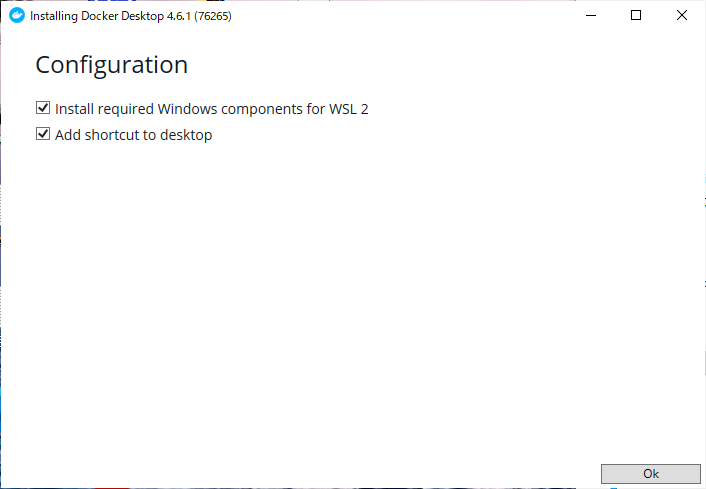
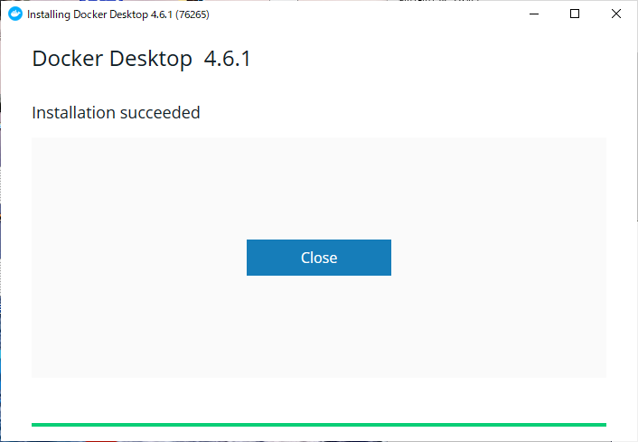
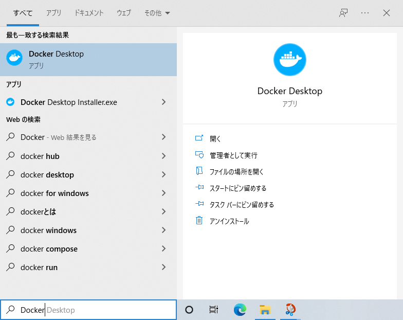
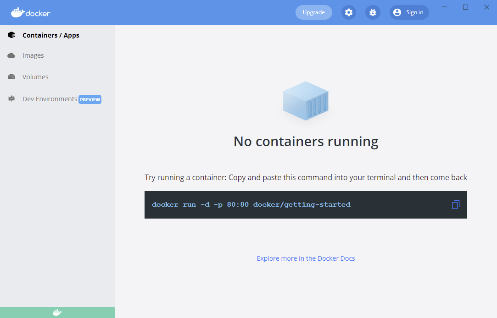

================
インストール手順
================

インストール方法
================

Fessでは、ZIPアーカイブ、RPM/DEB パッケージ、Dockerイメージでの配布物を提供しています。
Dockerを利用することで、WindowsやMacなどでも、Fessを簡単にセットアップすることができます。

.. note::

   このページでは **Windows 上での Docker を使ったセットアップ手順** を説明します。
   Linux や macOS をご利用の方も同様の手順でセットアップできますが、Docker Desktop のインストール手順は異なります。
   詳細は `Docker <https://docs.docker.com/get-docker/>`_ のドキュメントを参照してください。

本番環境を構築する場合は、必ず :doc:`15.6/install/index` を参照してください。
また、システム要件については :doc:`15.6/install/prerequisites` を確認してください。

.. warning::

   **本番環境での重要な注意事項**

   本番環境や負荷検証などでは、組み込み OpenSearch での稼働は推奨しません。
   必ず外部の OpenSearch サーバーを構築してください。

セットアップの流れ
------------------

以下の順番で作業を進めます。

1. Docker Desktop のインストール
2. OS 設定（vm.max_map_count の調整）
3. Fess の起動ファイルをダウンロード
4. Fess を起動して動作確認

Docker Desktopのインストール
============================

Docker Desktopがインストールされていない場合は、以下の手順でインストールしてください。

ダウンロード
------------

`Docker Desktop <https://www.docker.com/products/docker-desktop/>`__ で該当OSのインストーラーをダウンロードします。

インストーラーの実行
--------------------

ダウンロードしたインストーラーをダブルクリックして、インストールを開始します。

「Install required Windows components for WSL 2」 または
「Install required Enable Hyper-V Windows Features」 が選択されていることを確認して、
OKボタンをクリックします。

|image0|

インストールが完了したら、「close」ボタンをクリックして画面を閉じます。

|image1|

Docker Desktop の起動
---------------------

Windows メニュー内の「Docker Desktop」をクリックして起動します。

|image2|

Docker Desktop 起動後、利用規約が表示されるので、「I accept the terms」にチェックを入れて「Accept」ボタンをクリックします。

チュートリアル開始の案内が出ますが、ここでは「Skip tutorial」をクリックしてスキップします。
「Skip tutorial」をクリックすると Dashboard が表示されます。

|image3|

設定
====

OpenSearch が Docker コンテナーとして実行できるようにするため、OS側で「vm.max_map_count」の値を調整します。
利用する環境によって設定方法が異なるので、それぞれの設定方法については「`Set vm.max_map_count to at least 262144 <https://www.elastic.co/guide/en/elasticsearch/reference/current/docker.html#_set_vm_max_map_count_to_at_least_262144>`_ 」を参照してください。

Fessのセットアップ
==================

起動ファイルの作成
------------------

適当なフォルダーを作成して、 `compose.yaml <https://raw.githubusercontent.com/codelibs/docker-fess/master/compose/compose.yaml>`_ と `compose-opensearch3.yaml <https://raw.githubusercontent.com/codelibs/docker-fess/master/compose/compose-opensearch3.yaml>`_ をダウンロードします。

.. note::

   ``compose-opensearch3.yaml`` は OpenSearch 3.x を使用するための追加設定ファイルです。
   ``compose.yaml`` と組み合わせて使用します。

curlコマンドで以下のように取得することもできます。

.. code-block:: bash

    curl -o compose.yaml https://raw.githubusercontent.com/codelibs/docker-fess/master/compose/compose.yaml
    curl -o compose-opensearch3.yaml https://raw.githubusercontent.com/codelibs/docker-fess/master/compose/compose-opensearch3.yaml

Fessの起動
----------

Fessをdocker composeコマンドで起動します。

コマンドプロンプトを開き、compose.yamlファイルがあるフォルダーに移動して、以下のコマンドを実行します。

.. code-block:: bash

    docker compose -f compose.yaml -f compose-opensearch3.yaml up -d

.. note::

   起動には数分かかる場合があります。
   以下のコマンドでログを確認できます。

   .. code-block:: bash

       docker compose -f compose.yaml -f compose-opensearch3.yaml logs -f

   ``Ctrl+C`` でログ表示を終了できます。

動作確認
========

.. note::

   起動が完了したら、ブラウザで以下のURLにアクセスして動作を確認してください。

   - **検索画面:** http://localhost:8080/
   - **管理UI:** http://localhost:8080/admin/

デフォルトの管理者アカウントのユーザー名/パスワードは、admin/adminになります。

.. warning::

   **セキュリティに関する重要な注意**

   デフォルトのパスワードは必ず変更してください。
   特に本番環境では、初回ログイン後すぐにパスワードを変更することを強く推奨します。

管理者アカウントはアプリケーションサーバーにより管理されています。
Fessの管理 UI では、アプリケーションサーバーで fess ロールで認証されたユーザーを管理者として判断しています。

その他
======

Fessの停止
----------

Fessの停止は、Fessを起動したフォルダーで、以下のコマンドを実行します。

.. code-block:: bash

    docker compose -f compose.yaml -f compose-opensearch3.yaml stop

コンテナを停止して削除する場合:

.. code-block:: bash

    docker compose -f compose.yaml -f compose-opensearch3.yaml down

.. warning::

   ``down`` コマンドでボリュームも削除する場合は ``-v`` オプションを追加します。
   この場合、すべてのデータが削除されるため注意してください。

   .. code-block:: bash

       docker compose -f compose.yaml -f compose-opensearch3.yaml down -v

管理者パスワードの変更
----------------------

管理 UI のユーザー編集画面でパスワードを変更できます。

1. http://localhost:8080/admin/ にアクセスしてログインします。
2. 右上のメニューから「ユーザー」を選択します。
3. 管理者ユーザー（admin）の編集画面を開き、パスワードを変更します。

次のステップ
============

Fessのセットアップが完了したら、以下のドキュメントを参照してFessを活用してください。

- :doc:`15.6/install/run` — Fessの起動・停止・設定の詳細
- :doc:`15.6/admin/index` — 管理者向けガイド（クロール設定、ユーザー管理など）
- :doc:`15.6/user/index` — ユーザーガイド（検索の使い方）

問題が発生した場合は、 :doc:`15.6/install/troubleshooting` を参照してください。

