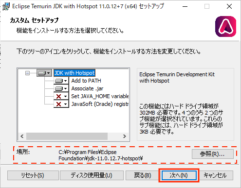
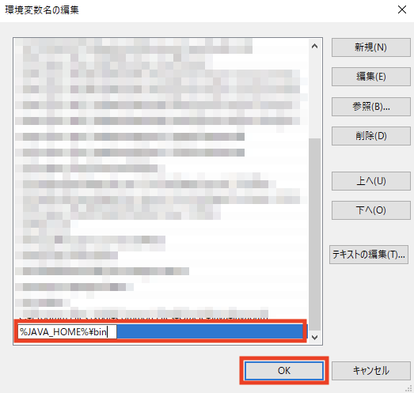
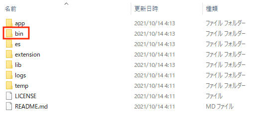

================
セットアップ手順
================

インストール方法
================

|Fess| は Java 実行環境があればどの OS
でも実行可能です。動作環境は以下のとおりです。

-  Windows や Unix など Java が実行できる OS 環境

-  Java: Java 11

運用環境を構築する場合は必ずインストールガイドを参照してください。

Javaのインストール
==================

Java がインストールされていない場合は以下の手順でJavaをインストールしてください。

ダウンロード
--------------------------------------

`Adoptium <https://adoptium.net/>`_ページにアクセスします。
「Temurin 11」を選択して「Latest release」をクリックします。

インストールするOSが一致していない場合は「Other Platforms」をクリックし、該当OSのファイルをダウンロードしてください。

|image0|

インストーラーの実行
-----------------------

ダウンロードしたJDKインストーラー (OpenJDKU-jdk_x64_windows_hostspot_11.x.xx_x.msi)を右クリックし、「インストール」を選択します。
(ファイル名はWindows 64ビット版をダウンロードした場合のファイル名です。XXはダウンロードしたアップデートリリースのバージョンになります。)

JDKのインストール
-----------------

インストーラーが起動したら、「次へ」ボタンをクリックします。

|image1|

インストール先のフォルダが変更できます。
変更する場合は「参照」ボタンをクリックして変更します。
デフォルトのままで問題なければ、「次へ」ボタンをクリックします。

|image2|

「インストール」をクリックします。JDKのインストールが開始されるので、しばらく待ちます。

|image3|

インストール完了
----------------

インストール完了のメッセージが表示されます。 「完了」ボタンをクリックします。

|image4|

環境変数の設定
--------------

環境変数とは、プログラムに渡される設定情報です。
Javaをインストール後、コマンドプロンプトでJDKのコマンドを実行するために、環境変数を設定します。

以下は、Windows 10での設定手順です。

「コントロールパネル」をクリックします。

|image5|

「システムとセキュリティ」をクリックします。

|image6|

「システム」をクリックします。

|image7|

「システムの詳細設定」をクリックします。

|image8|

「環境変数」をクリックします。

|image9|

「システム環境変数」の「新規」ボタン（画面下部）をクリックします。

|image10|

「変数名」には「JAVA\_HOME」と入力します。
「変数値」には、JDKがインストールしたディレクトリのパスを指定します。
パスは「ディレクトリの参照」をクリックして、インストール先を指定できます。

パスを指定した後、「OK」をクリックします。

|image11|

「システム環境変数」のリストから、「変数」が「Path」である行を選択し、「編集」ボタンをクリックします。

|image12|

「新規」ボタンをクリックします。

|image13|

「%JAVA\_HOME%\\bin」という文字列を追加し、「OK」をクリックします。

|image14|

|Fess| のインストール
==================

|Fess| のダウンロードページへアクセス
----------------------------------

https://github.com/codelibs/fess/releases から最新の |Fess| パッケージをダウンロードします。

URL先のリリースファイル一覧から「fess-x.y.z.zip」をクリックします。

|image15|

インストール
------------

ダウンロードしたzipファイルを解凍します。Windows環境の場合はzip解凍ツールなどで展開してください。

Unix 環境にインストールした場合、bin
以下にあるスクリプトに実行権を付加します。

::

    $ unzip fess-x.y.z.zip
    $ cd fess-x.y.z

解凍したフォルダーをダブルクリックで開きます。

|image16|

binフォルダーをダブルクリックで開きます。

|image17|

|Fess| の起動
-----------

binフォルダにあるfess.batファイルをダブルクリックして、 |Fess| を起動させます。

Unix環境の場合は以下を実行します。

::

    $ ./bin/fess

|image18|

コマンドプロンプトが表示され起動されます。
fess\\logs\\server_*.log(更新日時が最新のもの)の内容に「Boot successful」が出力されていれば起動完了です。

動作確認
========

http://localhost:8080/
にアクセスすることによって、起動を確認できます。

管理 UI は http://localhost:8080/admin/ です。
デフォルトの管理者アカウントのユーザー名/パスワードは、admin/adminになります。
管理者アカウントはアプリケーションサーバーにより管理されています。
|Fess|の管理 UI では、アプリケーションサーバーで fess ロールで認証されたユーザーを管理者として判断しています。

その他
======

|Fess| の停止
-----------

|Fess| のプロセスを停止してください。

管理者パスワードの変更
----------------------

管理 UI のユーザー編集画面で変更することができます。

.. |image0| image:: ../resources/images/ja/install/java-1.png
.. |image1| image:: ../resources/images/ja/install/java-2.png

.. |image3| image:: ../resources/images/ja/install/java-4.png
.. |image4| image:: ../resources/images/ja/install/java-5.png
.. |image5| image:: ../resources/images/ja/install/java-6.png
.. |image6| image:: ../resources/images/ja/install/java-7.png
.. |image7| image:: ../resources/images/ja/install/java-8.png
.. |image8| image:: ../resources/images/ja/install/java-9.png
.. |image9| image:: ../resources/images/ja/install/java-10.png
.. |image10| image:: ../resources/images/ja/install/java-11.png
.. |image11| image:: ../resources/images/ja/install/java-12.png
.. |image12| image:: ../resources/images/ja/install/java-13.png
.. |image13| image:: ../resources/images/ja/install/java-14.png

.. |image15| image:: ../resources/images/ja/install/Fess-1.png
.. |image16| image:: ../resources/images/ja/install/Fess-2.png

.. |image18| image:: ../resources/images/ja/install/Fess-4.png
