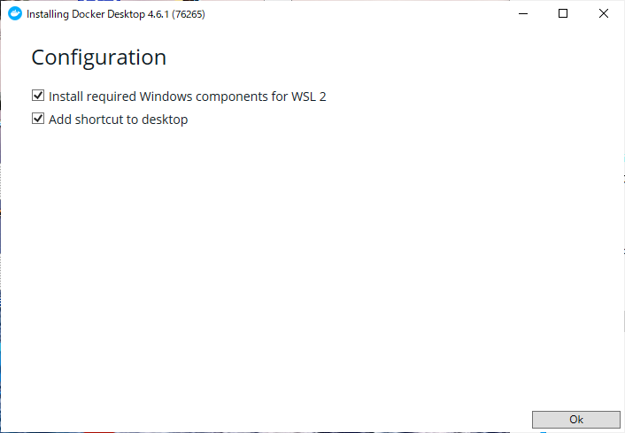

================
インストール手順
================

インストール方法
================

Fessでは、ZIPアーカイブ、RPM/DEB/パッケージ、Dockerイメージでの配布物を提供しています。
Dockerを利用することで、WindowsやMacなどでも、Fessを簡単にセットアップすることができます。

運用環境を構築する場合は必ずインストールガイドを参照してください。

Docker Desktopのインストール
============================

今回は、Windowsでの利用方法を説明します。
Docker Desktopがインストールされていない場合は、以下の手順でインストールしてください。

OSごとにダウンロードするファイルや手順に違いがあるので、お使いの環境に合わせて実施する必要があります。
詳細は`Docker <https://docs.docker.com/get-docker/>`_ のドキュメントを参照してください。

ダウンロード
------------

`Docker Desktop <https://www.docker.com/products/docker-desktop/>`__ で該当OSのインストーラーをダウンロードします。

インストーラーの実行
--------------------

ダウンロードしたインストーラーをダブルクリックして、インストールを開始します。

「Install required Windows components for WSL 2」 または
「Install required Enable Hyper-V Windows Features」 が選択されていることを確認して、
OKボタンをクリックします。

|image0|

インストールが完了したら、「close」ボタンをクリックして画面を閉じます。

|image1|

Docker Desktop の起動
---------------------

Windows メニュー内の「Docker Desktop」をクリックして起動します。

|image2|

Docker Desktop 起動後、利用規約が表示されるので、「I accept the terms」にチェックを入れて「Accept」ボタンをクリックします。

チュートリアル開始の案内が出ますが、ここでは「Skip tutorial」をクリックしてスキップします。
「Skip tutorial」をクリックすると Dashboard が表示されます。

|image3|

設定
====

Elasticsearch が Docker コンテナとして実行できるようにするため、OS側で「vm.max_map_count」の値を調整します。
利用する環境によって設定方法が異なるので、それぞれの設定方法については「`Set vm.max_map_count to at least 262144 <https://www.elastic.co/guide/en/elasticsearch/reference/current/docker.html#_set_vm_max_map_count_to_at_least_262144>`_ 」を参照してください。

Fessのセットアップ
==================

起動ファイルの作成
-------------------

適当なフォルダを作成して、 `compose.yaml <https://raw.githubusercontent.com/codelibs/docker-fess/master/compose/compose.yaml>`_ と `compose-elasticsearch8.yaml <https://raw.githubusercontent.com/codelibs/docker-fess/master/compose/compose-elasticsearch8.yaml>`_ をダウンロードします。

curlコマンドで以下のように取得することもできます。

::

    curl -o compose.yaml https://raw.githubusercontent.com/codelibs/docker-fess/master/compose/compose.yaml
    curl -o compose-elasticsearch8.yaml https://raw.githubusercontent.com/codelibs/docker-fess/master/compose/compose-elasticsearch8.yaml

Fessの起動
----------

Fessをdocker composeコマンドで起動します。

コマンドプロンプトを開き、compose.yamlファイルがあるフォルダに移動して、以下のコマンドを実行します。

::

    docker compose -f compose.yaml -f compose-elasticsearch8.yaml up -d

動作確認
========

\http://localhost:8080/ にアクセスすることによって、起動を確認できます。

管理 UI は \http://localhost:8080/admin/ です。
デフォルトの管理者アカウントのユーザー名/パスワードは、admin/adminになります。
管理者アカウントはアプリケーションサーバーにより管理されています。
Fessの管理 UI では、アプリケーションサーバーで fess ロールで認証されたユーザーを管理者として判断しています。

その他
======

Fessの停止
----------

Fessの停止は、Fessを起動したフォルダで、以下のコマンドを実行します。

::

    docker compose -f compose.yaml -f compose-elasticsearch8.yaml down

管理者パスワードの変更
----------------------

管理 UI のユーザー編集画面で変更することができます。

.. |image1| image:: ../resources/images/ja/install/dockerdesktop-2.png
.. |image2| image:: ../resources/images/ja/install/dockerdesktop-3.png
.. |image3| image:: ../resources/images/ja/install/dockerdesktop-4.png
