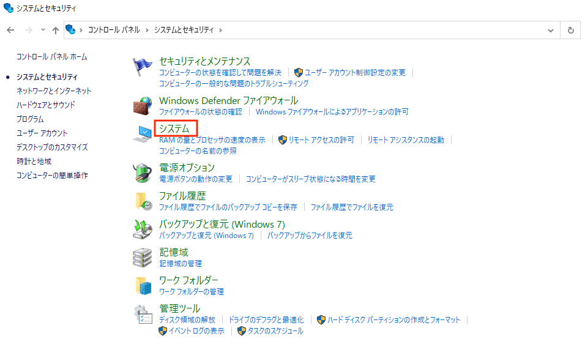
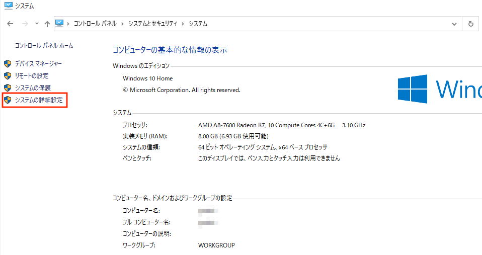
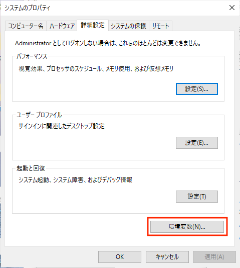
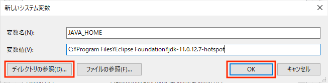
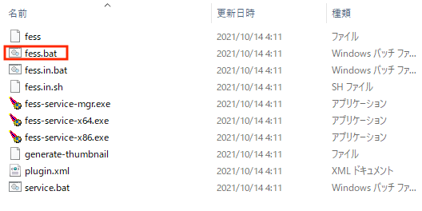

==================
|Fess| のインストール
==================

インストール方法
================

|Fess| は Java 実行環境があればどの OS
でも実行可能です。動作環境は以下のとおりです。

-  Windows や Unix など Java が実行できる OS 環境

-  Java: Java 8 以上

Javaのインストール
==================

Java がインストールされていない場合は以下の手順でJavaをインストールしてください。

Java SE のダウンロードページへアクセス
--------------------------------------

JavaScriptが有効な状態でOracle社の「`Java SE
Downloads <http://www.oracle.com/technetwork/java/javase/downloads/index.html>`_」ページにアクセスします。

JavaSE 8 の「Download JDK」をクリックします。(JavaScriptが無効になっているとダウンロードが有効となりません)

|image0|

ライセンスの確認
----------------

「Oracle Binary Code License Agreement for Java SE」を読んでライセンスに同意されたら「Accept License Agreement」にチェックを入れます。

|image1|

ダウンロードの開始
------------------

インストールを行うパソコンのOSに合わせてJDKのダウンロードを行います。
Windwos 64ビットの場合は「Windows x64」、Windows 32ビットの場合は「Windows x86」を選択します (以下はWindows 64ビット版の例です) 。

|image2|

JDKインストーラーの実行
-----------------------

ダウンロードしたJDKインストーラー (jdk-8uXX-windows-x64.exe)
を実行します(XXはダウンロードしたアップデートリリースのバージョン)。以下はWindows
64ビット版の例です。

|image3|

Windowsの設定によっては、「次のプログラムにこのコンピュータへの変更を許可しますか？」というダイアログが表示されることがあります。その場合、[はい]ボタンをクリックしてください。

JDKのインストール
-----------------

インストーラが起動します。[次へ]ボタンを押します。

|image4|

インストール先のフォルダが変更できます。デフォルトのままで問題なければ、[次へ]ボタンを押します。

|image5|

JDKのインストールが開始されるので、しばらく待ちます。

|image6|

JREのインストール
-----------------

JDKのインストール後、使用のパソコンにJREがインストールされていなければ、JREのインストールが実行されます。JDK同様にインストール先のフォルダの変更が可能ですが、基本的にはJDKと同じフォルダで問題ありません。[次へ]ボタンを押します。

|image7|

JREのインストールが開始されるので、しばらく待ちます。

|image8|

インストール完了
----------------

インストール完了のメッセージが表示されます。 [閉じる]ボタンを押します。

|image9|

インストール完了です。

インストールされたコンポーネントは、以下の2つです。以下で確認できます。(Windows
7の場合)

1. [コントロールパネル]→[プログラム]→[プログラムと機能]の一覧に表示されます。

   -  Java SE Development Kit 8 Update XX (64-bit)

   -  Java(TM) 8 Update XX (64-bit)

環境変数の設定
--------------

「環境変数」とは、プログラムに渡される設定情報です。コマンドプロンプトでJDKのコマンドを実行するために、Javaインストールの後、環境変数の設定が必要です。

Windows 7
では以下のように設定します。[コントロールパネル]→[システムとセキュリティ]→[システム]→[システムの詳細設定]→[環境変数]を選択します。

|image10|

「システムとセキュリティ」をクリックします。

|image11|

「システム」をクリックします。

|image12|

「詳細設定」をクリックします。

|image13|

「環境変数」をクリックします。

|image14|

「システム環境変数」の「新規」ボタン（画面下部）をクリックします。

|image15|

「変数名」には「JAVA\_HOME」と入力します。

|image16|

「変数値」には、JDKがインストールしたディレクトリを記述します。

エクスプローラで「C:\\Program
Files\\Java」を開き、「jdk・・・」というフォルダを探して、そのアドレスを記述します。

たとえばjdkのバージョン1.8.0\_XXをインストールした場合は、「C:\\Program
Files\\Java\\jdk1.8.0\_XX」となります。(XXの部分にはインストールしたバージョンが入ります)

記述後、「OK」を押します。

「システム環境変数」のリストから、「変数」が「Path」である行を探します。

|image17|

その行をクリックして編集ボタンを押して開き、「変数値」の末尾に「;%JAVA\_HOME%\\bin」という文字列を追加し、「OK」をクリックします。

|image18|

|Fess| のインストール
==================

|Fess| のダウンロードページへアクセス
----------------------------------

https://github.com/codelibs/fess/releases から最新の |Fess| パッケージをダウンロードします。

URL先のリリースファイル一覧から「fess-x.y.z.zip」をクリックします。

|image19|

インストール
------------

ダウンロードしたzipファイルを解凍します。Windows環境の場合はzip解凍ツールなどで展開してください。

Unix 環境にインストールした場合、bin
以下にあるスクリプトに実行権を付加します。

::

    $ unzip fess-x.y.z.zip
    $ cd fess-x.y.z

|image20|

解凍したフォルダーをダブルクリックで開きます。

|image21|

binフォルダーをダブルクリックで開きます。

|image22|

|Fess| の起動
-----------

binフォルダにあるfess.batファイルをダブルクリックして、 |Fess| を起動させます。

Unix環境の場合は以下を実行します。

::

    $ ./bin/fess

|image23|

コマンドプロンプトが表示され起動されます。

|image24|

動作確認
========

http://localhost:8080/
にアクセスすることによって、起動を確認できます。

管理 UI は http://localhost:8080/admin/ です。
デフォルトの管理者アカウントのユーザー名/パスワードは、admin/admin
になります。
管理者アカウントはアプリケーションサーバーにより管理されています。 |Fess| 
の管理 UI では、アプリケーションサーバーで fess
ロールで認証されたユーザーを管理者として判断しています。

その他
======

|Fess| の停止
-----------

|Fess| のプロセスを停止してください。

管理者パスワードの変更
----------------------

管理 UI のユーザー編集画面で変更することができます。

.. |image0| image:: ../resources/images/ja/install/java-1.png

.. |image2| image:: ../resources/images/ja/install/java-3.png
.. |image3| image:: ../resources/images/ja/install/java-4.png
.. |image4| image:: ../resources/images/ja/install/java-5.png
.. |image5| image:: ../resources/images/ja/install/java-6.png
.. |image6| image:: ../resources/images/ja/install/java-7.png

.. |image10| image:: ../resources/images/ja/install/java-11.png

.. |image14| image:: ../resources/images/ja/install/java-15.png
.. |image15| image:: ../resources/images/ja/install/java-16.png
.. |image16| image:: ../resources/images/ja/install/java-17.png
.. |image17| image:: ../resources/images/ja/install/java-18.png
.. |image18| image:: ../resources/images/ja/install/java-19.png
.. |image19| image:: ../resources/images/ja/install/Fess-1.png
.. |image20| image:: ../resources/images/ja/install/Fess-2.png
.. |image21| image:: ../resources/images/ja/install/Fess-3.png

.. |image23| image:: ../resources/images/ja/install/Fess-5.png
.. |image24| image:: ../resources/images/ja/install/Fess-6.png
