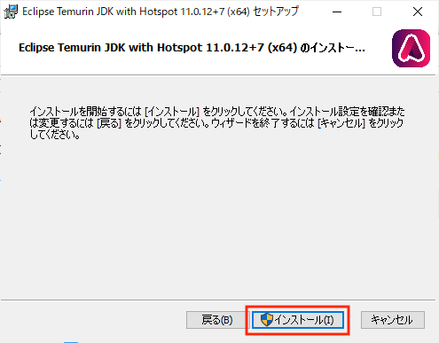
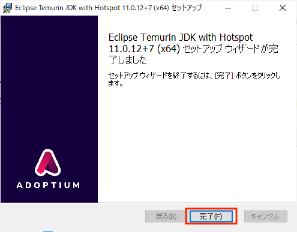
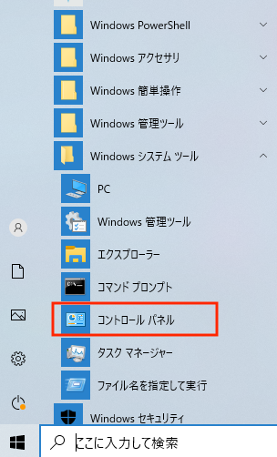
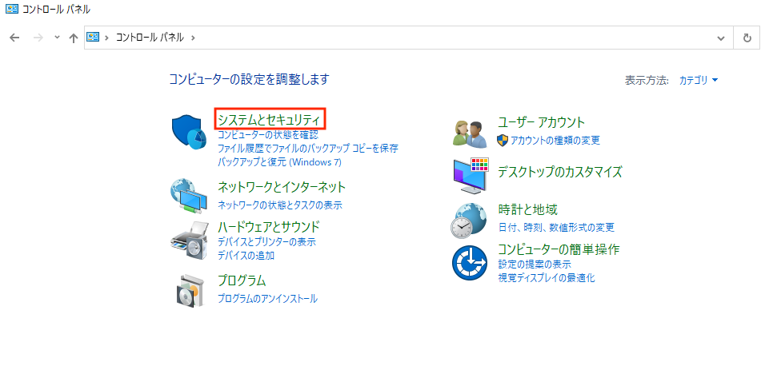
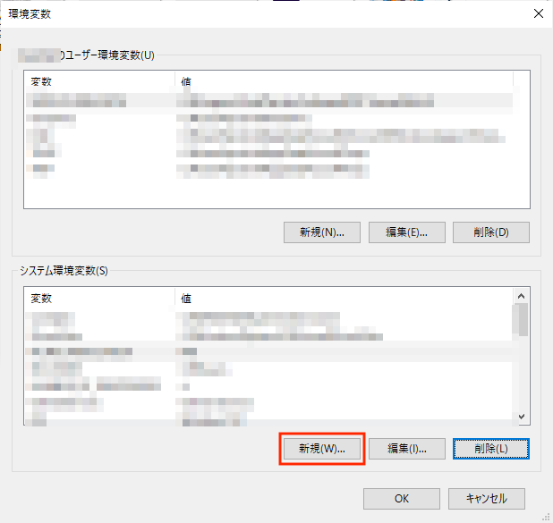
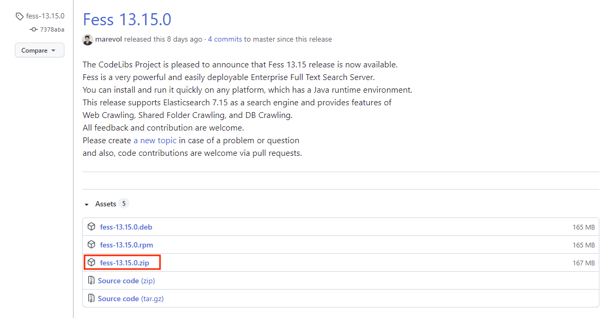
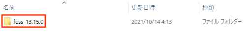

==================
|Fess| のインストール
==================

インストール方法
================

|Fess| は Java 実行環境があればどの OS
でも実行可能です。動作環境は以下のとおりです。

-  Windows や Unix など Java が実行できる OS 環境

-  Java: Java 7 以上

Javaのインストール
==================

Java
がインストールされていない場合は以下の手順でJavaをインストールしてください。

Java SE のダウンロードページへアクセス
--------------------------------------

JavaScriptが有効な状態でOracle社の\ `「Java SE
Downloads」ページ <http://www.oracle.com/technetwork/java/javase/downloads/index.html>`__\ にアクセスします。

※以下の手順とはバージョンが異なりますが、\ `「Java
8u40」<http://www.oracle.com/technetwork/java/javase/downloads/jdk8-downloads-2133151.html#jdk-8u40-oth-JPR>`__\ をインストールしてください(推奨)。[2015/3/13]

JavaSE8の「Download
JDK」をクリックします。(JavaScriptが無効になっているとダウンロードが有効となりません)

|image0|

JavaScriptが有効になっているかどうかは、下記のように確認できます。(Internet
Explorer 9 の場合)

1. メニューバーで [ツール] をクリックします。

2. [インターネット オプション] をクリックします。

3. [セキュリティ] タブをクリックします。

4. [レベルのカスタマイズ] をクリックします。

5. [スクリプト] のセクションが表示されるまでスクロールします。

6. [アクティブ スクリプト] セクションで [有効にする]
   のラジオボタンがをオンなっているかを確認する。

7. オフになっている場合はオンにし、[OK] をクリックします。

ライセンスの確認
----------------

「Oracle Binary Code License Agreement for Java SE
」を読んでライセンスに同意されたら「Accept License
Agreement」にチェックを入れます。

|image1|

ダウンロードの開始
------------------

インストールを行うパソコンのOSに合わせてJDKのダウンロードを行います。
Windwos 64ビットの場合は「Windows x64」、Windows
32ビットの場合は「Windows x86」を選択します (以下はWindows
64ビット版の例です) 。

使用しているパソコンがどちらなのかは、下記のように確認できます。(Windows
7の場合)

1. [コントロールパネル]→[システムとセキュリティ]→[システム]で、「システムの種類」に表示されます。

|image2|

JDKインストーラーの実行
-----------------------

ダウンロードしたJDKインストーラー (jdk-7uXX-windows-x64.exe)
を実行します(XXはダウンロードしたアップデートリリースのバージョン)。以下はWindows
64ビット版の例です。

|image3|

Windowsの設定によっては、「次のプログラムにこのコンピュータへの変更を許可しますか？」というダイアログが表示されることがあります。その場合、[はい]ボタンをクリックしてください。

JDKのインストール
-----------------

インストーラが起動します。[次へ]ボタンを押します。

|image4|

インストール先のフォルダが変更できます。デフォルトのままで問題なければ、[次へ]ボタンを押します。

|image5|

JDKのインストールが開始されるので、しばらく待ちます。

|image6|

JREのインストール
-----------------

JDKのインストール後、使用のパソコンにJREがインストールされていなければ、JREのインストールが実行されます。JDK同様にインストール先のフォルダの変更が可能ですが、基本的にはJDKと同じフォルダで問題ありません。[次へ]ボタンを押します。

|image7|

JREのインストールが開始されるので、しばらく待ちます。

|image8|

インストール完了
----------------

インストール完了のメッセージが表示されます。 [閉じる]ボタンを押します。

|image9|

インストール完了です。

インストールされたコンポーネントは、以下の2つです。以下で確認できます。(Windows
7の場合)

1. [コントロールパネル]→[プログラム]→[プログラムと機能]の一覧に表示されます。

   -  Java SE Development Kit 8 Update XX (64-bit)

   -  Java(TM) 8 Update XX (64-bit)

環境変数の設定
--------------

「環境変数」とは、プログラムに渡される設定情報です。コマンドプロンプトでJDKのコマンドを実行するために、Javaインストールの後、環境変数の設定が必要です。

Windows 7
では以下のように設定します。[コントロールパネル]→[システムとセキュリティ]→[システム]→[システムの詳細設定]→[環境変数]を選択します。

|image10|

「システムとセキュリティ」をクリックします。

|image11|

「システム」をクリックします。

|image12|

「詳細設定」をクリックします。

|image13|

「環境変数」をクリックします。

|image14|

「システム環境変数」の「新規」ボタン（画面下部）をクリックします。

|image15|

「変数名」には「JAVA\_HOME」と入力します。

|image16|

「変数値」には、JDKがインストールしたディレクトリを記述します。

エクスプローラで「C:\\Program
Files\\Java」を開き、「jdk・・・」というフォルダを探して、そのアドレスを記述します。

たとえばjdkのバージョン1.7.0\_XXをインストールした場合は、「C:\\Program
Files\\Java\\jdk1.7.0\_XX」となります。(XXの部分にはインストールしたバージョンが入ります)

記述後、「OK」を押します。

「システム環境変数」のリストから、「変数」が「Path」である行を探します。

|image17|

その行をクリックして編集ボタンを押して開き、「変数値」の末尾に「;%JAVA\_HOME%\\bin」という文字列を追加し、「OK」をクリックします。

|image18|

|Fess| のインストール
==================

|Fess| のダウンロードページへアクセス
----------------------------------

http://sourceforge.jp/projects/fess/releases/ から最新の |Fess| 
パッケージをダウンロードします。

URL先のリリースファイル一覧から「fess-server-9.x.y.zip」をクリックします。

|image19|

インストール
------------

ダウンロードしたzipファイルを解凍します。Windows環境の場合はzip解凍ツールなどで展開してください。

Unix 環境にインストールした場合、bin
以下にあるスクリプトに実行権を付加します。

::

    $ unzip fess-server-9.x.y.zip
    $ cd fess-server-9.x.y
    $ chmod +x bin/*.sh   # (Unix環境のみ)

|image20|

解凍したフォルダーをダブルクリックで開きます。

|image21|

binフォルダーをダブルクリックで開きます。

|image22|

|Fess| の起動
-----------

binフォルダにあるstartup.batファイルをダブルクリックして、 |Fess| を起動させます。

Unix環境の場合はstartup.shを実行します。

::

    $ ./bin/startup.sh

|image23|

コマンドプロンプトが表示され起動されます。最後の文に「Server
startup...」が表示されればセットアップ完了です。

|image24|

動作確認
========

http://localhost:8080/fess/
にアクセスすることによって、起動を確認できます。

管理 UI は http://localhost:8080/fess/admin/ です。
デフォルトの管理者アカウントのユーザー名/パスワードは、admin/admin
になります。
管理者アカウントはアプリケーションサーバーにより管理されています。 |Fess| 
の管理 UI では、アプリケーションサーバーで fess
ロールで認証されたユーザーを管理者として判断しています。

その他
======

|Fess| の停止
-----------

binフォルダにあるshutdown.batファイルをダブルクリックして、 |Fess| を停止させます。

Unix環境の場合はshutdown.shを実行します。

::

    $ ./bin/shutdown.sh

管理者パスワードの変更
----------------------

管理者アカウントはアプリケーションサーバーにより管理されています。標準の
|Fess| サーバーは Tomcat を利用しているので、Tomcat
のユーザー変更方法と同様になります。変更する場合は、conf/tomcat-user.xml
の admin アカウントのパスワードを修正してください。

::

      <user username="admin" password="admin" roles="fess"/>

Solr サーバーのパスワード変更
-----------------------------

|Fess| サーバーには Solr
が組み込まれていますが、アクセスするためにはパスワードが必要になります。実運用などにおいては、デフォルトのパスワードを変更してください。

パスワードの変更方法は、まず、conf/tomcat-user.xml の solradmin
のパスワード属性を変更します。

::

      <user username="solradmin" password="solradmin" roles="solr"/>

次に webapps/fess/WEB-INF/classes/solrlib.dicon、fess\_suggest.dicon
および solr/core1/conf/solrconfig.xml
の3ファイルを変更します。以下のパスワードの箇所へ tomcat-user.xml
で指定したものを記述します。

solrlib.dicon の対象箇所を以下のように修正します。

::

    <component class="org.apache.commons.httpclient.UsernamePasswordCredentials">
        <arg>"solradmin"</arg> <!-- ユーザー名 -->
        <arg>"solradmin"</arg> <!-- パスワード -->
    </component>

fess\_suggest.dicon は以下の箇所です。

::

    <component name="suggestCredentials" class="org.apache.http.auth.UsernamePasswordCredentials">
        <arg>"solradmin"</arg> <!-- ユーザー名 -->
        <arg>"solradmin"</arg> <!-- パスワード -->
    </component>

solr/core1/conf/solrconfig.xml は以下の箇所です。

::

    <!-- SuggestTranslogUpdateHandler settings -->
    <suggest>
      <solrServer class="org.codelibs.solr.lib.server.SolrLibHttpSolrServer">
        <arg>http://localhost:8080/solr/core1-suggest</arg>
        <credentials>
          <username>solradmin</username> <!-- ユーザー名 -->
          <password>solradmin</password> <!-- パスワード -->
        </credentials>

.. |image1| image:: ../resources/images/ja/install/java-2.png
.. |image2| image:: ../resources/images/ja/install/java-3.png

.. |image7| image:: ../resources/images/ja/install/java-8.png
.. |image8| image:: ../resources/images/ja/install/java-9.png
.. |image9| image:: ../resources/images/ja/install/java-10.png

.. |image11| image:: ../resources/images/ja/install/java-12.png
.. |image12| image:: ../resources/images/ja/install/java-13.png
.. |image13| image:: ../resources/images/ja/install/java-14.png
.. |image14| image:: ../resources/images/ja/install/java-15.png
.. |image15| image:: ../resources/images/ja/install/java-16.png
.. |image16| image:: ../resources/images/ja/install/java-17.png
.. |image17| image:: ../resources/images/ja/install/java-18.png
.. |image18| image:: ../resources/images/ja/install/java-19.png

.. |image21| image:: ../resources/images/ja/install/Fess-3.png
.. |image22| image:: ../resources/images/ja/install/Fess-4.png
.. |image23| image:: ../resources/images/ja/install/Fess-5.png
.. |image24| image:: ../resources/images/ja/install/Fess-6.png
