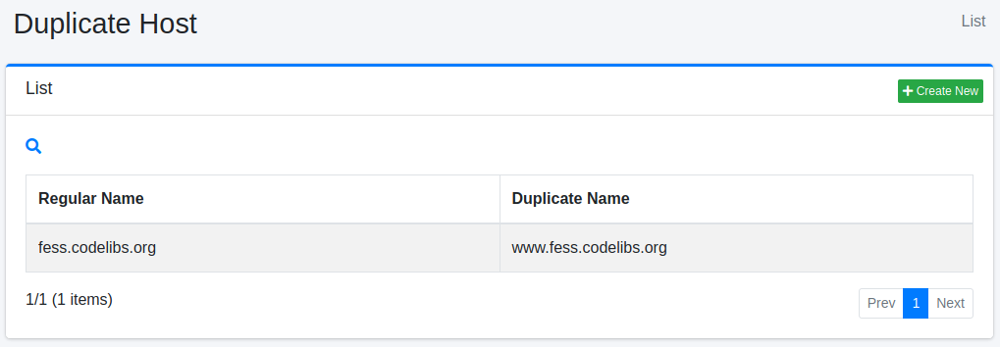
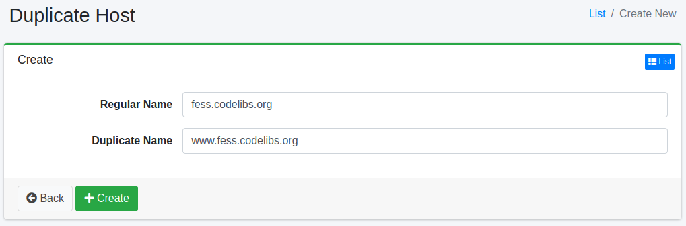

========
중복 호스트
========

개요
====

여기서는 중복 호스트에 관한 설정에 대해 설명합니다.
중복 호스트는 크롤링 시 다른 호스트 이름을 동일한 것으로 처리하고 싶을 때 사용합니다.
예를 들어, www.example.com과 example.com을 같은 사이트로 처리하고 싶은 경우 등에 사용할 수 있습니다.

관리 방법
======

표시 방법
------

아래 그림의 중복 호스트 설정 목록 페이지를 열려면 왼쪽 메뉴의 [크롤러 > 중복 호스트]를 클릭합니다.

|image0|

편집하려면 설정 이름을 클릭합니다.

설정 생성
--------

중복 호스트 설정 페이지를 열려면 신규 생성 버튼을 클릭합니다.

|image1|

설정 항목
------

정규 이름
:::::

정규 호스트 이름을 지정합니다. 중복 호스트 이름은 정규 호스트 이름으로 대체됩니다.

중복 이름
:::::

중복되는 호스트 이름을 지정합니다. 대체하려는 호스트 이름을 지정합니다.

설정 삭제
--------

목록 페이지의 설정 이름을 클릭하고 삭제 버튼을 클릭하면 확인 화면이 표시됩니다.
삭제 버튼을 누르면 설정이 삭제됩니다.

