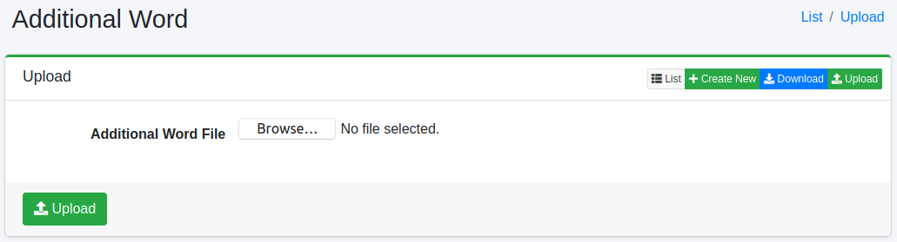

========
추가 단어
========

개요
====

여기서는 추천 단어의 추가 후보 설정에 대해 설명합니다. 추천은 검색어에 따라 표시되지만, 해당 단어를 추가할 수 있습니다.

관리 방법
======

표시 방법
------

아래 그림의 추가 단어 설정 목록 페이지를 열려면 왼쪽 메뉴의 [추천 > 추가 단어]를 클릭합니다.

|image0|

편집하려면 설정 이름을 클릭합니다.

설정 생성
--------

추가 단어 설정 페이지를 열려면 신규 생성 버튼을 클릭합니다.

|image1|

설정 항목
------

단어
::::

추천 후보로 표시될 단어를 지정합니다.

읽기
::::

추천 후보 단어의 읽기를 지정합니다.

권한
:::::::::::

단어에 역할 정보를 설정합니다.
설정한 역할을 가진 사용자만 추천에 표시됩니다.

레이블
:::::

단어에 레이블을 설정합니다.
설정한 레이블 이외를 선택한 경우 추천에 표시되지 않습니다.

부스트 값
::::::::

단어에 부스트 값을 설정합니다.

설정 삭제
--------

목록 페이지의 설정 이름을 클릭하고 삭제 버튼을 클릭하면 확인 화면이 표시됩니다.
삭제 버튼을 누르면 설정이 삭제됩니다.

다운로드
=========

등록한 단어를 CSV 형식으로 다운로드합니다.

|image2|

CSV 내용
--------

1행은 헤더입니다.
2행 이후에 추가 단어가 기재됩니다.

::

"SuggestWord","Reading","Role","Label","Boost"
"fess","ふぇす","role1","label1","100"

업로드
=========

CSV 형식으로 단어를 등록합니다.

|image3|

CSV 내용
--------

1행은 헤더입니다.
2행 이후에 추가 단어를 기술합니다.

::

"SuggestWord","Reading","Role","Label","Boost"
"fess","ふぇす","role1","label1","100"

.. |image0| image:: ../../../resources/images/en/15.3/admin/elevateword-1.png
.. |image1| image:: ../../../resources/images/en/15.3/admin/elevateword-2.png
.. |image2| image:: ../../../resources/images/en/15.3/admin/elevateword-3.png

