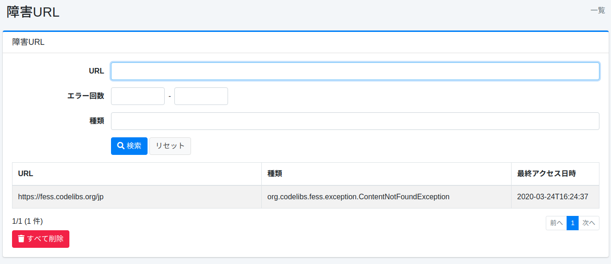

======
장애 URL
======

개요
====

여기서는 장애 URL에 대해 설명합니다.
크롤링 시 가져올 수 없었던 URL이 기록되어 장애 URL로 확인할 수 있습니다.

관리 방법
======

표시 방법
------

장애 URL을 확인하기 위한 목록 페이지를 열려면 왼쪽 메뉴의 [시스템 정보 > 장애 URL]을 클릭합니다.

|image0|

장애 URL 확인 링크를 클릭하면 세부 정보가 표시됩니다.

장애 URL 세부 정보
===========

장애 URL 세부 정보에서는 크롤링 시 발생한 예외가 기록됩니다.

|image1|

세부 정보 내용
--------

URL
::::

예외가 발생한 URL.

스레드 이름
::::::::

크롤링을 실행하던 스레드 이름.
로그 파일을 확인할 때 사용할 수 있습니다.

종류
::::

예외의 종류.

로그
::::

예외의 내용.

오류 횟수
::::::::

이 예외가 발생한 횟수.

최종 액세스 일시
::::::::::::

이 예외가 발생한 시각.

.. |image1| image:: ../../../resources/images/ja/15.3/admin/failureurl-2.png
