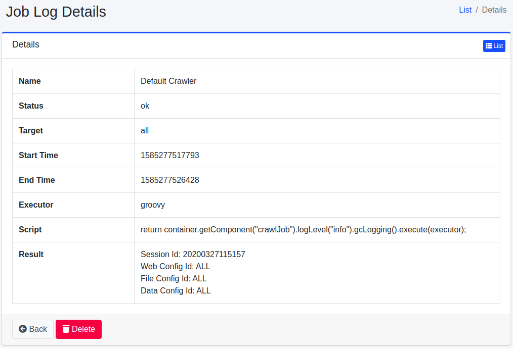

========
작업 로그
========

개요
====

실행한 작업의 결과를 목록으로 표시합니다.

관리 방법
======

표시 방법
------

아래 그림의 작업 로그 확인 페이지를 열려면 왼쪽 메뉴의 [시스템 정보 > 작업 로그]를 클릭합니다.

|image0|

작업 로그 세부 정보
-----------

작업의 로그 내용을 확인할 수 있습니다. 작업 이름, 상태, 시작·완료 시각, 결과 등을 표시합니다.

|image1|

이름
::::

실행된 작업 이름.

상태
::::

작업의 실행 결과.

대상
::::

작업이 실행되는 대상.

시작 시간
::::::

작업이 시작한 UNIX 시간.

종료 시간
::::::

작업이 종료한 UNIX 시간.

실행 방법
::::::

작업이 실행된 실행 환경.

스크립트
::::::::

작업의 실행 내용.

결과
::::

작업의 실행 결과.

.. |image0| image:: ../../../resources/images/en/15.3/admin/joblog-1.png

