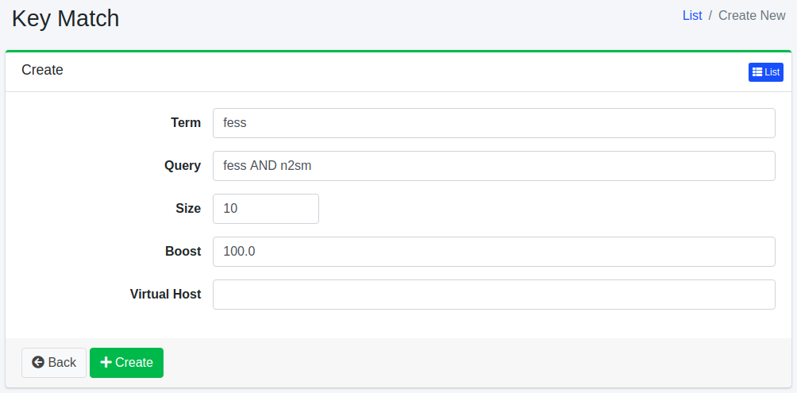

========
키 매치
========

개요
====

여기서는 키 매치에 관한 설정에 대해 설명합니다.
키 매치 설정을 수행하면 등록한 검색어로 검색할 때 검색 결과의 상위에 문서를 배치할 수 있습니다.
자주 사용되는 용도는 광고입니다.

관리 방법
======

표시 방법
------
아래 그림의 키 매치 설정 목록 페이지를 열려면 왼쪽 메뉴의 [크롤러 > 키 매치]를 클릭합니다.

|image0|

편집하려면 설정 이름을 클릭합니다.

설정 생성
--------

키 매치 설정 페이지를 열려면 신규 생성 버튼을 클릭합니다.

|image1|

설정 항목
------

검색어
:::::

이 검색어로 검색할 때의 검색 결과에만 가중치가 적용됩니다.

쿼리
::::::

상위에 배치하려는 대상 문서를 검색 쿼리로 결정합니다.

크기
:::::

쿼리와 일치하는 최대 문서 수를 지정합니다.

부스트 값
::::::::

문서 가중치 값을 지정합니다.

가상 호스트
::::::::

가상 호스트의 호스트명을 지정합니다.
자세한 내용은 :doc:`설정 가이드의 가상 호스트 <../config/virtual-host>` 를 참조하십시오.

설정 삭제
--------

목록 페이지의 설정 이름을 클릭하고 삭제 버튼을 클릭하면 확인 화면이 표시됩니다.
삭제 버튼을 누르면 설정이 삭제됩니다.

.. |image0| image:: ../../../resources/images/en/15.3/admin/keymatch-1.png

