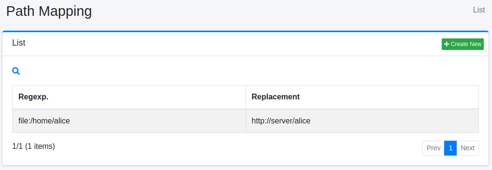

===========
경로 매핑
===========

개요
====

여기서는 경로 매핑에 관한 설정에 대해 설명합니다.
경로 매핑은 검색 결과에 표시할 링크를 바꾸고 싶은 경우 등에 사용할 수 있습니다.

관리 방법
======

표시 방법
------

아래 그림의 경로 매핑 설정 목록 페이지를 열려면 왼쪽 메뉴의 [크롤러 > 경로 매핑]을 클릭합니다.

|image0|

편집하려면 설정 이름을 클릭합니다.

설정 생성
--------

경로 매핑 설정 페이지를 열려면 신규 생성 버튼을 클릭합니다.

|image1|

설정 항목
------

정규 표현식
::::::

대체하려는 문자열을 지정합니다.
기술 방법은 Java의 정규 표현식을 따릅니다.

대체
::::

일치한 정규 표현식을 대체할 문자열을 지정합니다.

처리 유형
::::::::

대체 시점을 지정합니다.

* 크롤링: 크롤링 시 문서 획득 후 인덱싱하기 전에 URL을 대체합니다.
* 표시: 검색 시 표시하기 전에 URL을 대체합니다.
* 크롤링/표시: 크롤링과 표시 모두에서 URL을 대체합니다.
* 저장된 URL: 크롤링 시 문서 획득 전에 URL을 대체합니다.

표시 순서
::::::

경로 매핑의 처리 순서를 지정할 수 있습니다.
오름차순으로 처리됩니다.

설정 삭제
--------

목록 페이지의 설정 이름을 클릭하고 삭제 버튼을 클릭하면 확인 화면이 표시됩니다.
삭제 버튼을 누르면 설정이 삭제됩니다.

.. |image1| image:: ../../../resources/images/en/15.3/admin/pathmap-2.png
