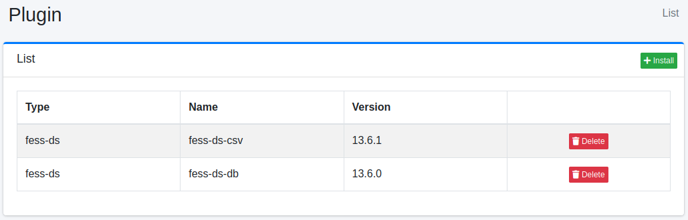

========
플러그인
========

개요
====

플러그인 설정 페이지에서 플러그인을 관리합니다.

관리 방법
======

표시 방법
------

아래 그림의 설치된 플러그인 목록 페이지를 열려면 왼쪽 메뉴의 [시스템 > 플러그인]을 클릭합니다.

|image0|

제거하려면 삭제 버튼을 클릭합니다.

설치
---------

새로운 플러그인을 설치하려면 설치 버튼을 클릭합니다.

|image1|

풀다운 메뉴에서 설치할 플러그인을 선택하고 설치 버튼을 클릭하면 설치가 시작됩니다.

.. |image1| image:: ../../../resources/images/en/15.3/admin/plugin-2.png
