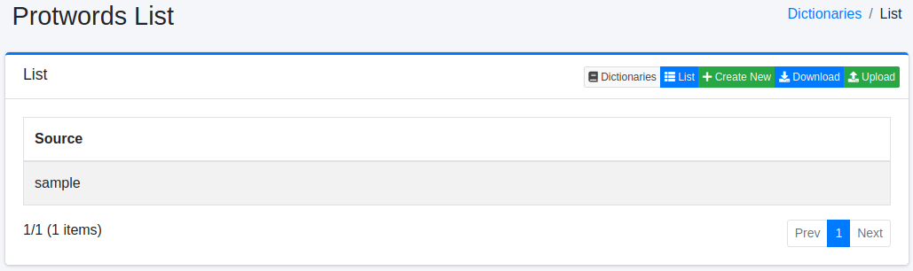
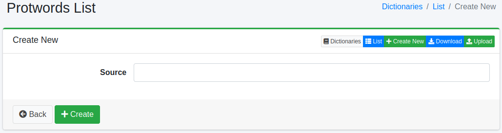

============
Protwords 사전
============

개요
====

스테밍 처리 대상에서 제외할 단어를 관리할 수 있습니다.
스테밍 처리는 기본적으로 규칙 기반 처리이므로 의도하지 않은 정규화가 수행될 가능성이 있습니다.
예를 들어 Maine(미국 주 이름)이라는 단어는 main으로 정규화됩니다.

관리 방법
======

표시 방법
------

아래 그림의 Protwords 설정 목록 페이지를 열려면 왼쪽 메뉴의 [시스템 > 사전]을 선택한 후 protwords를 클릭합니다.

|image0|

편집하려면 설정 이름을 클릭합니다.

설정 방법
------

Protwords 설정 페이지를 열려면 신규 생성 버튼을 클릭합니다.

|image1|

설정 항목
------

단어 정보
::::::

스테밍 처리 대상에서 제외할 단어를 입력합니다.

다운로드
=========

Protwords 사전 형식으로 다운로드할 수 있습니다.

업로드
=========

Protwords 사전 형식으로 업로드할 수 있습니다.

