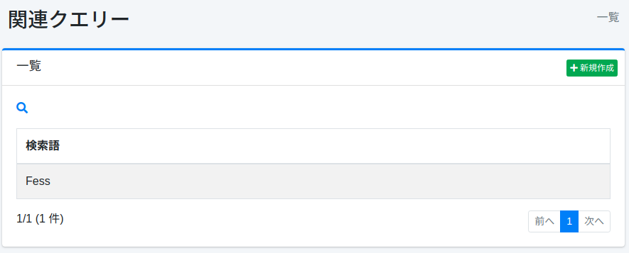
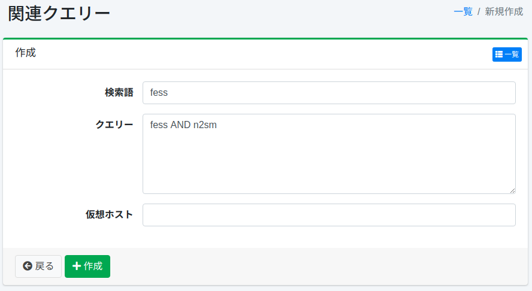

=========
관련 쿼리
=========

개요
====

여기서는 관련 쿼리 설정에 대해 설명합니다.
등록한 관련 쿼리로 검색 결과를 개선할 수 있습니다.
관련 쿼리는 검색어의 대체어로 사용할 수 있습니다.

관리 방법
======

표시 방법
------

아래 그림의 관련 쿼리 설정 목록 페이지를 열려면 왼쪽 메뉴의 [크롤러 > 관련 쿼리]를 클릭합니다.

|image0|

편집하려면 설정 이름을 클릭합니다.

설정 생성
--------

관련 쿼리 설정 페이지를 열려면 신규 생성 버튼을 클릭합니다.

|image1|

설정 항목
------

검색어
:::::

검색 쿼리와 일치시킬 검색어를 지정합니다.

쿼리
::::::

쿼리를 지정합니다.

가상 호스트
:::::::

가상 호스트의 호스트명을 지정합니다.
자세한 내용은 :doc:`설정 가이드의 가상 호스트 <../config/virtual-host>` 를 참조하십시오.

설정 삭제
----------

목록 페이지의 설정 이름을 클릭하고 삭제 버튼을 클릭하면 확인 화면이 표시됩니다.
삭제 버튼을 누르면 설정이 삭제됩니다.

