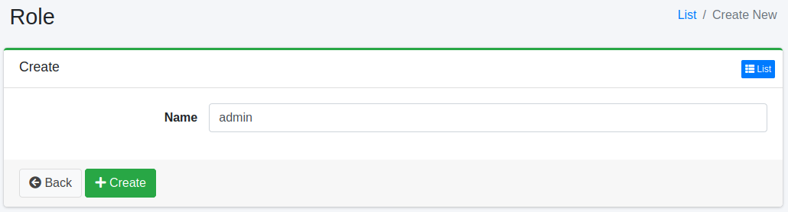

=====
역할
=====

개요
====

사용자가 속한 역할을 관리할 수 있습니다.
LDAP 연계를 하는 경우 등에 사용할 수 있습니다.

관리 방법
======

표시 방법
------

아래 그림의 역할 설정 목록 페이지를 열려면 왼쪽 메뉴의 [사용자 > 역할]을 클릭합니다.

|image0|

편집하려면 설정 이름을 클릭합니다.

설정 생성
--------

역할 설정 페이지를 열려면 신규 생성 버튼을 클릭합니다.

|image1|

설정 항목
------

이름
::::

역할 이름.

설정 삭제
--------

목록 페이지의 설정 이름을 클릭하고 삭제 버튼을 클릭하면 확인 화면이 표시됩니다.
삭제 버튼을 누르면 설정이 삭제됩니다.

.. |image0| image:: ../../../resources/images/en/15.3/admin/role-1.png

