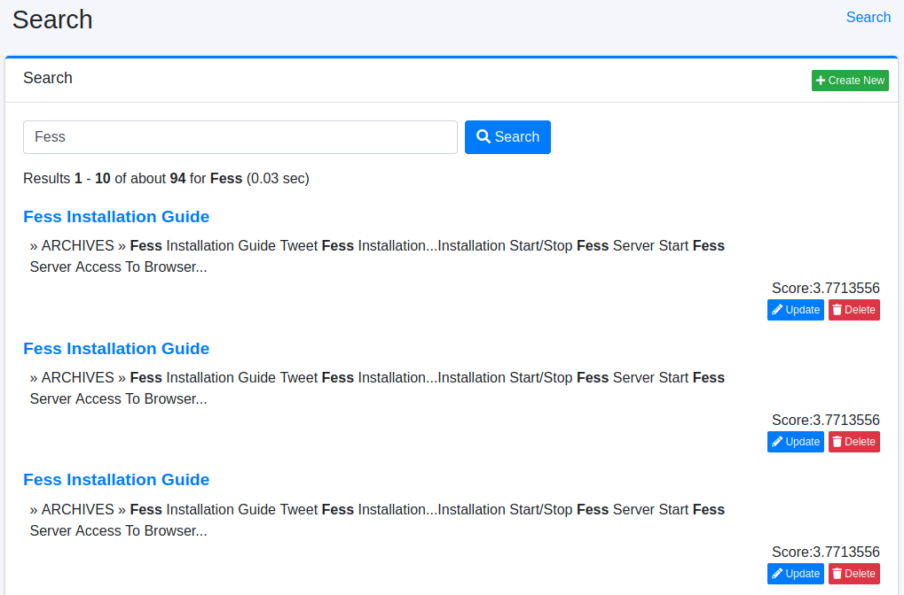

====
검색
====

개요
====

여기서는 관리용 검색에 대해 설명합니다.

관리 방법
======

표시 방법
------

아래 그림의 검색 페이지를 열려면 왼쪽 메뉴의 [시스템 정보 > 검색]을 클릭합니다.

|image0|

검색 목록
------

지정한 조건으로 검색할 수 있습니다.
일반 검색 화면에서는 역할이나 브라우저의 조건이 암묵적으로 추가되지만, 이 관리용 검색에서는 추가되지 않습니다.
표시된 검색 결과에서 특정 문서를 인덱스에서 삭제할 수도 있습니다.

일괄 삭제
------

인덱스에서 모든 문서를 삭제하려면 "\*:\*"로 "이 쿼리로 모두 삭제" 버튼을 클릭하여 삭제됩니다.
검색 조건을 지정하여 대상 문서만 삭제하는 것도 가능합니다.

