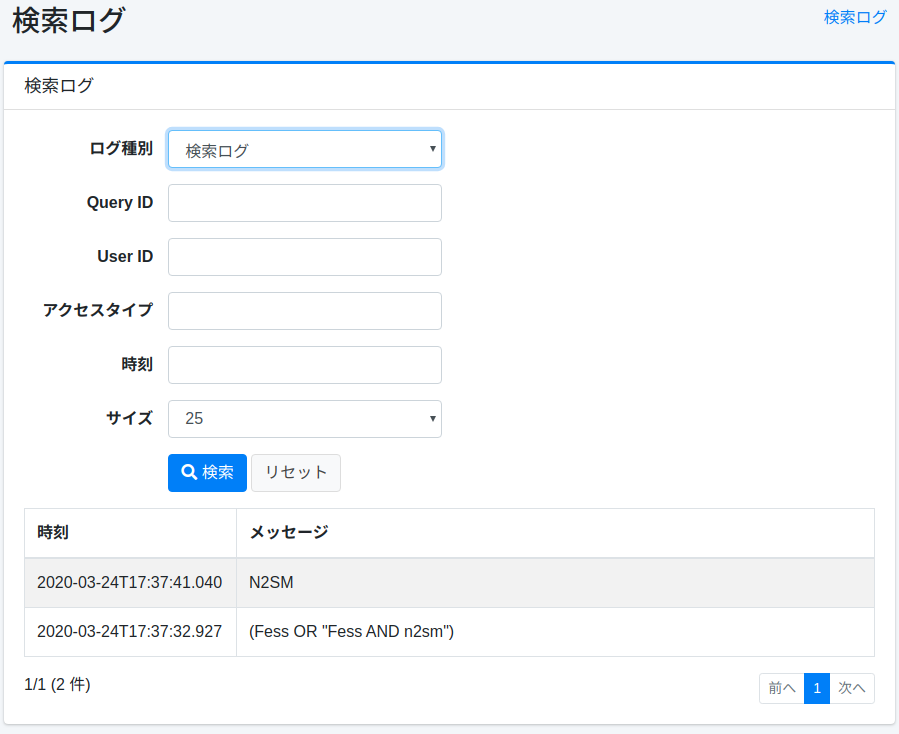
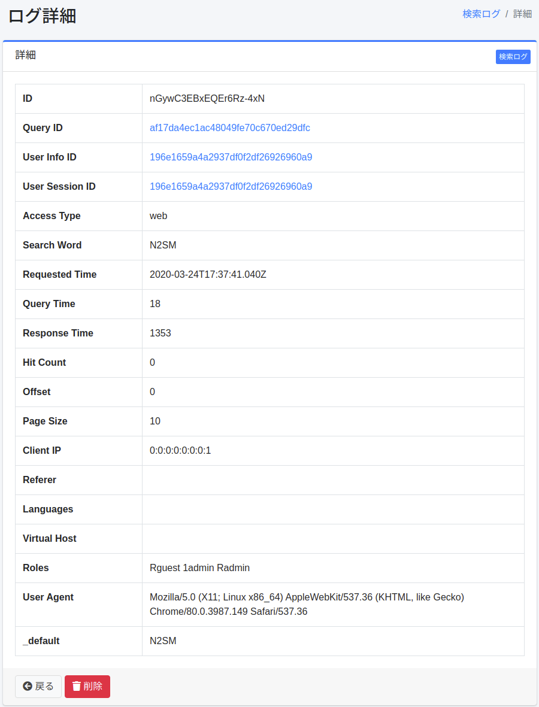

======
검색 로그
======

개요
====

검색, 클릭, 즐겨찾기의 실행 결과가 기록되며, 검색 로그는 이 관리 화면에서 확인할 수 있습니다.

관리 방법
======

목록
====

목록에서는 검색, 클릭, 즐겨찾기의 검색 로그를 확인할 수 있습니다.
검색 로그의 세부 정보를 확인하려면 대상 검색 로그를 클릭합니다.

|image0|

세부 정보
====

목록에서 검색 로그를 클릭하면 대상 검색 로그 세부 정보가 표시됩니다.

|image1|

