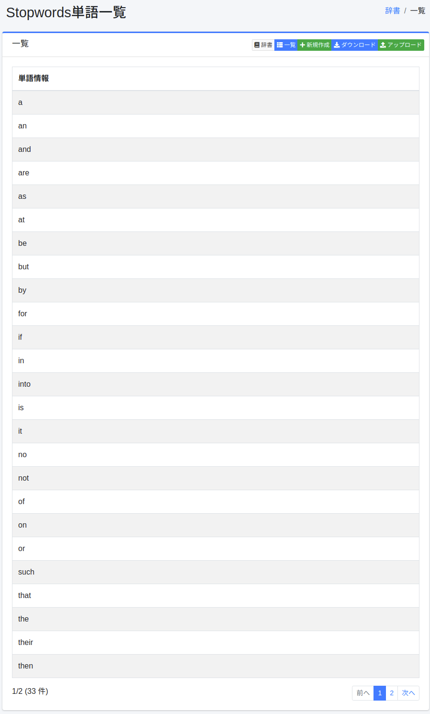
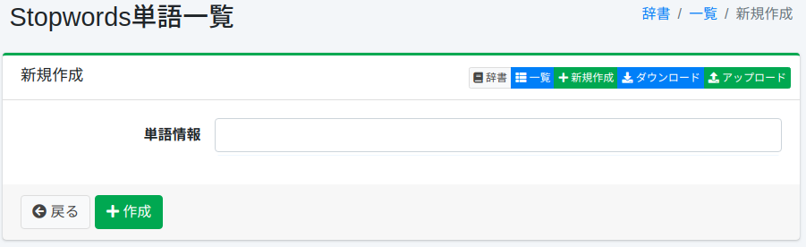

==============
불용어 사전
==============

개요
====

특정 문자(기호·문자 코드·전각반각)를 불용어로 지정할 수 있습니다.

관리 방법
======

표시 방법
------

아래 그림의 불용어 설정 목록 페이지를 열려면 왼쪽 메뉴의 [시스템 > 사전]을 선택한 후 stopwords를 클릭합니다.

|image0|

편집하려면 설정 이름을 클릭합니다.

설정 방법
------

불용어 설정 페이지를 열려면 신규 생성 버튼을 클릭합니다.

|image1|

설정 항목
------

변환원
:::::

불용어 대상이 되는 문자(기호·문자 코드·전각반각)를 입력합니다.

변환후
:::::

변환원에서 입력한 문자를 변환 후 문자로 전개합니다.

다운로드
=========

불용어 사전 형식으로 다운로드할 수 있습니다.

업로드
=========

불용어 사전 형식으로 업로드할 수 있습니다.

