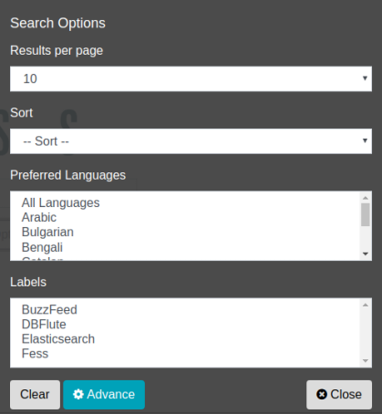

===========
라벨 지정 검색
===========

라벨 지정 검색 (카테고리 검색)
=======================

검색 대상 문서에 카테고리를 분류하기 위한 라벨 정보를 추가함으로써 검색 시 라벨을 지정한 필터링 검색이 가능합니다.

라벨 정보는 관리 화면에서 등록해 두면 검색 화면에서 라벨별 검색이 가능해집니다. 사용 가능한 라벨 정보는 검색 시 풀다운 메뉴에서 여러 개를 선택할 수 있습니다. 라벨을 등록하지 않은 경우 라벨 풀다운 박스는 표시되지 않습니다.

사용 방법
------

검색 시 라벨 정보를 선택할 수 있습니다. 라벨 정보는 옵션 버튼을 클릭하여 표시되는 검색 옵션 대화상자에서 선택할 수 있습니다.

|image0|

라벨을 설정하고 인덱스를 생성하면 라벨이 설정된 문서별로 검색할 수 있습니다. 라벨을 지정하지 않은 검색은 일반적인 전체 검색과 동일합니다. 라벨 정보를 변경한 경우 인덱스를 업데이트해야 합니다.

.. pdf   :width: 300 px
