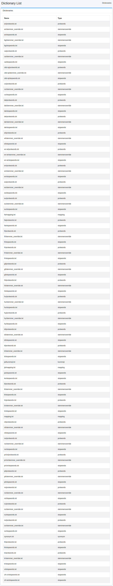

====
사전
====

개요
====

여기에서는 사전에 관한 설정에 대해 설명합니다.

사전 변경은 각 사전에 관한 사양을 이해한 후 실시하십시오.
사전 변경에 실패하면 인덱스에 액세스할 수 없게 될 수 있습니다.

목록
====

아래 그림의 관리 가능한 사전 목록 페이지를 열려면 왼쪽 메뉴의 [시스템 > 사전]을 클릭합니다.

|image0|

Kuromoji
========

일본어 형태소 분석용 사전을 관리합니다.
ja/kuromoji.txt는 일본어 형태소 분석용 사전입니다.

동의어
=====

동의어 사전을 관리합니다.
synonym.txt는 언어 공통으로 사용되는 동의어 사전 파일입니다.

매핑
========

문자 치환 사전을 관리합니다.
mapping.txt는 언어 공통 또는 각 언어용 단어 치환 사전 파일입니다.

Protwords
=========

보호 단어 사전을 관리합니다.
protwords.txt는 각 언어용으로 배치하여 스테밍 대상 제외 등을 위한 단어 목록 파일입니다.

불용어
===========

불용어 사전을 관리합니다.
stopwords.txt는 각 언어용으로 배치하여 인덱스 생성 시 제외할 단어 목록 파일입니다.

Stemmer 재정의
============

Stemmer 재정의 사전을 관리합니다.
stemmer_override.txt는 각 언어용으로 배치하여 스테밍 처리를 재정의하기 위한 단어 치환 사전 파일입니다.

