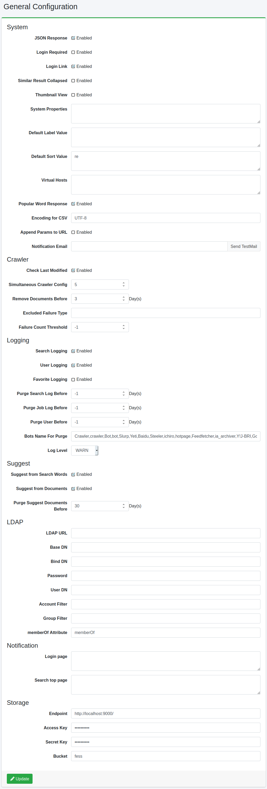

====
일반
====

개요
====

이 관리 페이지에서는 |Fess| 의 설정을 관리할 수 있습니다.
|Fess| 를 재시작하지 않고 |Fess| 의 다양한 설정을 변경할 수 있습니다.

|image0|

설정 내용
======

시스템
------

JSON 응답
::::::::::::

JSON API를 활성화할지 여부를 지정합니다.

로그인 필요
:::::::::::

검색 기능을 로그인 필수로 할지 여부를 지정합니다.

로그인 링크 표시
::::::::::::::

검색 화면에서 로그인 페이지로의 링크를 표시할지 여부를 설정합니다.

중복 결과 접기
::::::::::::::

중복 결과 접기를 활성화할지 여부를 설정합니다.

썸네일 표시
:::::::::::

썸네일 표시를 활성화할지 여부를 설정합니다.

기본 라벨 값
:::::::::::::::

기본적으로 검색 조건에 추가할 라벨 값을 기술합니다.
역할이나 그룹 단위로 지정하는 경우 "role:admin=label1"과 같이 role: 또는 group: 을 추가하여 지정합니다.

기본 정렬 값
:::::::::::::::

기본적으로 검색 조건에 추가할 정렬 값을 기술합니다.
역할이나 그룹 단위로 지정하는 경우 "role:admin=content_length.desc"와 같이 role: 또는 group: 을 추가하여 지정합니다.

가상 호스트
::::::::

가상 호스트를 설정합니다.
자세한 내용은 :doc:`설정 가이드의 가상 호스트 <../config/security-virtual-host>` 를 참조하십시오.

인기 검색어 응답
:::::::::::::::::

인기 키워드 API를 활성화할지 여부를 지정합니다.

CSV 파일 인코딩
::::::::::::::::::

다운로드하는 CSV 파일의 인코딩을 지정합니다.

검색 파라미터 추가
:::::::::::::::::

검색 결과 표시에 매개변수를 전달하는 경우 활성화합니다.

검색 파일 프록시
:::::::::::::::

검색 결과의 파일 프록시를 활성화할지 여부를 지정합니다.

브라우저 로케일 사용
:::::::::::::::::

검색 시 브라우저의 로케일을 사용할지 여부를 지정합니다.

SSO 유형
::::::::

싱글 사인온(Single Sign-On) 유형을 지정합니다.

- **None**: SSO를 사용하지 않음
- **OpenID Connect**: OpenID Connect 사용
- **SAML**: SAML 사용
- **SPNEGO**: SPNEGO 사용
- **Entra ID**: Microsoft Entra ID 사용

크롤러
--------

최종 갱신 일시 확인
::::::::::::::

차분 크롤을 수행하는 경우 활성화합니다.

동시 크롤러 설정
::::::::::::::

동시에 실행할 크롤 설정 수를 지정합니다.

사용자 에이전트
:::::::::::::

크롤러가 사용하는 사용자 에이전트 이름을 지정합니다.

이전 문서 삭제
::::::::::::::::::

인덱싱 후 유효 기간의 일수를 지정합니다.

제외할 오류 종류
:::::::::::::::

임계값을 초과하는 장애 URL은 크롤 대상에서 제외되지만, 여기에서 지정된 예외명 등은 임계값을 초과하는 장애 URL이어도 크롤 대상이 됩니다.

장애 수 임계값
::::::::::::

크롤 대상 문서가 여기에서 지정된 횟수 이상 장애 URL에 기록된 경우 다음 크롤에서 대상에서 제외됩니다.

로깅
------

검색 로그
::::::

검색 로그 기록을 활성화할지 여부를 지정합니다.

사용자 로그
::::::::

사용자 로그 기록을 활성화할지 여부를 지정합니다.

즐겨찾기 로그
:::::::::::

즐겨찾기 로그 기록을 활성화할지 여부를 지정합니다.

이전 검색 로그 삭제
:::::::::::::::

지정된 일수 이전의 검색 로그를 삭제합니다.

이전 작업 로그 삭제
:::::::::::::::::

지정된 일수 이전의 작업 로그를 삭제합니다.

이전 사용자 로그 삭제
::::::::::::::::::

지정된 일수 이전의 사용자 로그를 삭제합니다.

로그를 삭제할 봇 이름
:::::::::::::::::

검색 로그에서 제외할 봇 이름을 지정합니다.

로그 레벨
::::::::

fess.log의 로그 레벨을 지정합니다.

로그 알림
::::::::

ERROR 및 WARN 레벨의 로그 이벤트를 자동으로 캡처하여 알림을 보내는 기능을 활성화할지 여부를 지정합니다.
자세한 내용은 :doc:`로그 알림 설정 <../config/admin-log-notification>` 을 참조하십시오.

로그 알림 레벨
:::::::::::

로그 알림 대상 로그 레벨을 지정합니다.
선택한 레벨 이상의 로그 이벤트가 알림됩니다.

- **ERROR**: 오류만 알림 (기본값)
- **WARN**: 경고 이상 알림
- **INFO**: 정보 이상 알림
- **DEBUG**: 디버그 이상 알림
- **TRACE**: 모든 로그 알림

추천
--------

검색어로 추천
::::::::::::::

검색 로그에서 추천 후보를 생성할지 여부를 지정합니다.

문서로 추천
::::::::::::::::::

인덱싱한 문서에서 추천 후보를 생성할지 여부를 지정합니다.

이전 추천 정보 삭제
::::::::::::::::::::

지정된 일수 이전의 추천 데이터를 삭제합니다.

LDAP
----

LDAP URL
::::::::

LDAP 서버의 URL을 지정합니다.

베이스 DN
:::::::

검색 화면에 로그인하는 베이스 식별명을 지정합니다.

바인드 DN
:::::::

관리자의 바인드 DN을 지정합니다.

비밀번호
::::::::

바인드 DN의 비밀번호를 지정합니다.

사용자 DN
:::::::

사용자의 식별명을 지정합니다.

계정 필터
:::::::::::::::

사용자의 Common Name이나 uid 등을 지정합니다.

그룹 필터
::::::::::::::

가져올 그룹의 필터 조건을 지정합니다.

memberOf 속성
:::::::::::

LDAP 서버에서 사용할 수 있는 memberOf 속성명을 지정합니다.
Active Directory의 경우 memberOf입니다.
기타 LDAP 서버에서는 isMemberOf인 경우도 있습니다.

보안 인증
::::::::

LDAP의 보안 인증 방식을 지정합니다 (예: simple).

초기 컨텍스트 팩토리
:::::::::::::::::

LDAP의 초기 컨텍스트 팩토리 클래스를 지정합니다 (예: com.sun.jndi.ldap.LdapCtxFactory).

OpenID Connect
--------------

클라이언트 ID
:::::::::::

OpenID Connect 공급자의 클라이언트 ID를 지정합니다.

클라이언트 시크릿
::::::::::::::

OpenID Connect 공급자의 클라이언트 시크릿을 지정합니다.

인증 서버 URL
:::::::::::

OpenID Connect의 인증 서버 URL을 지정합니다.

토큰 서버 URL
:::::::::::

OpenID Connect의 토큰 서버 URL을 지정합니다.

리다이렉트 URL
::::::::::::

OpenID Connect의 리다이렉트 URL을 지정합니다.

스코프
:::::

OpenID Connect의 스코프를 지정합니다.

베이스 URL
::::::::

OpenID Connect의 베이스 URL을 지정합니다.

기본 그룹
::::::::

OpenID Connect 인증 시 사용자에게 할당할 기본 그룹을 지정합니다.

기본 역할
::::::::

OpenID Connect 인증 시 사용자에게 할당할 기본 역할을 지정합니다.

SAML
----

SP 베이스 URL
:::::::::::

SAML Service Provider의 베이스 URL을 지정합니다.

그룹 속성명
:::::::::

SAML 응답에서 그룹을 가져오기 위한 속성명을 지정합니다.

역할 속성명
:::::::::

SAML 응답에서 역할을 가져오기 위한 속성명을 지정합니다.

기본 그룹
::::::::

SAML 인증 시 사용자에게 할당할 기본 그룹을 지정합니다.

기본 역할
::::::::

SAML 인증 시 사용자에게 할당할 기본 역할을 지정합니다.

SPNEGO
------

Krb5 설정
::::::::

Kerberos 5 설정 파일의 경로를 지정합니다.

로그인 설정
:::::::::

JAAS (Java Authentication and Authorization Service) 로그인 설정 파일의 경로를 지정합니다.

로그인 클라이언트 모듈
::::::::::::::::::::

JAAS의 클라이언트 로그인 모듈명을 지정합니다.

로그인 서버 모듈
::::::::::::::

JAAS의 서버 로그인 모듈명을 지정합니다.

사전 인증 사용자명
::::::::::::::

SPNEGO 사전 인증에 사용하는 사용자명을 지정합니다.

사전 인증 비밀번호
::::::::::::::

SPNEGO 사전 인증에 사용하는 비밀번호를 지정합니다.

Basic 인증 허용
:::::::::::::

Basic 인증 폴백을 허용할지 여부를 지정합니다.

비보안 Basic 인증 허용
::::::::::::::::::

비보안(HTTP) 연결에서의 Basic 인증을 허용할지 여부를 지정합니다.

NTLM 프롬프트
:::::::::::

NTLM 프롬프트를 활성화할지 여부를 지정합니다.

로컬호스트 허용
::::::::::::

로컬호스트에서의 접근을 허용할지 여부를 지정합니다.

위임 허용
::::::::

Kerberos 위임을 허용할지 여부를 지정합니다.

제외 디렉터리
::::::::::

SPNEGO 인증에서 제외할 디렉터리를 지정합니다.

Entra ID
--------

클라이언트 ID
:::::::::::

Microsoft Entra ID의 애플리케이션(클라이언트) ID를 지정합니다.

클라이언트 시크릿
::::::::::::::

Microsoft Entra ID의 클라이언트 시크릿을 지정합니다.

테넌트
:::::

Microsoft Entra ID의 테넌트 ID를 지정합니다.

인증 기관
::::::::

Microsoft Entra ID의 인증 기관 URL을 지정합니다.

응답 URL
::::::

Microsoft Entra ID의 응답(리다이렉트) URL을 지정합니다.

상태 TTL
::::::

인증 상태의 유효 기간(TTL)을 지정합니다.

기본 그룹
::::::::

Entra ID 인증 시 사용자에게 할당할 기본 그룹을 지정합니다.

기본 역할
::::::::

Entra ID 인증 시 사용자에게 할당할 기본 역할을 지정합니다.

권한 필드
::::::::

Entra ID에서 권한 정보를 가져오는 필드를 지정합니다.

도메인 서비스 사용
::::::::::::::

Entra ID 도메인 서비스를 사용할지 여부를 지정합니다.

알림 표시
---------

로그인 페이지
:::::::::::

로그인 화면에 표시할 메시지를 기술합니다.

검색 상단 페이지
::::::::::::

검색 상단 화면에 표시할 메시지를 기술합니다.

상세 검색 페이지
::::::::::::

상세 검색 화면에 표시할 메시지를 기술합니다.

알림
----

알림 메일
::::::::

크롤 완료 시 알림을 받을 메일 주소를 지정합니다.
쉼표로 구분하여 여러 개 지정할 수 있습니다. 사용하려면 메일 서버가 필요합니다.

Slack Webhook URL
:::::::::::::::::

Slack 알림에 사용할 Webhook URL을 지정합니다.

Google Chat Webhook URL
:::::::::::::::::::::::

Google Chat 알림에 사용할 Webhook URL을 지정합니다.

스토리지
--------

각 항목을 설정한 후 왼쪽 메뉴에 [시스템 > 스토리지] 메뉴가 표시됩니다.
파일 관리에 대해서는 :doc:`스토리지 <../admin/storage-guide>` 를 참조하십시오.

유형
::::

스토리지의 유형을 지정합니다.
「자동」을 선택하면 엔드포인트에서 자동으로 스토리지 유형을 판정합니다.

- **자동**: 엔드포인트에서 자동 판정
- **S3**: Amazon S3
- **GCS**: Google Cloud Storage

버킷
::::::

관리할 버킷명을 지정합니다.

엔드포인트
:::::::::::

스토리지 서버의 엔드포인트 URL을 지정합니다.

- S3: 빈칸인 경우 AWS 기본 엔드포인트를 사용
- GCS: 빈칸인 경우 Google Cloud 기본 엔드포인트를 사용
- MinIO 등: MinIO 서버의 엔드포인트 URL

액세스 키
::::::::::

S3 또는 S3 호환 스토리지의 액세스 키를 지정합니다.

비밀 키
:::::::::::::

S3 또는 S3 호환 스토리지의 비밀 키를 지정합니다.

리전
::::::::

S3의 리전을 지정합니다 (예: ap-northeast-1).

프로젝트 ID
:::::::::::

GCS의 Google Cloud 프로젝트 ID를 지정합니다.

자격 증명 경로
::::::::::

GCS용 서비스 계정 인증 정보 JSON 파일의 경로를 지정합니다.

예제
==

LDAP 설정 예제
----------

.. tabularcolumns:: |p{4cm}|p{4cm}|p{4cm}|
.. list-table:: LDAP/Active Directory 설정
   :header-rows: 1

   * - 이름
     - 값 (LDAP)
     - 값 (Active Directory)
   * - LDAP URL
     - ldap://SERVERNAME:389
     - ldap://SERVERNAME:389
   * - 베이스 DN
     - cn=Directory Manager
     - dc=fess,dc=codelibs,dc=org
   * - 바인드 DN
     - uid=%s,ou=People,dc=fess,dc=codelibs,dc=org
     - manager@fess.codelibs.org
   * - 사용자 DN
     - uid=%s,ou=People,dc=fess,dc=codelibs,dc=org
     - %s@fess.codelibs.org
   * - 계정 필터
     - cn=%s 또는 uid=%s
     - (&(objectClass=user)(sAMAccountName=%s))
   * - 그룹 필터
     -
     - (member:1.2.840.113556.1.4.1941:=%s)
   * - memberOf
     - isMemberOf
     - memberOf

.. pdf            :height: 940 px
