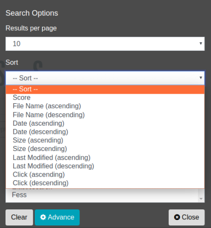

========
정렬 검색
========

검색 일시 등의 필드를 지정하여 검색 결과를 정렬할 수 있습니다.

정렬 대상 필드
---------------

기본적으로 다음 필드를 지정하여 정렬할 수 있습니다.

.. list-table::
   :header-rows: 1

   * - 필드명
     - 설명
   * - created
     - 크롤링한 일시
   * - content_length
     - 크롤링한 문서 크기
   * - last_modified
     - 크롤링한 문서의 최종 수정 일시
   * - filename
     - 파일명
   * - score
     - 점수 값
   * - timestamp
     - 문서를 인덱싱한 일시
   * - click_count
     - 문서를 클릭한 횟수
   * - favorite_count
     - 문서를 즐겨찾기한 횟수

표: 정렬 대상 필드 목록

독자적인 필드를 정렬 대상으로 추가할 수도 있습니다. 추가하려면 ``fess_config.properties`` 의 ``query.additional.sort.fields`` 에 정렬 대상으로 하고 싶은 필드명을 쉼표(,)로 구분하여 지정합니다(초기값은 비어 있습니다). 여기서 지정한 필드는 위의 표준 필드에 추가되어 정렬에 이용할 수 있게 됩니다. 또한 정렬 대상으로 하는 필드는 사전에 인덱스에 등록되어 있어야 합니다.

사용 방법
------

검색 시 정렬 조건을 선택할 수 있습니다. 정렬 조건은 옵션 버튼을 클릭하여 표시되는 검색 옵션 대화상자에서 선택할 수 있습니다.

|image0|

또한 검색 필드에서 정렬하는 경우 "sort:필드명"과 같이 sort와 필드명을 콜론(:)으로 구분하여 검색 양식에 입력하여 검색합니다.

다음은 fess를 검색어로 하여 문서 크기를 오름차순으로 정렬합니다.

::

    fess sort:content_length

내림차순으로 정렬하는 경우에는 필드명 뒤에 ``.desc`` 를 붙입니다.

::

    fess sort:content_length.desc

필드명 뒤에 지정할 수 있는 것은 ``.asc`` (오름차순) 또는 ``.desc`` (내림차순)이며, 생략한 경우에는 오름차순이 됩니다.

여러 필드로 정렬하는 경우에는 다음과 같이 쉼표(,)로 구분하여 지정합니다. 먼저 지정한 필드가 우선되며, 그 값이 동일한 문서끼리는 다음 필드로 정렬됩니다.

::

    fess sort:content_length.desc,last_modified

.. note::
   정렬 대상 필드 목록에 없는 필드명이나 ``asc`` · ``desc`` 이외의 정렬 순서를 지정한 경우에는 검색이 오류가 됩니다.

.. pdf            :width: 300 px
